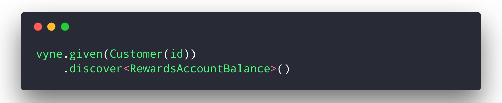

# Welcome


Vyne is a platform for automating integration between services.



Vyne provides intelligent on-the-fly integrations, that automatically upgrade themselves as your services update. 


Vyne is cool.  It's also pretty early in it's implementation.  Vyne has bugs, and features are being stablised.  You **will** find bugs.  When you do,  please let us know by [filing an issue](https://gitlab.com/vyne/vyne/issues).

Also, these docs are evolving.  Please bear with us while we work to document Vyne in it's entirety.

A good starting point is working through the examples.




## Maven setup

To grab our artifacts, you'll need the following repository info in your maven build.

```markup
 <repositories>
      <repository>
          <id>taxi-releases</id>
          <url>https://dl.bintray.com/taxi-lang/releases</url>
      </repository>
      <repository>
          <id>vyne-releases</id>
          <url>http://repo.vyne.co/release</url>
      </repository>
      <repository>
          <id>vyne-snapshots</id>
          <url>http://repo.vyne.co/snapshot</url>
          <snapshots>
              <enabled>true</enabled>
          </snapshots>
      </repository>
  </repositories>
```

