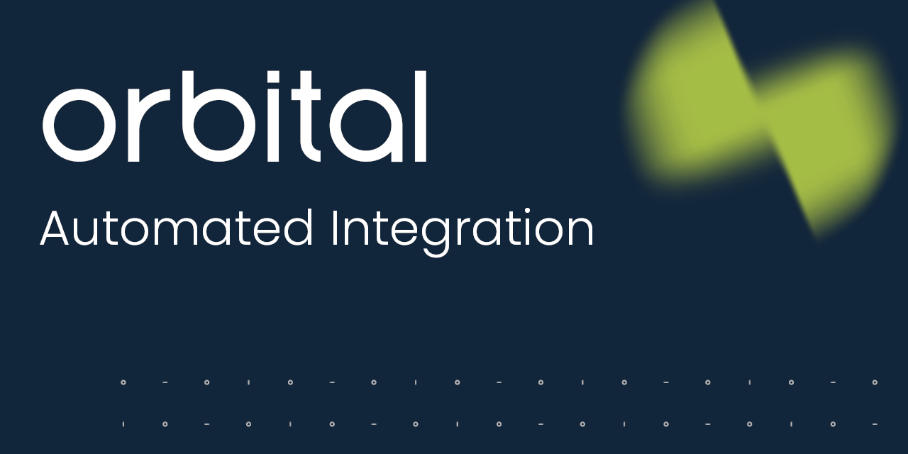
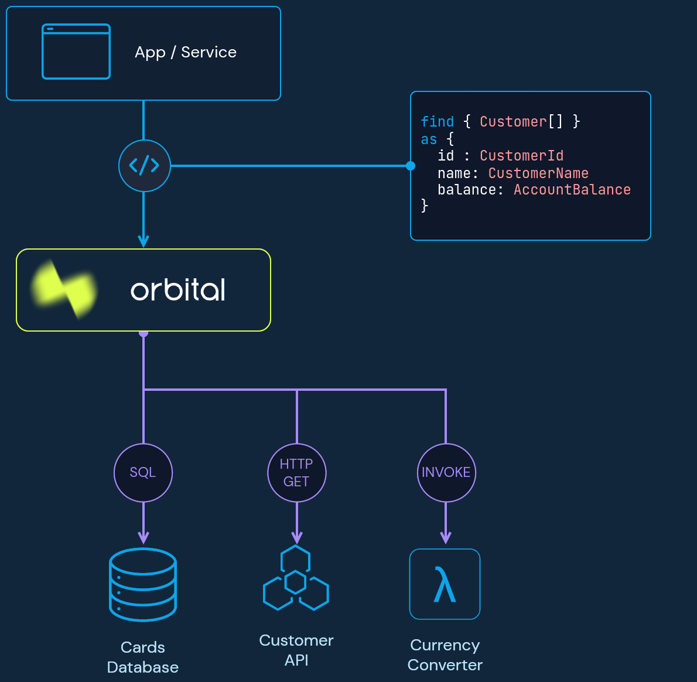

<div align="center">


[](https://hub.docker.com/r/orbitalhq/orbital)


</div>

<div align="center">

[](https://join.slack.com/t/orbitalapi/shared_invite/zt-697laanr-DHGXXak5slqsY9DqwrkzHg)
[](https://twitter.com/orbitalapi)
</div>

<div align="center">

[Website](https://orbitalhq.com)&nbsp;&nbsp;&nbsp;•&nbsp;&nbsp;&nbsp;
[Docs](https://orbitalhq.com/docs)&nbsp;&nbsp;&nbsp;•&nbsp;&nbsp;&nbsp;
[Blog](https://orbitalhq.com/blog)&nbsp;&nbsp;&nbsp;

</div>

Orbital automates integration between your data sources. 

It's decentralized by nature - there's no central mapping code defined.
Instead, teams add Taxi Metadata to their API specs, and push those to Orbital.

Orbital creates integration on-the-fly, without engineers having to write glue code.

Get started right now, by spinning up Orbital on your machine

```bash
docker run -p 9022:9022 orbitalhq/orbital
```

Then visit https://localhost:9022 in your browser.

## What is Orbital?
Orbital is a data gateway that automates the integration, transformation and discovery of data from data sources (API’s, databases, message brokers) across your enterprise.

Orbital integrates on-the-fly, automatically adjusting as your data sources change.

This is powered [Taxi](https://github.com/taxilang/taxilang) which adds rich [Semantic Metadata](https://orbitalhq.com/blog/2023-05-22-semantic-metadata-101) to your exist API specs, that describes how data relates between your data sources.



## Orbital Fly-by
Here's the main ideas of Orbital.

0. **Define some shared terms**

Create a [Taxi project](https://taxilang.org/taxi-cli/intro/):

```bash
taxi init
```

... and create some types...

```taxi
type MovieId inherits Int
type MovieTitle inherits String
// ... etc...
```


1. **Add metadata into your APIs**
   
```diff
# An extract of an OpenAPI spec:
components:
  schemas:
    Reviews:
      properties:
        id:
          type: string
+           # Embed semantic type metadata directly in OpenAPI
+           x-taxi-type:
+             name: MovieId

```   

(See the full docs for [OpenAPI](https://orbitalhq.com/docs/describing-data-sources/open-api), or other examples in [Protobuf](https://orbitalhq.com/docs/describing-data-sources/protobuf) and [Databases](https://orbitalhq.com/docs/describing-data-sources/databases))

2. **Publish your API specs to Orbital**

Tell Orbital about your API.  There's a few ways to do this.

 * [Get Orbital to poll your OpenAPI spec](https://orbitalhq.com/docs/describing-data-sources/open-api#publishing-open-api-specs-to-orbital)
 * [Read from a Git repository](https://orbitalhq.com/docs/connecting-data-sources/connecting-a-git-repo)
 * [Get your app to push directly to Orbital](https://orbitalhq.com/docs/connecting-data-sources/overview#pushing-updates-on-startup)

3. **Query for data**

Some example queries:
```taxi
// Find all the movies
find { Movie[] }

// Find a specific movie
find { Movie(MovieId == 1)}

// Join some other data
find { Movie[] } as {
    title: MovieTitle

    // Compose together APIs:
    // Where can I watch this?
    // This data comes from another REST API
    streamingServiceName: ServiceName
    price: PricePerMonth

    // Reviews - is the film any good?
    // This data comes from a third API
    reviewScore: ReviewScore
    reviewText: ReviewText
}
```

Orbital builds the integration for each query, and composes the APIs on demand.

Because it's powered by API specs:
 * There's no resolvers to maintain
 * Changes to API specs are automatically main

## Taxi
Under the hood, Orbital is a [TaxiQL](https://docs.taxilang.org/language-reference/querying-with-taxiql/) query server.

### Links
 * [Taxi](https://taxilang.org)
 * [TaxiQL](https://docs.taxilang.org/language-reference/querying-with-taxiql/) 


## FAQ's

### How does this relate to GraphQL?
Orbital gives you many of the benefits of GraphQL (API federation, custom response schemas), without having to move your tech stack over to GraphQl - instead working with your existing tech stack(s).

The key differences are:

#### Technology agnostic
GraphQL works great when you have GraphQL everywhere.  For everything else, you have to maintain a seperate shim layer to adapt your RESTful API / Database / Message Queue etc., to GraphQL.

Orbital and Taxi work by embedding metatdata in your existing API specs (OpenAPI / Protobuf / Avro / JsonSchema, etc), so that you don't need to change the underlying tech you're using.

#### Decentralized, spec-first federation
Orbital is built for decentralized teams, so that teams can ship changes independently, without having to build and maintain a seperate integration layer.

#### Resolver-free
Resolvers in GraphQL are integration code that has to be maintated - often by a dedicated GraphQL / middleware team.  This means teams that own services have to co-ordinate changes with a seperate integration team.

Instead, Orbital uses Taxi metadata embedded in API specs to define how data relates semantically.  From here, most integration can be created automatically.

### Does this mean all my systems have to have the same ID schemes and request/response models?
Nope. Taxi is designed to encourage teams to evolve independently, without sharing common models.  Instead, semantic scalars are used to compose models together automatically.

We talk more about that in [Why we built Taxi](https://orbitalhq.com/blog/2023-05-12-why-we-created-taxi)

## Doc links

 * [Semantic Integration 101](https://orbitalhq.com/blog/2023-05-22-semantic-metadata-101)
 * [Why we built Taxi](https://orbitalhq.com/blog/2023-05-12-why-we-created-taxi)
 * [Using Semantic Metadata to automate integration](https://orbitalhq.com/blog/2023-01-16-using-semantic-metadata)
 * [Querying for data](https://orbitalhq.com/docs/querying/writing-queries)
 * 
