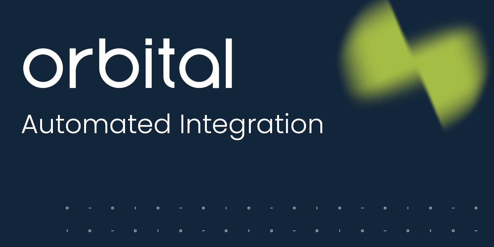
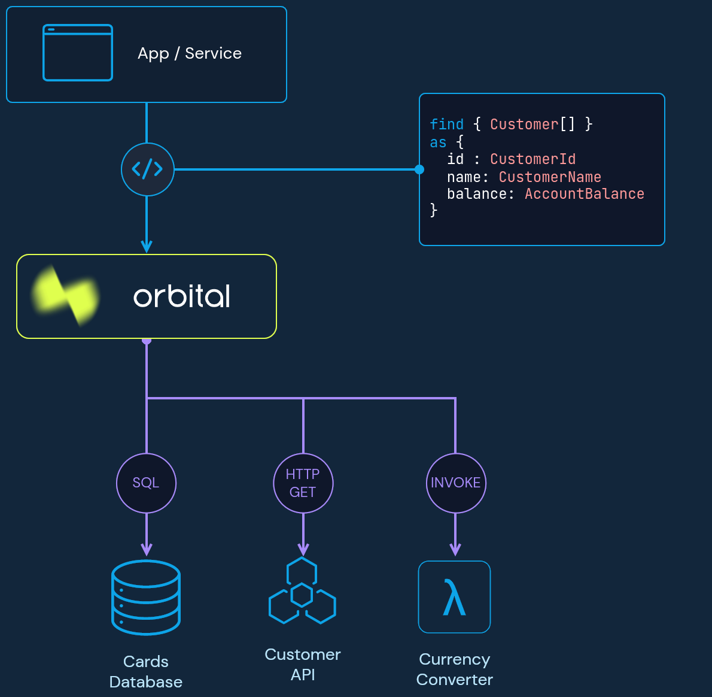

<div align="center">

[](https://hub.docker.com/r/orbitalhq/orbital)
[](https://gitlab.com/orbitalapi/orbital/-/releases)

</div>

<div align="center">

[](https://join.slack.com/t/orbitalapi/shared_invite/zt-697laanr-DHGXXak5slqsY9DqwrkzHg)
[](https://twitter.com/orbitalapi)

</div>

<div align="center">

[Website](https://orbitalhq.com)&nbsp;&nbsp;&nbsp;•&nbsp;&nbsp;&nbsp;
[Docs](https://orbitalhq.com/docs)&nbsp;&nbsp;&nbsp;•&nbsp;&nbsp;&nbsp;
[Blog](https://orbitalhq.com/blog)&nbsp;&nbsp;&nbsp;•&nbsp;&nbsp;&nbsp;
[Get in touch](https://join.slack.com/t/orbitalapi/shared_invite/zt-697laanr-DHGXXak5slqsY9DqwrkzHg)

</div>

**Orbital is a data gateway that automates integration across your APIs, databases, and message queues — no glue code required.**

Powered by [Taxi](https://taxilang.org), Orbital reads your existing API specs (enriched with semantic metadata) and composes services on-the-fly, adapting automatically as they change. Think of it as data federation — a single API for all your sources — without having to shift to GraphQL.



## Table of Contents

-  [Quick Start](#quick-start)
-  [Why Orbital?](#why-orbital)
-  [How does it work?](#how-does-it-work)
-  [Supported Connectors](#supported-connectors)
-  [Development](#development)
-  [Project Structure](#project-structure)
-  [Contributing](#contributing)
-  [FAQs](#faqs)
-  [Get in touch](#get-in-touch)

## Quick Start

Requires [Docker Desktop](https://www.docker.com/products/docker-desktop/) installed and running.

```bash
curl -sSL https://start.orbitalhq.com/start.sh | bash
```

The script will:
- Detect your OS and download the right Docker Compose file
- Start Orbital in the background
- Open **[http://localhost:9022](http://localhost:9022)** in your browser

## Why Orbital?

1. **No glue code:** Glue code that stitches APIs together is brittle, breaking whenever APIs change.
2. **API First:** Orbital is powered by your existing API specs, meaning less code to maintain
3. **Technology Agnostic:** Using gRPC? REST? SOAP? Kafka? Orbital doesn't care. It'll work with what you have
4. **Automatically Adapts:** As your API specs change, Orbital automatically adapts its integration flows, so consumers stay unaffected.

## How does it work?

Here's the main ideas of Orbital.

0. **Define some shared terms**

Create a [Taxi project](https://taxilang.org/docs):

```bash
taxi init
```

... and create some types...

```taxi
type MovieId inherits Int
type MovieTitle inherits String
// ... etc...
```

1. **Add metadata into your APIs**

```diff
# An extract of an OpenAPI spec:
components:
  schemas:
    Reviews:
      properties:
        id:
          type: string
+           # Embed semantic type metadata directly in OpenAPI
+           x-taxi-type:
+             name: MovieId

```

(See the full docs for [OpenAPI](https://orbitalhq.com/docs/describing-data-sources/open-api), or other examples in [Protobuf](https://orbitalhq.com/docs/describing-data-sources/protobuf) and [Databases](https://orbitalhq.com/docs/describing-data-sources/databases))

2. **Publish your API specs to Orbital**

Tell Orbital about your API. There's a few ways to do this.

-  [Get Orbital to poll your OpenAPI spec](https://orbitalhq.com/docs/describing-data-sources/open-api#publishing-open-api-specs-to-orbital)
-  [Connect your data sources](https://orbitalhq.com/docs/describing-data-sources/configuring-connections)

3. **Query for data**

Some example queries:

```taxi
// Find all the movies
find { Movie[] }

// Find a specific movie
find { Movie(MovieId == 1)}

// Join some other data
find { Movie[] } as {
    title: MovieTitle

    // Compose together APIs:
    // Where can I watch this?
    // This data comes from another REST API
    streamingServiceName: ServiceName
    price: PricePerMonth

    // Reviews - is the film any good?
    // This data comes from a third API
    reviewScore: ReviewScore
    reviewText: ReviewText
}
```

Orbital builds the integration for each query, and composes the APIs on demand.

Because it's powered by API specs:

-  There's no resolvers to maintain
-  Changes to API specs are automatically maintained

## Supported Connectors

| Category | Connectors |
|----------|------------|
| REST / HTTP | OpenAPI, REST |
| Messaging | Kafka, AWS SQS |
| Databases | JDBC (PostgreSQL, MySQL, and more) |
| RPC | gRPC, SOAP |
| Cloud | AWS, Azure |
| Schema formats | Protobuf, Avro, JSON Schema |

## Development

We actively develop on [GitLab](https://gitlab.com/vyne/vyne) and mirror to GitHub.

For building from source, Maven configuration, development workflow, commit conventions, and release instructions, see [DEVELOPING.md](./DEVELOPING.md).

**Note:** Orbital was previously called Vyne, so you'll see that name throughout the codebase.

## Project Structure

This is a multi-module Maven project with key modules:

-  **`schema-server-core`** - Core schema server functionality
-  **`taxiql-query-engine`** - TaxiQL query engine (all changes require tests)
-  **`station`** - Main shipped application
-  **`orbital-ui`** - User interface components
-  **`connectors/`** - Integration connectors (JDBC, Kafka, AWS, Azure, etc.)
-  **`schema-management`** - Schema management utilities
-  **`vyne-spring`** - Spring Framework integrations

See [project structure](./pom.xml) for the complete module list. For UI-specific conventions, see [orbital-ui/CLAUDE.md](./orbital-ui/CLAUDE.md).

## Contributing

We'd love to have you contribute! Please reach out on [Slack](https://join.slack.com/t/orbitalapi/shared_invite/zt-697laanr-DHGXXak5slqsY9DqwrkzHg) before opening a PR — since development is primarily on GitLab, a quick heads-up saves everyone time.

-  [Report a bug](https://github.com/orbitalapi/orbital/issues)
-  [Ask a question](https://github.com/orbitalapi/orbital/discussions)

## Taxi

Under the hood, Orbital is a [TaxiQL](https://taxilang.org/docs/taxiql/querying) query server.

### Further Reading

-  [Taxi language](https://taxilang.org)
-  [TaxiQL query language](https://taxilang.org/docs/taxiql/querying)
-  [Semantic Integration 101](https://orbitalhq.com/blog/2023-05-22-semantic-metadata-101)
-  [Why we built Taxi](https://orbitalhq.com/blog/2023-05-12-why-we-created-taxi)
-  [Using Semantic Metadata to automate integration](https://orbitalhq.com/blog/2023-01-16-using-semantic-metadata)
-  [Querying for data](https://orbitalhq.com/docs/querying/writing-queries)

## Get in touch

-  💬 [Connect with us on Slack](https://join.slack.com/t/orbitalapi/shared_invite/zt-697laanr-DHGXXak5slqsY9DqwrkzHg)
-  ☎️ [Book a call with the founders](https://calendar.google.com/calendar/u/0/appointments/schedules/AcZssZ0ihMtHrlqo-9Zu2041JizUvJv-rk8m2l88UtiTI14c-dtv8ZVrnd_p1dLnmMyFFKc1tAF2ig41)
-  🐞 [Report a bug](https://github.com/orbitalapi/orbital/issues)
-  🙋 [Ask a question](https://github.com/orbitalapi/orbital/discussions)

## FAQs

#### How does this relate to GraphQL?

Orbital gives you many of the benefits of GraphQL (API federation, custom response schemas), without having to move your tech stack over to GraphQL - instead working with your existing tech stack(s).

The key differences are:

##### Technology agnostic

GraphQL works great when you have GraphQL everywhere. For everything else, you have to maintain a separate shim layer to adapt your RESTful API / Database / Message Queue etc., to GraphQL.

Orbital and Taxi work by embedding metadata in your existing API specs (OpenAPI / Protobuf / Avro / JsonSchema, etc), so that you don't need to change the underlying tech you're using.

##### Decentralized, spec-first federation

Orbital is built for decentralized teams, so that teams can ship changes independently, without having to build and maintain a separate integration layer.

##### Resolver-free

Resolvers in GraphQL are integration code that has to be maintained - often by a dedicated GraphQL / middleware team. This means teams that own services have to co-ordinate changes with a separate integration team.

Instead, Orbital uses Taxi metadata embedded in API specs to define how data relates semantically. From here, most integration can be created automatically.

#### Does this mean all my systems have to have the same ID schemes and request/response models?

Nope. Taxi is designed to encourage teams to evolve independently, without sharing common models. Instead, semantic scalars are used to compose models together automatically.

We talk more about that in [Why we built Taxi](https://orbitalhq.com/blog/2023-05-12-why-we-created-taxi)

#### I can't embed tags in my API specs - does that stop me using Orbital?

Nope. There's plenty of options if you can't edit API specs directly (or don't have them) - such as working with a clone of the spec,
or implementing the spec from scratch in Taxi (it's really quick)

