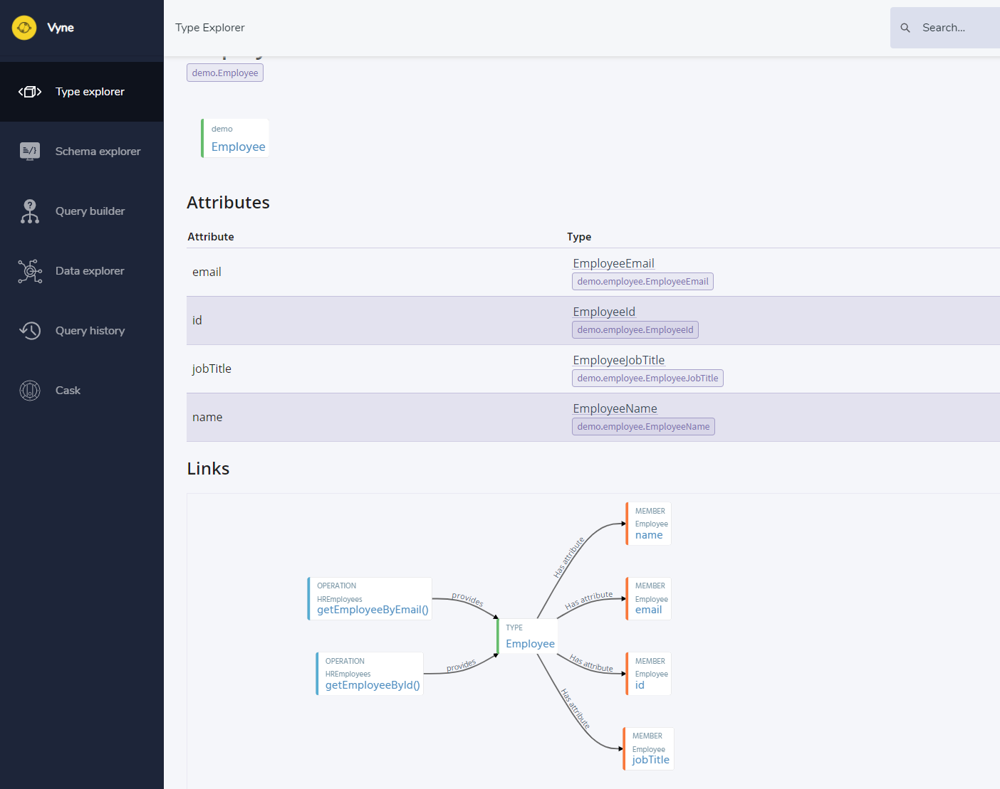
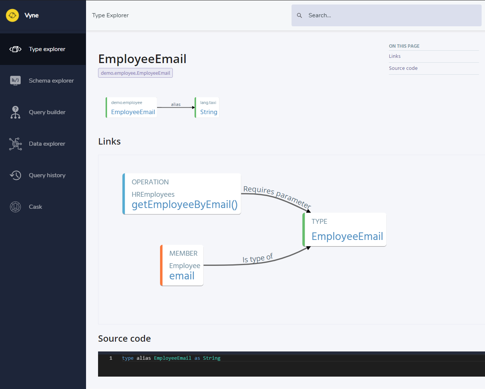
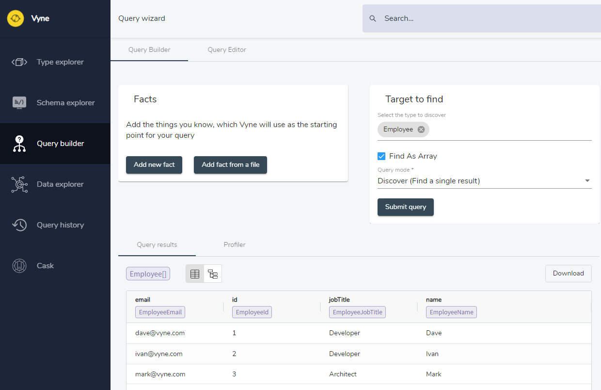
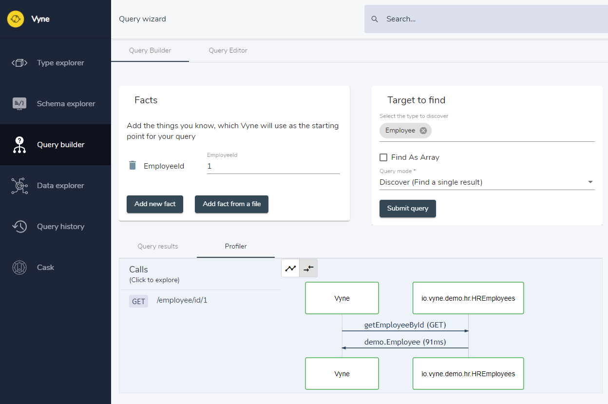

# Hello World

## Getting started with Vyne

Once we've [set-up Vyne locally](setting-up-vyne-locally.md), we can start building services that can leverage Vyne's automated integration. 

We are going to be building a Spring application based on an HR system. We'll keep the demo app itself really simple, and focus on the Vyne integration.  

We will be exploring how Vyne dynamically calls services based on what it knows \(input\) and what we want to discover \(output\). Vyne has some fairly advanced features, but we'll keep this demo focussed on a simple service-to-service integration.

## Configuring Maven pom.xml

### Dependencies

Our project will need the following dependencies: 

```markup
<parent>
    <groupId>org.springframework.boot</groupId>
    <artifactId>spring-boot-starter-parent</artifactId>
    <version>2.3.1.RELEASE</version>
    <relativePath/>
</parent>
<groupId>com.vyne.demo.hr</groupId>
<artifactId>hr-demo</artifactId>
<version>0.0.1-SNAPSHOT</version>
<name>hr-demo</name>
<description>Basic Demo to integrate Vyne with our HR App</description>

<properties>
    <java.version>11</java.version>
    <kotlin.version>1.3.50</kotlin.version>
    <maven.compiler.target>1.8</maven.compiler.target>
    <maven.compiler.source>1.8</maven.compiler.source>
    <taxi.version>0.10.0</taxi.version>
    <vyne.version>0.12.2</vyne.version>
    <spring.cloud.netflix.version>2.2.2.RELEASE</spring.cloud.netflix.version>
</properties>

<dependencies>
        <dependency>
            <groupId>org.springframework.boot</groupId>
            <artifactId>spring-boot-starter-web</artifactId>
        </dependency>
        <dependency>
            <groupId>org.jetbrains.kotlin</groupId>
            <artifactId>kotlin-stdlib-jdk8</artifactId>
        </dependency>
        <dependency>
            <groupId>io.vyne</groupId>
            <artifactId>vyne-spring</artifactId>
            <version>${vyne.version}</version>
        </dependency>
        <dependency>
            <groupId>lang.taxi</groupId>
            <artifactId>taxi-annotation-processor</artifactId>
            <version>${taxi.version}</version>
        </dependency>
        <dependency>
            <groupId>org.springframework.cloud</groupId>
            <artifactId>spring-cloud-starter-netflix-eureka-client</artifactId>
            <version>${spring.cloud.netflix.version}</version>
        </dependency>
    </dependencies>
```

In this example we use [Eureka for service discovery](https://spring.io/guides/gs/service-registration-and-discovery/).  \(hence the dependency on `spring-cloud-starter-netflix-erueka-client`\). 

Service discovery isn't directly related to Vyne, but it's a necessary component in the world of microservices, and Vyne uses service discovery to find the microservices that it calls.  Given it's such a core component of microservices, Vyne comes bundled with an optional built-in service discovery component called "Eureka", which we'll be using throughout this demo.

### Repositories

Vyne and Taxi are not available in Maven Central, so we need to add the following repositories:

```markup
<repositories>
    <repository>
        <id>bintray-taxi-lang-releases</id>
        <name>bintray</name>
        <url>https://dl.bintray.com/taxi-lang/releases</url>
    </repository>
    <repository>
        <id>vyne-releases</id>
        <url>http://repo.vyne.co/release</url>
    </repository>
</repositories>
```

### Build

Our demo project uses kotlin, so we going to use kotlin-maven-plugin to build it and to generate taxi types. Your source directory may differ depending on your structure. For example, it might be `src/main/java` instead of `src/main/kotlin`.


Kotlin isn't mandatory for Vyne or Spring boot, we just love it.  We've provided code samples in both Kotlin and Java throughout.


```markup
<build>
    <sourceDirectory>${project.basedir}/src/main/kotlin</sourceDirectory>
    <testSourceDirectory>${project.basedir}/src/test/kotlin</testSourceDirectory>
    <plugins>
        <plugin>
            <artifactId>kotlin-maven-plugin</artifactId>
            <groupId>org.jetbrains.kotlin</groupId>
            <version>${kotlin.version}</version>
            <executions>
                <execution>
                    <id>kapt</id>
                    <goals>
                        <goal>kapt</goal>
                    </goals>
                    <configuration>
                        <sourceDirs>
                            <sourceDir>src/main/kotlin</sourceDir>
                        </sourceDirs>
                    </configuration>
                </execution>
                <execution>
                    <id>compile</id>
                    <phase>process-sources</phase>
                    <goals>
                        <goal>compile</goal>
                    </goals>
                    <configuration>
                        <sourceDirs>
                            <sourceDir>src/main/kotlin</sourceDir>
                        </sourceDirs>
                    </configuration>
                </execution>

                <execution>
                    <id>test-compile</id>
                    <goals>
                        <goal>test-compile</goal>
                    </goals>
                    <configuration>
                        <sourceDirs>
                            <sourceDir>src/test/kotlin</sourceDir>
                        </sourceDirs>
                    </configuration>
                </execution>
            </executions>
        </plugin>
    </plugins>
</build>
```

## Our demo application

### Main class

This is a basic Spring Boot main class for our HR Demo.



```kotlin
@SpringBootApplication
open class HrApplication{
    companion object {
        @JvmStatic
        fun main(args: Array<String>) {
            runApplication<HrApplication>(*args)
        }
    }
}
```



```java
@SpringBootApplication
public class HrApplication {
    public static void main(String[] args) {
        SpringApplication.run(HrApplication.class, args);
    }
}
```



### Defining our domain model



```kotlin
typealias EmployeeId = Int
typealias EmployeeName = String
typealias EmployeeEmail = String
typealias EmployeeJobTitle = String

data class Employee(
        val id: EmployeeId,
        val name: EmployeeName,
        val email: EmployeeEmail,
        val jobTitle: EmployeeJobTitle
)
```



```java
public class Employee {

    private final Integer employeeId;
    private final String employeeName;
    private final String employeeEmail;
    private final String employeeJobTitle;

    public Employee(Integer employeeId, String employeeName, String employeeEmail, String employeeJobTitle) {
        this.employeeId = employeeId;
        this.employeeName = employeeName;
        this.employeeEmail = employeeEmail;
        this.employeeJobTitle = employeeJobTitle;
    }
}
```




We have not shown the getters in the above java code to remove noise, but they are required.


### Generating a schema

Now it's time to build a schema which we can later publish to Vyne.  We'll configure our application to publish a schema to Vyne on startup which describes the data our service exposes, and what information it's services need.

Vyne uses a schema language called Taxi. Taxi is similar to Swagger / RAML, but more advanced. Taxi is a standalone, open source project.  You can find more information about Taxi [here](https://docs.taxilang.org).

There are lots of ways to create your Taxi schemas, in our demo we are choosing to generate our Taxi schema from our code, by adding annotations to our service and model.   Alternatively, you could choose to bundle a hand-written schema in the project, which is covered in a later post.

In order to add Taxi annotations, we need to add a dependency on the Taxi annotation processor, and wire it into our build.  Add the following snippet into the  `pom.xml` file:  



```markup
<annotationProcessorPaths>
    <annotationProcessorPath>
        <groupId>lang.taxi</groupId>
        <artifactId>taxi-annotation-processor</artifactId>
        <version>${taxi.version}</version>
    </annotationProcessorPath>
</annotationProcessorPaths>
```



```markup
<build>
    <sourceDirectory>${project.basedir}/src/main/kotlin</sourceDirectory>
    <testSourceDirectory>${project.basedir}/src/test/kotlin</testSourceDirectory>
    <plugins>
        <plugin>
            <artifactId>kotlin-maven-plugin</artifactId>
            <groupId>org.jetbrains.kotlin</groupId>
            <version>${kotlin.version}</version>
            <executions>
                <execution>
                    <id>kapt</id>
                    <goals>
                        <goal>kapt</goal>
                    </goals>
                    <configuration>
                        <sourceDirs>
                            <sourceDir>src/main/kotlin</sourceDir>
                        </sourceDirs>
                        <annotationProcessorPaths>
                            <annotationProcessorPath>
                                <groupId>lang.taxi</groupId>
                                <artifactId>taxi-annotation-processor</artifactId>
                                <version>${taxi.version}</version>
                            </annotationProcessorPath>
                        </annotationProcessorPaths>
                    </configuration>
                </execution>
                <execution>
                    <id>compile</id>
                    <phase>process-sources</phase>
                    <goals>
                        <goal>compile</goal>
                    </goals>
                    <configuration>
                        <sourceDirs>
                            <sourceDir>src/main/kotlin</sourceDir>
                        </sourceDirs>
                    </configuration>
                </execution>
                <execution>
                    <id>test-compile</id>
                    <goals>
                        <goal>test-compile</goal>
                    </goals>
                    <configuration>
                        <sourceDirs>
                            <sourceDir>src/test/kotlin</sourceDir>
                        </sourceDirs>
                    </configuration>
                </execution>
            </executions>
        </plugin>
    </plugins>
</build>
```



### Adding Taxi annotations

Once we have refreshed Maven, we can add our Taxi annotations.  

Taxi uses the idea of semantic types in place of primitives.  \(i.e. instead of everything being a `String` or `Number`, we use more descriptive types, like `EmployeeName` and `EmployeeEmail`.  The actual names for the type can be anything we choose, but these become important when we're asking for data later.


We have not shown the Getters here to reduce noise, but standard practices apply. The Getters are necessary in the controller which you will see later on.




```kotlin
@DataType("demo.employee.EmployeeId")
typealias EmployeeId = Int
@DataType("demo.employee.EmployeeName")
typealias EmployeeName = String
@DataType("demo.employee.EmployeeEmail")
typealias EmployeeEmail = String
@DataType("demo.employee.EmployeeJobTitle")
typealias EmployeeJobTitle = String

@DataType("demo.Employee")
data class Employee(
        val id: EmployeeId,
        val name: EmployeeName,
        val email: EmployeeEmail,
        val jobTitle: EmployeeJobTitle
)
```



```java
@DataType("demo.Employee")
public class Employee {

    @DataType("demo.employee.EmployeeId")
    private final Integer employeeId;
    @DataType("demo.employee.EmployeeName")
    private final String employeeName;
    @DataType("demo.employee.EmployeeEmail")
    private final String employeeEmail;
    @DataType("demo.employee.EmployeeJobTitle")
    private final String employeeJobTitle;

    public Employee(Integer employeeId, String employeeName, String employeeEmail, String employeeJobTitle) {
        this.employeeId = employeeId;
        this.employeeName = employeeName;
        this.employeeEmail = employeeEmail;
        this.employeeJobTitle = employeeJobTitle;
    }
}
```



Now, run a maven compile, which will let the annotation processor kick in.

`mvn compile`

#### What just happened?

The Kotlin annotation processor plugin has generated some additional metadata to allow us to use `@DataType` annotations on kotlin `typealias` types.  This is a workaround for a [Kotlin limitation](https://youtrack.jetbrains.com/issue/KT-21489).  

So, the `taxi-annotation-processor` we wired in earlier generates additional metadata at compile time that we can wire in at runtime.

Finally, let's configure our application to publish the taxi schema on startup.


Vyne uses Taxi to describe our data in our services. There are lots of ways to create your Taxi schemas, in our demo we are choosing to generate our Taxi schema from our code. In order to support Taxi generation on primitive types Taxi has an annotation processor that we can hook into our build.

In order to leverage this Taxi metadata at runtime, we need to call `TypeAliasRegistry.register()`




```kotlin
@SpringBootApplication
@EnableEurekaClient
@VyneSchemaPublisher(publicationMethod = SchemaPublicationMethod.EUREKA)
open class HrApplication{
    companion object {
        @JvmStatic
        fun main(args: Array<String>) {
            TypeAliasRegistry.register(TypeAliases::class.java)
            runApplication<HrApplication>(*args)
        }
    }
}
```



```java
@SpringBootApplication
@EnableEurekaClient
@VyneSchemaPublisher(publicationMethod = SchemaPublicationMethod.DISTRIBUTED)
public class HrApplication {
    public static void main(String[] args) {
        SpringApplication.run(HrApplication.class, args);
    }
}
```



Here, we added Spring support for Vyne using the `@VyneSchemaPublisher` annotation, and we wired up the TypeAlias metadata from our previous step with `TypeAlliasRegistry.register( ... )`.

### Spring Boot configuration

In `application.yml` __we will need to add: 

```yaml
spring:
  application:
    name: vyne-hr-demo

server:
  port: 9402

# This configures a Eureka client which we are using in our demo
# for service discovery
# Vyne comes with the option of running Eureka inside of it, which
# is useful for POC's and demos but it's not recommended to take to
# production. The following config sets up Eureka.
eureka:
  uri: http://127.0.0.1:9022
  client:
    registryFetchIntervalSeconds: 1
    initialInstanceInfoReplicationIntervalSeconds: 5
    serviceUrl:
      defaultZone: ${eureka.uri}/eureka/
  instance:
    leaseRenewalIntervalInSeconds: 2
    leaseExpirationDurationInSeconds: 5
    # this is enabling vyne running in docker to call service running in your IDE
    preferIpAddress: true

# This configures how our application will publish it's schema to Vyne
vyne:
  schema:
    # Schemas need a unique name. We will use the name of our application
    name: ${spring.application.name}
    version: 0.1.0 # Version of the app exposed to Vyne
```

## Exposing rest endpoints

Now that we have created our types, we can expose our endpoints:



```kotlin
@RestController
@Service
class HREmployees {

    private var employees = listOf(
            Employee(1, "Dave", "dave@vyne.com", "Developer"),
            Employee(2, "Ivan", "ivan@vyne.com", "Developer"),
            Employee(3, "Mark", "mark@vyne.com", "Architect")
    )

    @Operation
    @GetMapping("/employees")
    fun getEmployees(): List<Employee> {
        return employees
    }

    @Operation
    @GetMapping("/employee/id/{id}")
    fun getEmployeeById(@PathVariable("id") id: EmployeeId): Employee {
        return employees.first { it.id == id }
    }

    @Operation
    @GetMapping("/employee/email/{email}")
    fun getEmployeeByEmail(@PathVariable("email") email: EmployeeEmail): Employee {
        return employees.first { it.email == email }
    }

}
```



```java
@RestController
@Service
class HREmployees {

    private final List<Employee> employees = new ArrayList<>();

    public HREmployees() {
        employees.add(new Employee(1, "Dave", "dave@vyne.com", "Developer"));
        employees.add(new Employee(2, "Ivan", "ivan@vyne.com", "Developer"));
        employees.add(new Employee(3, "Mark", "mark@vyne.com", "Architect"));
    }

    @Operation
    @GetMapping("/employees")
    List<Employee> getEmployees() {
        return employees;
    }

    @Operation
    @GetMapping("/employees/id/{id}")
    Optional<Employee> getEmployeeById(@PathVariable("id") int id) {
        return employees.stream().filter(employee -> employee.getEmployeeId().equals(id)).findFirst();
    }

    @Operation
    @GetMapping("/employees/email/{email}")
    Optional<Employee> getEmployeeByEmail(@PathVariable("email") String email) {
        return employees.stream().filter(employee -> employee.getEmployeeEmail().equals(email)).findFirst();
    }

}
```



`@Service` and `@Operation` are the only Vyne specific code above. These annotations allow our service and our endpoints to be exposed to Vyne.


Be sure that the `@Service` annotation belongs to the taxi `lang.taxi.annotations` package, and not Spring's `@Service` annotation.


## Starting Vyne in Docker

For this step to work we need a running Vyne instance. If you don't have it please follow instructions of how [set-up Vyne locally](setting-up-vyne-locally.md).

To launch Vyne, run:

```text
docker run -p 9022:9022 --env PROFILE=embedded-discovery,inmemory-query-history,eureka-schema vyneco/vyne
```

Now, run your app and it will have successfully joined the Vyne cluster!

## Exploring our data using the Vyne UI

Now that we have a service exposed to Vyne, we're going to explore some of the data it's publishing through Vyne's query service.

First, let's take a look around Vyne's UI:

### Vyne schema-explorer

Vyne schema-explorer shows all the services discover-able through Vyne. 

When you navigate to [http://localhost:9022/schema-explorer](http://localhost:9022/schema-explorer) you should see:

* vyne-hr-demo
* version 1.0
* all our Taxi Types
* three REST endpoints


### Type Explorer

The Type Explorer shows us the types we registered in our Taxi schemas, and how everything hangs together. It allows us to view and search for all deployed Types and Services.


If we click into one of the types, in the case we will click into Employee, there are a number of things available to us. Lets take a look:



As we can see, the type explorer provides us with information on the employee. We are able to see which methods return an employee, as well as the attributes an employee has. 

This provides us a visualisation of the full data mesh that Vyne is building, based on the schemas that services are publishing.  As more services come online and publish their schemas, new connections are added, and the graph gets richer.

Lets look at one more example:



Above we can see what the type of an employee email is, as well as functions it's used it. We can also see how the `EmployeeEmail` is constructed in the source code. 

### Querying

Vyne offers couple of ways of querying, for a full list refer to [Query Api](../running-a-local-taxonomy-editor-environment/query-api.md) section.

#### Querying all Employees

Vyne UI offers an easy way for testing your services. To query for all the employees:

* navigate to [http://localhost:9022/query-wizard](http://localhost:9022/query-wizard)
* select type to discover 'demo.Employee'
* select 'Find as array' checkbox - this allows us to bring back all employees
* click Submit Query



In the result you can see all the employees defined by your service, the employees endpoint and how long it took to call that endpoint.

#### Looking up Employee by Id

Now that we've seen Vyne discover all the employees, let's try bring back only one employee based on their Id. Once we have done this, we can look in the profiler tab to see what route Vyne took to get us this data.

Navigate to [http://localhost:9022/query-wizard](http://localhost:9022/query-wizard)

* click 'Add new fact' button
* add Id value '1'
* select type to discover 'demo.Employee'
* click 'Submit query' button


Inside the Profiler tab below we can see the route that Vyne took. If we were to change some code in the background, Vyne would still produce our data for us, it would just take a different route. This can all be monitored through this view.



You can see the path taken under the Calls header. Vyne made a `GET` request on `/employee/id/{id}` to retrieve our data.

## Summary

Congratulations!  You made it!

In this tutorial we've covered:

* Building a vanilla Spring Boot microservice
* Generating a Taxi schema from our code and publishing it to Vyne
* Exploring our schema within Vyne's UI
* Executing simple queries from Vyne's UI


