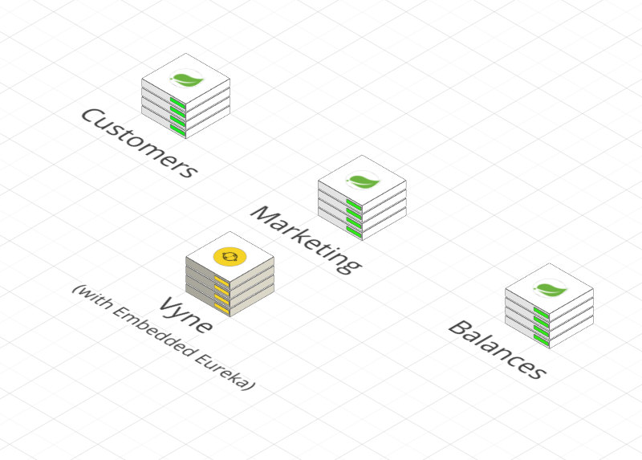
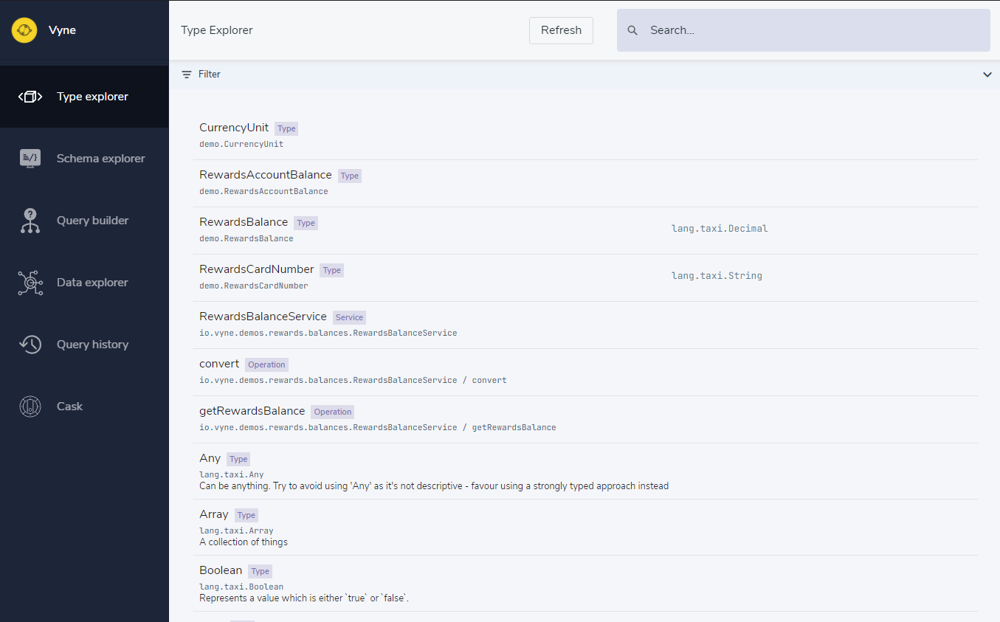

# Walkthrough - Adaptive Integration

## Overview

In this guide, we're working with our imaginary marketing department, and using Vyne to get data about balances of customer rewards card.


We'll build a deployment with three services, then use Vyne to query data from them.  Our services are built in Kotlin and Java, using Spring Boot.

We'll see how Vyne enables us to discover & fetch data declaratively, using Vyne's API library, without having to write any integration code.


This walkthrough doesn't have the full code for the three services - we just highlight the parts that are interesting.  The full source for this demo is available on Gitlab, [here](https://gitlab.com/vyne/demos/tree/master/rewards).


## Before we begin

It's assumed that you've gotten the Vyne query server up & running, and taken a walk through the basic Hello World.  If not, now's a good time to do so.



## Our model & topology

Our model is pretty basic - 3 classes, from 3 different services. Our task is to get the account balance for a customer, using their email address.

Here are our services:

<table>
  <thead>
    <tr>
      <th style="text-align:left">Service</th>
      <th style="text-align:left">Function</th>
    </tr>
  </thead>
  <tbody>
    <tr>
      <td style="text-align:left">Customers Service</td>
      <td style="text-align:left">Holds a list of customers, and their ID&apos;s</td>
    </tr>
    <tr>
      <td style="text-align:left">Marketing Service</td>
      <td style="text-align:left">
        <p>Holds marketing information about customers, including their rewards card
          #.</p>
        <p>However, because balances are transactional, they&apos;re not stored here.</p>
      </td>
    </tr>
    <tr>
      <td style="text-align:left">Rewards Balances</td>
      <td style="text-align:left">Our transactional service, which looks after transactions on rewards cards.
        This service contains the balance information.</td>
    </tr>
  </tbody>
</table>



## Defining the services

The first service we'll define is the Customer service - which simply takes a `CustomerEmail` and returns a `Customer`.  Here's the relevant extract:



```kotlin
@DataType("demo.CustomerId")
typealias CustomerId = Int
@DataType("demo.CustomerEmailAddress")
typealias CustomerEmailAddress = String
@DataType("demo.CustomerName")
typealias CustomerName = String
@DataType("demo.Customer")
data class Customer(
        val id: CustomerId,
        val name: CustomerName,
        val emailAddress: CustomerEmailAddress
)

@Operation
@GetMapping("/customers/email/{email}")
fun getCustomerByEmail(@PathVariable("email") email: CustomerEmailAddress) =
    customers.first { it.email == email }
```



```java
@DataType("demo.Customer")
public class Customer {

    @DataType("demos.CustomerId")
    private final Integer id;
    @DataType("demos.CustomerName")
    private final String name;
    @DataType("demos.CustomerEmailAddress")
    private final String emailAddress;

    public Customer(Integer id, String name, String emailAddress) {
        this.id = id;
        this.name = name;
        this.emailAddress = emailAddress;
    }
}

@RestController
@Service
class Customers {

    @Operation
    @GetMapping("customers/email/{email}")
    Optional<Customer> getCustomerByEmail(@PathVariable("email") String email) {
        // Not shown
    }
}
```



There's a few points of interest there in the Kotlin code - let's drill down:

```kotlin
fun getCustomerByEmail(email: CustomerEmailAddress)
```

Note that we've declared the input as `CustomerEmailAddress`, rather than just `String`.  A typealias marks that `CustomerEmailAddress = String`.  However, to Vyne, these distinctions are important -- it's these aliases that Vyne uses for building connections.

By using Kotlin' type aliases, we're able to keep the code cleaner too - adding the `@DataType` annotation to the typealias means we only have to declare it once.  Vyne will look up the underlying data type whenever it sees the alias used.



Here are the three services in full - they all follow a similar pattern. There are both Kotlin and Java examples below:



```kotlin
@RestController
@Service
class CustomerService {

    private val customers = listOf(
            Customer(1, "Jimmy", "jimmy@demo.com"),
            Customer(2, "Peter", "peter@demo.com"),
            Customer(3, "Steve", "steve@demo.com")
    )

    @Operation
    @GetMapping("/customers/{id}")
    fun getCustomer(@PathVariable("id") customerId: CustomerId): Customer {
        return customers.first { it.id == customerId }
    }

    @Operation
    @GetMapping("/customers/email/{email}")
    fun getCustomerByEmail(@PathVariable("email") email: CustomerEmailAddress): Customer {
        return customers.first { it.email == email }
    }

}

@DataType("demo.CustomerId")
typealias CustomerId = Int
@DataType("demo.CustomerEmailAddress")
typealias CustomerEmailAddress = String
@DataType("demo.CustomerName")
typealias CustomerName = String

@DataType("demo.Customer")
data class Customer(
        val id: CustomerId,
        val name: CustomerName,
        val email: CustomerEmailAddress
)
```



```kotlin
@RestController
@Service
class MarketingService {

    val customerRecords = listOf(
            CustomerMarketingRecord(1, "4005-2003-2330-1002"),
            CustomerMarketingRecord(2, "4002-0230-9979-2004"),
            CustomerMarketingRecord(3, "4974-2847-2994-2003")
    ).associateBy { it.id }

    @GetMapping("/marketing/{customerId}")
    @Operation
    fun getMarketingDetailsForCustomer(@PathVariable("customerId") customerId: CustomerId): CustomerMarketingRecord {
        return customerRecords[customerId]
                ?: throw error("No customer marketing record found for customer $customerId")
    }
}

@DataType("demo.CustomerId")
typealias CustomerId = Int
@DataType("demo.RewardsCardNumber")
typealias RewardsCardNumber = String
@DataType("demo.CustomerMarketingRecord")
data class CustomerMarketingRecord(
        val id: CustomerId,
        val rewardsCardNumber: RewardsCardNumber
)
```



```kotlin
@RestController
@Service
class RewardsBalanceService {

    val balances = listOf(
            RewardsAccountBalance("4005-2003-2330-1002", BigDecimal("2300")),
            RewardsAccountBalance("4002-0230-9979-2004", BigDecimal("2050")),
            RewardsAccountBalance("4974-2847-2994-2003", BigDecimal("10020"))
    ).associateBy { it.cardNumber }

    @GetMapping("/balances/{cardNumber}")
    @Operation
    fun getRewardsBalance(@PathVariable("cardNumber") cardNumber: RewardsCardNumber): RewardsAccountBalance {
        return balances[cardNumber] ?: throw error("No account with card number $cardNumber found")
    }
}

@DataType("demo.RewardsCardNumber")
typealias RewardsCardNumber = String
@DataType("demo.RewardsBalance")
typealias RewardsBalance = BigDecimal
@DataType("demo.RewardsAccountBalance")
data class RewardsAccountBalance(
        val cardNumber: RewardsCardNumber,
        val balance: RewardsBalance
)
```





```java
@RestController
@Service
public class CustomerService {

    private final List<Customer> customers = new ArrayList<>();

    public CustomerService() {
        customers.add(new Customer(1, "Jimmy", "jimmy@demo.com"));
        customers.add(new Customer(2, "Peter", "peter@demo.com"));
        customers.add(new Customer(3, "Steve", "steve@demo.com"));
    }

    @Operation
    @GetMapping("customers/email/{email}")
    Optional<Customer> getCustomerByEmail(@PathVariable("email") String email) {
        return customers.stream().filter(customer -> customer.getEmailAddress().equals(email)).findFirst();
    }

    @Operation
    @GetMapping("customers/{id}")
    Optional<Customer> getCustomer(@PathVariable("id") Integer id) {
        return customers.stream().filter(customer -> customer.getId().equals(id)).findFirst();
    }
}

@DataType("demo.Customer")
public class Customer {

    @DataType("demos.CustomerId")
    private final Integer id;
    @DataType("demos.CustomerName")
    private final String name;
    @DataType("demos.CustomerEmailAddress")
    private final String emailAddress;

    public Customer(Integer id, String name, String emailAddress) {
        this.id = id;
        this.name = name;
        this.emailAddress = emailAddress;
    }
}
```



```java
@RestController
@Service
public class MarketingService {

    private final List<CustomerMarketingRecord> customerRecords = new ArrayList<>();

    public MarketingService() {
        customerRecords.add(new CustomerMarketingRecord(1, "4005-2003-2330-1002"));
        customerRecords.add(new CustomerMarketingRecord(2, "4002-0230-9979-2004"));
        customerRecords.add(new CustomerMarketingRecord(3, "4974-2847-2994-2003"));
    }

    @Operation
    @GetMapping("marketing/{customerId}")
    Optional<CustomerMarketingRecord> getMarketingDetailsForCustomer(@PathVariable("customerId") Integer customerId) {
        return customerRecords.stream().filter(records -> records.getCustomerId().equals(customerId)).findFirst();
    }
}

@DataType("demo.CustomerMarketingRecord")
public class CustomerMarketingRecord {

    @DataType("demo.CustomerId")
    private final Integer customerId;
    @DataType("demo.RewardsCardNumber")
    private final String rewardsCardNumber;

    public CustomerMarketingRecord(Integer customerId, String rewardsCardNumber) {
        this.customerId = customerId;
        this.rewardsCardNumber = rewardsCardNumber;
    }

    public Integer getCustomerId() {
        return customerId;
    }
}
```



```java
@RestController
@Service
public class RewardsBalanceService {

    private final List<RewardsAccountBalance> balances = new ArrayList<>();

    public RewardsBalanceService() {
        balances.add(new RewardsAccountBalance("4005-2003-2330-1002", BigDecimal.valueOf(2300)));
        balances.add(new RewardsAccountBalance("4002-0230-9979-2004", BigDecimal.valueOf(2050)));
        balances.add(new RewardsAccountBalance("4974-2847-2994-2003", BigDecimal.valueOf(10020)));
    }

    @Operation
    @GetMapping("/balances/{cardNumber}")
    Optional<RewardsAccountBalance> getRewardsBalance(@PathVariable("cardNumber") String cardNumber) {
        return balances.stream().filter(balances -> balances.getRewardsCardNumber().equals(cardNumber)).findFirst();
    }
}

@DataType("demo.RewardsAccountBalance")
public class RewardsAccountBalance {

    @DataType("demo.RewardsCardNumber")
    private final String rewardsCardNumber;
    @DataType("demo.RewardsBalance")
    private final BigDecimal rewardsBalance;

    public RewardsAccountBalance(String rewardsCardNumber, BigDecimal rewardsBalance) {
        this.rewardsCardNumber = rewardsCardNumber;
        this.rewardsBalance = rewardsBalance;
    }

    public String getRewardsCardNumber() {
        return rewardsCardNumber;
    }
}
```




Be sure to use the full code from the[ Gitlab repo](https://gitlab.com/vyne/demos/tree/master/rewards) in order to create your services.  We're only showing highlights here.


### Working with Type Aliases

Kotlin's type aliases are a great fit for Vyne's approach to microtypes, and Taxi has first-class support for them.

However, in order to get them working, there's a little additional setup we need to do.

#### Declaring Typealias's

We need to leverage Taxi's annotation processor in order to capture the annotations present on the TypeAlias.   We need to add the annotation processor to the `kapt` section of our `kotlin-maven-plugin` in the build:

```markup
<plugin>
    <artifactId>kotlin-maven-plugin</artifactId>
    <groupId>org.jetbrains.kotlin</groupId>
    <version>${kotlin.version}</version>
    <executions>
        <execution>
            <id>kapt</id>
            <goals>
                <goal>kapt</goal>
            </goals>
            <configuration>
                <annotationProcessorPaths>
                    <annotationProcessorPath>
                        <groupId>lang.taxi</groupId>
                        <artifactId>taxi-annotation-processor</artifactId>
                        <version>${taxi.version}</version>
                    </annotationProcessorPath>
                </annotationProcessorPaths>
            </configuration>
        </execution>
    </executions>
</plugin>
```

When this runs, a class called `TypeAliases` is created in our package.

#### Consuming / Registering TypeAliases

At runtime, we need to register the captured metadata, so that Vyne and Taxi can leverage it.  

This is a simple 1-line addition in the start of our application's main method. This is only applicable in Kotlin,  the Java code will remain the same:



```kotlin
open class RewardsBalanceApp {
    companion object {
        @JvmStatic
        fun main(args: Array<String>) {
            // Add this line below
            TypeAliasRegistry.register(TypeAliases::class.java)
            runApplication<RewardsBalanceApp>(*args)
        }
    }
}
```



```java
public class RewardsBalanceApp {
    public static void main(String[] args) {
        SpringApplication.run(RewardsBalanceApp.class, args);
    }
}
```




Note:  We're working on making this more seamless, especially when working in an app with `@EnableVyne` annotations.  Take a look at [this issue](https://gitlab.com/vyne/vyne/issues/20) to track progress.


Read more about registering type aliases in the [Taxi documentation](https://docs.taxilang.org/generating-taxi-from-source#taxi-annotation-processor).

## Querying through Vyne's query server

Let's start the services up, and run a query.  After launching your services, head to [http://localhost:9022](http://localhost:9022), and you should see our types present in the explorer:



As we did in our Hello World walkthrough, you might want to explore some of the types.

Let's run a query - remember, our task is to find the balance of a rewards card for a customer, so lets start with a `CustomerEmail`.  Click on `CustomerEmail` in the list, and then select "Start a query".

Fill out the form, and select "Submit query"


  
You should see a result, with our points balance & card number.  Also, you can see the route that Vyne took to gather this data:


## Querying programmatically

Let's execute the same query, but through Vyne's API:   To do this, we'll use a new spring boot microservice to run our queries.

We need to add a jar with the `VyneClient` dependencies.  Because we're running within Spring boot, we'll use `vyne-client-spring`, which has some convenience wrappers.

```markup
<dependency>
    <groupId>io.vyne</groupId>
    <artifactId>vyne-client-spring</artifactId>
    <version>${vyne.version}</version>
</dependency>
```

Also, we want to access some of the types from our other services we just authored, so let's add a dependency on them too:

```markup
<dependency>
    <groupId>io.vyne.demos.rewards</groupId>
    <artifactId>rewards-balance-service</artifactId>
    <version>0.1.0-SNAPSHOT</version>
</dependency>
<dependency>
    <groupId>io.vyne.demos.rewards</groupId>
    <artifactId>customer-service</artifactId>
    <version>0.1.0-SNAPSHOT</version>
</dependency>
```


Adding dependencies on other services \(or even shared model libraries\) isn't mandatory - and in many scenarios, isn't really recommended.  Other approaches are discussed below.




```kotlin
@SpringBootApplication
@EnableEurekaClient
@EnableVyneClient
@VyneSchemaPublisher(publicationMethod = SchemaPublicationMethod.DISTRIBUTED)
class RewardsQueryFacadeApp {
    companion object {
        @JvmStatic
        fun main(args: Array<String>) {
            TypeAliasRegistry.register(
                    io.vyne.demos.rewards.TypeAliases::class,
                    io.vyne.demos.rewards.balances.TypeAliases::class)
            SpringApplication.run(RewardsQueryFacadeApp::class.java, *args)
        }
    }
}

@RestController
class QueryController(val vyne: VyneClient) {
    @GetMapping("/balances/{customerEmail}")
    fun getCustomerPointsBalance(@PathVariable("customerEmail") email: CustomerEmailAddress): BigDecimal {
        val accountBalance = vyne.given(Customer(email))
                .discover<RewardsAccountBalance>()!!
        return accountBalance.balance
    }
}

@DataType
data class Customer(val customerEmail: CustomerEmailAddress)

```



```java
@SpringBootApplication
@EnableEurekaClient
@EnableVyneClient
@VyneSchemaPublisher(publicationMethod = SchemaPublicationMethod.DISTRIBUTED)
public class RewardsQueryFacadeApp {
    public static void main(String[] args) {
        SpringApplication.run(HrDemoApplication.class, args);
    }
}

@RestController
class QueryController(VyneClient vyne) {

    @GetMapping("/balances/{customerEmail}")
    BigDecimal getCustomerPointsBalance(@PathVariable("customerEmail") CustomerEmailAddress email) {
        AccountBalance accountBalance = vyne.given(Customer(email))
                .discover<RewardsAccountBalance>()!!
        return accountBalance.balance
    }
}

@DataType("demo.Customer")
public class Customer {
    
    @DataType("demo.CustomerEmailAddress")
    private final String emailAddress;
    
    public Customer(String emailAddress) {
        this.emailAddress = emailAddress;
    }
}
```



Let's look at the bits that are interesting here.

```kotlin
@EnableVyneClient
```

This takes care of the spring wiring to provide us with an injectable `VyneClient` instance - the client we use for running a query.  We also use the `TypeAliasRegistry.register(...)` to wire up our type aliases, just as before.

This is the interesting bit from the Kotlin snippet:

```kotlin
 val accountBalance = vyne.given(Customer(email))
                .discover<RewardsAccountBalance>()!!
```

It's pretty self explanatory.  Vyne will use the data we gave it \(A customer, with an Id\), and try to find a route to a RewardsAccountBalance.


### What's with the wrapper types?

You'll notice we had to use a `Customer` type, which wraps our `CustomerId`.  Unfortunately, it's not possible to capture type alias data on variables - to the compiler, these just appear as the underlying primitive type.  

It'd be preferable to write `vyne.given(CustomerId).discover<AccountBalance>()`, however because of the compiler limitations, this isn't possible.

We'll be looking to exploit Kotlin's Inline Classes when they are available, although for our purposes, it's not significantly different from we've achieved with the wrapper.


## Breaking changes that don't break

The integration we just built is adaptive.  As the services upgrade or change, the integration will update with them - at runtime, **no changes required.**  Let's have a play...

Let's make some breaking changes to our Customer service.  First, we'll change the structure of the `Customer` class, by nesting the `CustomerId` property in another type:



```kotlin
@DataType("demo.Customer")
data class Customer(
        val identity: Identity,
        val name: String
) {
    // Secondary constructor so our other code keeps working...
    constructor(id: Int, name: String) : this(Identity(id), name)
}

@DataType
@ParameterType
data class Identity(val customerNumber: CustomerId)

```



Note the `@ParameterType`?  This is part of Taxi's language that instructs tooling it's safe to construct these objects if required.  Read me about ParameterType's [here](https://docs.taxilang.org/taxi-language#parameter-types).

And now, let's remove the `GET` request we had, and require callers to pass us a search object:



```kotlin
// Comment out the existing operation...
//    @Operation
//    @GetMapping("/customers/{id}")
//    fun getCustomer(@PathVariable("id") customerId: CustomerId): Customer {
//    }

// And replace it with...    
@Operation
@PostMapping("/customers/identityQuery")
fun findCustomer(@RequestBody identity: Identity): Customer {
    return customers[identity.customerNumber] ?: throw error("Customer with id ${identity.customerNumber} not found")
}
```



```java
// Comment out the existing operation...
//    @Operation
//    @GetMapping("customers/{id}")
//    Optional<Customer> getCustomer(@PathVariable("id") Integer id) {
//       return customers.stream().filter(customer -> customer.getId().equals(id)).findFirst();
//    }

// And replace it with...    
@Operation
@PostMapping("customers/identityQuery")
Optional<Customer> getCustomer(@RequestBody Indentity indentity) {
    return customers.stream().filter(customer -> customer.getIdentity().equals(indentity).findFirst();
}
```



So, that's two breaking changes we've introduced - Refactored the model \(including several name changes\), and replaced a method.  In a traditional integration scenario, these would require updates to the consumers of the API.  

Now, restart the CustomerService app, and you should see our updated types in the Query Explorer.

Re-run the query - either from the app we built, or from within the query explorer, and see the updated path:


As you can see, Vyne has changed it's call to the CustomerService to a POST, constructing an identity query with the EmailAddress we provided.

## Summary

In this walkthrough, we've created some simple microservice API's, used Vyne's programmatic `VyneClient` query API, and seen how Vyne adjusts it's integrations when API's around it change.

Next up, take a look at one of our more advanced walkthroughs, to see how Vyne can problem solve, using service contracts and constraints.

