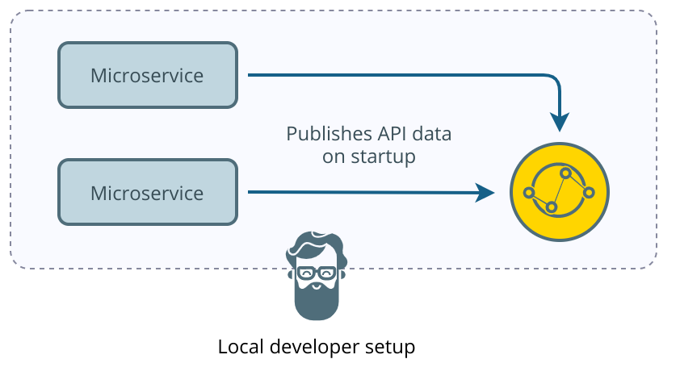
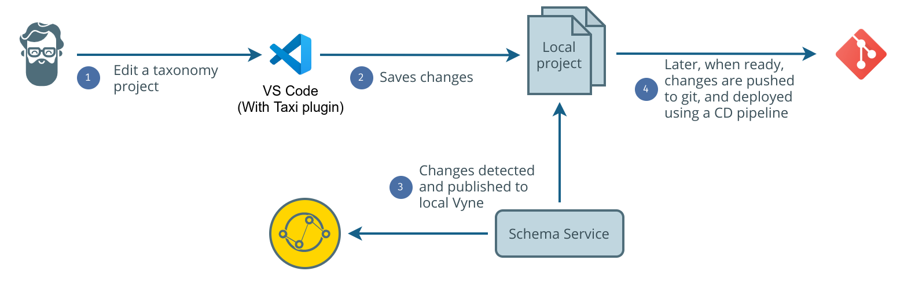
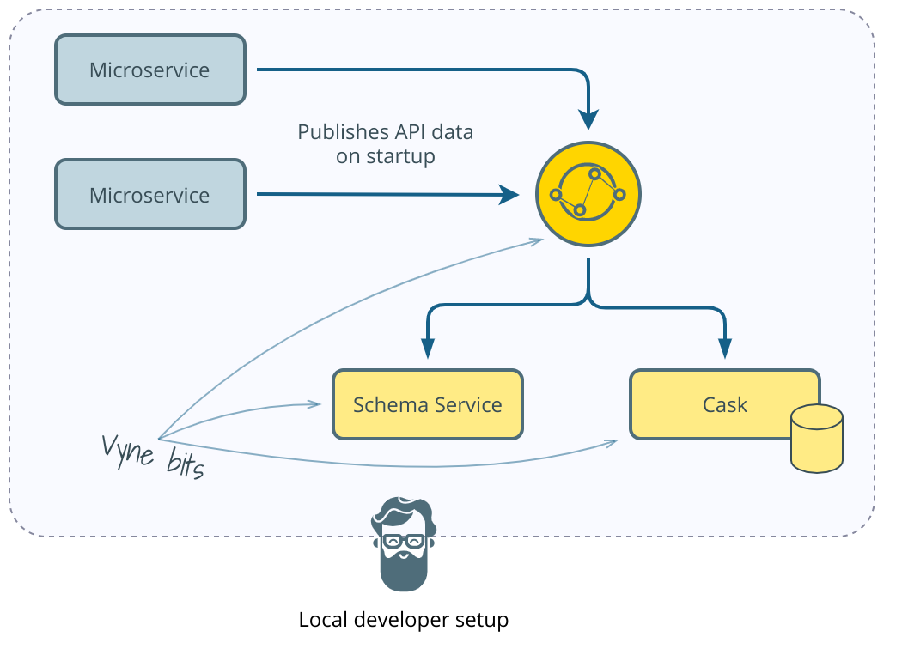
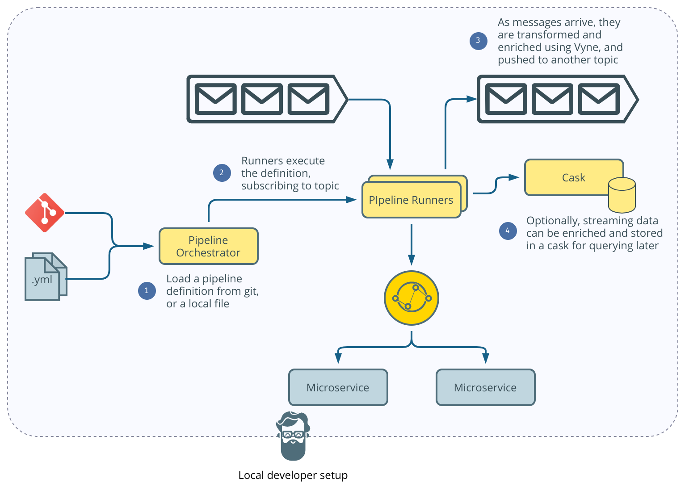

# Setting up Vyne locally

There are a few ways to get Vyne working on your local machine and which you choose depends on what you're interested in. 

This guide walks you through common use cases for running Vyne, and getting things going locally.  For all our examples, you'll need Docker installed - so i fyou haven't done that already, head over to the [Docker Docs](https://docs.docker.com/get-docker/) and get docker set up.

From here, getting started depends on what you'd like to achieve.  We have guides to help you get started locally for the following:

* [Exploring Vyne's automated API integrations](setting-up-vyne-locally-1.md#automating-api-integration)
* [Building a standalone taxonomy](setting-up-vyne-locally-1.md#building-a-standalone-taxonomy)
* [Building streaming data solutions](setting-up-vyne-locally-1.md#building-streaming-data-solutions)
* [Ingesting and querying flat-based data \(CSV, Json, Xml, etc\)](setting-up-vyne-locally-1.md#ingesting-and-querying-file-based-data)

## Automating API integration

Getting Vyne deployed locally to automate API integration is simple:

```bash
docker run -p 9022:9022 --env PROFILE=embedded-discovery,inmemory-query-history,eureka-schema vyneco/vyne
```

This will launch an instance of Vyne running on your local machine - just head over to [http://localhost:9022](http://localhost:9022) to see an empty instance of Vyne waiting for you.



This gives you a local developer envirnoment for Vyne, which is everything you need to start integrating APIs.  

The next step is to get Microservices to start and publish their schemas to Vyne.  We walk through this in detail in our Hello World tutorial - now's a good time to head over there.



## Building a standalone Taxonomy

A common usecase for Vyne is to build and share an enterprise taxonomy, as part of a data governance strategy.  

Taxi provides an excellent way to build a shared taxonomy, and Vyne is a fantastic way to view and explore it.



To get started, you can use our Docker Compose file for this configuration, which is available [here](https://gitlab.com/vyne/vyne-taxonomy-environment/-/blob/master/docker-compose.yml).

Download the docker compose file locally, then simply run:

```bash
docker-compose up -d
```

Wait a bit, then head to http://localhost:9022.

We have a dedicated guide to building and publishing a taxonomy, which you can follow along with here:



## Ingesting and querying file based data

Vyne doesn't just work with API's - we make any data discoverable and queryable.

For flat-file data that isn't served by an API \(such as CSV data, or just JSON / XML files\), we provide Casks -  a way of storing file data, applying a taxonomy, and then querying / enriching with Vyne.



To get started, you can use our Docker Compose file for this configuration, which is available [here](https://gitlab.com/vyne/vyne-taxonomy-environment/-/blob/master/docker-compose.yml).

Download the docker compose file locally, then simply run:

```bash
docker-compose up -d
```

Wait a bit, then head to http://localhost:9022.

We have a dedicated guide to storing and querying flat-file data, which you can follow along with here:



## Building streaming data solutions

With Vyne you can transform and enrich streaming data using our pipelines, either publishing data to another topic, or storing it in a cask to query later.



\[TODO - Provide docker compose file\]

## Sharing API schemas on your local machine

Vyne needs services to provide API schemas \(Taxi\) so that it can understand the data they provide, and the APIs that they publish.


Vyne provides automated API integration - in order for Vyne to work it's magic, the Microservices that we'll integrate with need to publish schemas that describe their API's to Vyne.  There's a few ways to acheive this.  

The simplest to get started when running locally, is to use Vyne's embedded Eureka instance.  This ships by default inside of Vyne, and provides all the neccessary bits to get provides both Service Discovery, and an easy place for Vyne to 

### Using Eureka

We use [Eureka for service discovery](https://spring.io/guides/gs/service-registration-and-discovery/). This brings in some extra steps if you work on Windows/Mac, however if you are on Linux it's simple to get a Docker container running.

#### Benefits of Eureka

* Simpler network configuration, and uses simple HTTP\(s\) traffic to share schema data
* Works well in containerised environments with virtual network layers

#### Drawbacks of Eureka

* Slower change detection, as updates are found by polling
* Service discovery container must support embedding additional metadata, otherwise requires an additional runtime component to aggregate schemas

#### Getting Eureka running

To do this on Windows/Mac, we need to change the way we distribute our schemas. In your main class, change `@VyneSchemaPublisher` to use `EUREKA` instead of `DISTRIBUTED`. Once this is done we can run the commands below and our app will have successfully joined the Vyne cluster.

If you are on a Linux machine, you don't need to make any of the above changes.



Run:

```text
docker run -p 9022:9022 --env PROFILE=embedded-discovery,inmemory-query-history,eureka-schema vyneco/vyne
```



Run:

```text
docker run --rm --net=host --env PROFILE=embedded-discovery,inmemory-query-history,distributed-schema vyneco/vyne
```



You now have Vyne up and running using Eureka, welldone!

## More Vyne - Docker compose

We have looked at getting Vyne running for a simple API integration, but there is another way to do this. We can use Multicast instead of Eureka. Using Multicast the services are grouped together in a cluster and made discoverable to Vyne. 

This is a better approach because it has much better restart times as schemas are updated as soon as the service comes online. It will also give us access to more advanced features that Vyne has to offer. Features such as git-backed schemas, streaming data pipelines, and querying flat-file data. 

This does involve a few more steps compared to the above integration, but it's definitely worth it. 

#### Benefits of Multicast

* Updates to schemas are instant
* Reduces dependency on centralised infrastructure

#### Drawbacks of Multicast

* Requires the network layer to support Multicast. Of note, this is not supported by default in orchestrated containerised environments \(such as Docker Swarm and Kubernetes\).

#### Getting Multicast running

First steps will be to update our local host IP. This step is required because we run Vyne in Docker. To update your IP:

* edit the .env file and set DOCKER\_HOST\_IP_=&lt;_your\_local\_host\_ip&gt;
* edit hazelcast.yml and replace member-list: _&lt;_your\_local\_host\_ip&gt; with your local IP

Once this is done navigate into your project directory and run:

`docker-compose up`

This will start the Vyne stack.

To view our service running in Vyne, navigate to [http://localhost:9022/schema-explorer](http://localhost:9022/schema-explorer). Here we can see if our service has successfully published schema types and operations to Vyne.

To stop the stack, run:

`docker-compose down` / `ctrl+c`

