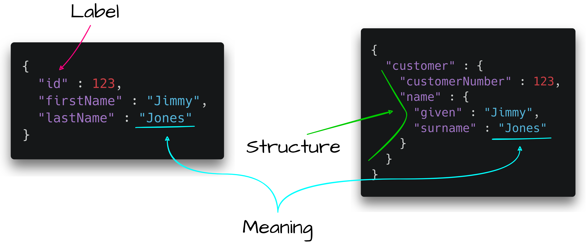

import { Callout } from "../../components/callout"
import { MultiCodeBlock } from "gatsby-theme-apollo-docs"

# Overview

Vyne is a data integration & querying platform, built on top of the Taxi schema language.

The idea behind Taxi (and semantic types in general) is to allow producers of data to define both the structural contract (the labels assigned to fields & shapes of objects),
and the semantic contract (what each field actually means).

A schema plays multiple roles:

-  **Labels** define how information is addressed within a message - eg., `firstName`, `lastName`
-  **Structure** defines how a message will be laid out - what's nested where. Sometimes data is flat (eg., tables or CSV files), othertimes there's nested structure (such as JSON)
-  **Semantics** define the contract of what information is in place at a certain location.
-  **Encoding** defines how data is written to the wire. (Not all schemas cover this)



Most schema languages focus entirely on addressing Labelling and Structure, but offer little to model the semantics of a contract. And, when you're trying
to consume data, the semantics are the most important thing.

<Callout title="Core principal" type="hint" size='large'>

Producers of data need to be careful about Labels, Structure and Semantics of the data they emit.

For consumers - the only thing that really matters is the content. Labelling and Structure are just
addresses to access the information consumers need.

</Callout>

## Structure-first schemas

Most data schemas (and subsequent integration techniques) focus on describing and connecting data based on the structure of information.

Here are some examples of linking data based on structure, shown in a couple of different languages:

```typescript
   // Server-side contracts that the producers of data have defined:
   interface Actor {
   name: string
   id : number
   agentId: number
}

   interface Agent {
   name: string
   id : number
}

   // As a consumer - load an actor, then fetch it's agent using the agentId
   function loadAgentsAndActors() {
   const actor = await loadActor();
   // Here, we're also coupled to another API call
   const agent = await loadAgent(actor.agentId)
   const castMember = {
   actorName : actor.name,
   agentName : agent.name
}
```

In this example, we wanted to consume data with two attributes - an actors name, and
their agents name. We also wanted to apply labels that were meaningful to us as consumers (`actorName` and `agentName`) that
differed from the way producers originally labelled the data (simply - `name`).

The only way we could build this was becoming tightly coupled to the producers contract.

That's a problem, because tight coupling makes it hard for producers to evolve their APIs, and brittle
for consumers when they do.

<Callout title="Core principal" type="hint" size='large'>

Integration based on structure is brittle - changes by producers have
expensive knock-on effects to consumers.

</Callout>

## Semantic Integration

Taxi and Vyne provide a different style of schema and integration - by allowing schemas to define
their semantic contract as well.

Semantic Types describe the meaning of content in a field, rather than just how it's written out by computers.

| Field Name   | System Type | Semantic Type       |
| ------------ | ----------- | ------------------- |
| `id`         | `String`    | `CustomerId`        |
| `name`       | `String`    | `CustomerFirstName` |
| `houseNbr`   | `Int`       | `HouseNumber`       |
| `ageInYears` | `Int`       | `CustomerAge`       |

The column on the left - `Field name` - describes how a producer has named the field in one specific system.
The column in the middle - `System Type` - describes how a system might read or write a field.
The column on the right - `Semantic Type` - describes the actual meaning of the text in a business sense.

By defining a semantic contract, we introduce a way of producers and consumers to discuss data, that's not coupled
to structure.

<Callout title="Core principal" type="hint" size='large'>

Semantic contracts provide a shared language for producers and consumers to discuss data,
that's not coupled to structure, so not as brittle when structural contracts change.

</Callout>

Semantic contracts allow requesting data based on it's meaning, irrespective of the shape producers are emitting it in.

Let's look at our example query again, this time run through TaxiQL - a semantic query language:

```taxi
given { ActorId = 1 }
find {
   actorName : ActorName
   agentName : AgentName
}
```

It's important to call out a few details:

#### There's no `FROM`

There's no FROM clause here - nothing that specifies which producer, and where, the data should come from.
That's left to the query layer to determine, which means that consumers remain protected when producers inevitably change.

#### There's no `JOIN`

Likewise, we haven't specified how to navigate infrastructure and data contracts to describe how to link two ideas (Actor and Agent) together.
In fact, for all we know - this could be coming from one table, or some complex lookup linking several entities together.

As a consumer, understanding the specifics of how data has been structured is an implementation detail they shouldn't be
concerned with.

#### Field names are defined by the consumer

The producing systems named these fields something else. The consumer has been able to define the shape of the
data they need, and left it to the querying layer to solve. There's enough semantic metadata present for the query layer
to understand what data is needed.

This is possible because we've seperated the Structural concept from the Semantic concept. Field names are now entirely
up to the consumer to decide - the way it should be.

<Callout title="Core principal" type="hint" size='large'>

Semantic querying is centered around what data the consumer needs,
how the consumer needs it. Producer concepts are abstracted away.

</Callout>

## Enhancing Structural contracts with Semantic metadata

It's not a question of Structure OR Semantics - or choosing one schema language to rule them all.  Taxi is a great schema language, but it's not intended as a replacement to your existing schemas./

Modern data architectures are polyglot - with a mix of APIs, databases, streaming sources, and flat files.
The key for making semantic schemas work across this ecosystem is to enhance existing schema structure with semantic metadata.

Taxi supports this, with a series of extensions.

For example, in Swagger / OpenAPI:

```yaml

// Partial OpenAPI example:
paths:
  /pets:
    get:
      description: |
        Returns all pets from the system that the user has access to
        Nam sed condimentum est. Maecenas tempor sagittis sapien, nec rhoncus sem sagittis sit amet. Aenean at gravida augue, ac iaculis sem. Curabitur odio lorem, ornare eget elementum nec, cursus id lectus. Duis mi turpis, pulvinar ac eros ac, tincidunt varius justo. In hac habitasse platea dictumst. Integer at adipiscing ante, a sagittis ligula. Aenean pharetra tempor ante molestie imperdiet. Vivamus id aliquam diam. Cras quis velit non tortor eleifend sagittis. Praesent at enim pharetra urna volutpat venenatis eget eget mauris. In eleifend fermentum facilisis. Praesent enim enim, gravida ac sodales sed, placerat id erat. Suspendisse lacus dolor, consectetur non augue vel, vehicula interdum libero. Morbi euismod sagittis libero sed lacinia.

        Sed tempus felis lobortis leo pulvinar rutrum. Nam mattis velit nisl, eu condimentum ligula luctus nec. Phasellus semper velit eget aliquet faucibus. In a mattis elit. Phasellus vel urna viverra, condimentum lorem id, rhoncus nibh. Ut pellentesque posuere elementum. Sed a varius odio. Morbi rhoncus ligula libero, vel eleifend nunc tristique vitae. Fusce et sem dui. Aenean nec scelerisque tortor. Fusce malesuada accumsan magna vel tempus. Quisque mollis felis eu dolor tristique, sit amet auctor felis gravida. Sed libero lorem, molestie sed nisl in, accumsan tempor nisi. Fusce sollicitudin massa ut lacinia mattis. Sed vel eleifend lorem. Pellentesque vitae felis pretium, pulvinar elit eu, euismod sapien.
      operationId: findPets
      parameters:
        - name: tags
          in: query
          description: tags to filter by
          required: false
          style: form
          schema:
            type: array
            items:
              //------Below is a taxi extension for semantic types-----------
              x-taxi-type:
                name: petstore.Tag
              //----------End the extension----------------------------------
              type: string

```

Or in Protobuf:

```protobuf
// An example of enriching a structural contract with semantic metadata
syntax = "proto3";
import "taxilang/dataType.proto"; // Import the DataType extension
package tutorial;


message Person {
  string name = 1 [(dataType='PersonName')];
  int32 id = 2  [(dataType='PersonId')];
  string email = 3 [(dataType='PersonEmail')];
}
```

