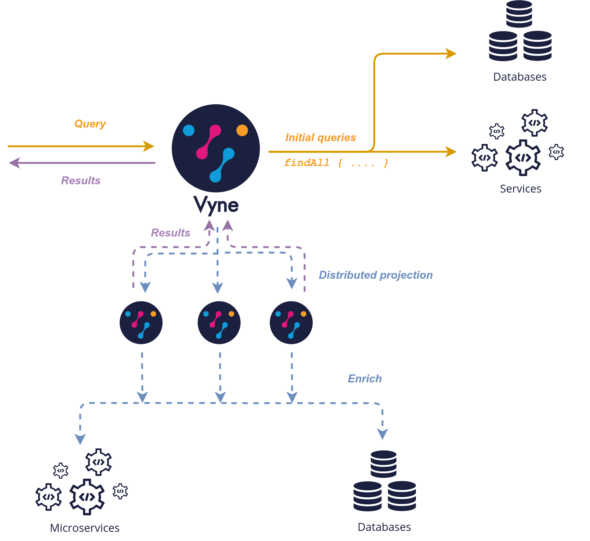

Deploying a cluster of Vyne instances allows for distribution of CPU intensive tasks, especially projections.

This is especially well suited for queries that return large numbers of records, which need to be projected.
Distributing the work over a cluster provides significant performance improvements, as the work can be parallelized.

## Understanding how work is distributed
When running in a multi-node cluster, the node that receives the query becomes the work-coordinator for that query.




The work-coordinator is responsible for issuing the initial queries that find the source data.  As data arrives on the
work-coordinator, it is then added onto a queue for other nodes to pick up and project.

As worker nodes pick up projection tasks, they perform projection work (transforming and enriching data, calling remote services as required), and return the results back to the work-coordinator,
who then sends the results back to the query issuer.

## Considerations

### Worker discovery via Multicast
When sharing work across a cluster of Vyne nodes, the workers will use Multicast to discover each other
and share work.

Vyne uses Hazelcast for multicast discovery.  Read more about how multicast works in Hazelcast [here](https://docs.hazelcast.com/imdg/latest/clusters/discovering-by-multicast)

### HTTP Caches
Caches are not shared between worker nodes, so remote services may receive a higher number of calls during parallelized enrichment.

### Preferring work on remote nodes
As the cluster size grows, the work can be parallelized across a greater number of nodes.  While this provides improved
throughput, the work coordinator incurs a heavier workload in serialization and deserialization of work tasks and responses.

To account for this the `vyne.projection.distributionRemoteBias` allows tuning at which point the work is preferentially distributed to remote nodes, versus the
query coordinator.  Once this value is exceeded, the query coordinator node will perform a lower proportion of projection work in a query.


## Work Distribution Configuration

For projection work to be distributed across all vyne nodes in a cluster the following configuration options are provided


| Config parameter                         | Description                                                                                                                           | Default setting |
|------------------------------------------|---------------------------------------------------------------------------------------------------------------------------------------|-----------------|
| `vyne.projection.distributionMode`       | Defines where projection work will be performed.  On the local node or the cluster LOCAL, DISTRIBUTED                                 | `LOCAL`         |
| `vyne.projection.distributionPacketSize` | Defines the number of records in each work packet distributed to other vyne servers.  Applicable to DISTRIBUTED distributionMode only | 100             |
| `vyne.projection.distributionRemoteBias` | Defines the number of cluster members before work is preferentially distributed to remote nodes                                       | 10              |


## Cluster Configuration

| Config parameter                           | Description                                                                                                                                                                                                                           | Default setting                 |
|--------------------------------------------|---------------------------------------------------------------------------------------------------------------------------------------------------------------------------------------------------------------------------------------|---------------------------------|
| `vyne.hazelcast.discovery`                 | Specifies the discovery mechanism hazelcast will use to find other instances. `multicast`, `aws_ec2` (formerly called `aws`) or `eureka`                                                                                              | `multicast`                     |
| `vyne.hazelcast.eurekaUri`                 | URI of the coordinating eureka instance when discovery is set to eureka                                                                                                                                                               | `http://127.0.0.1:8761/eureka/` |
| `vyne.hazelcast.memberTag`                 | Denotes which member type this is within the hazelcast cluster                                                                                                                                                                        | `vyne-query-service`            |
| `vyne.hazelcast.networkInterface`          | Should only be specified if the deployment environment requires that hazelcast only bind to a single network interface.  The network interface supplied should be specified in hazelcast networking naming e.g. 10.10.*.*, 172.16.*.* |                                 |
| `vyne.hazelcast.useMetadataForHostAndPort` | Specific to Eureka Hazelcast discovery.  Specifies if metadata should be published to and used for hazelcast node and port discovery                                                                                                  | `true`                          |
| `vyne.hazelcast.awsPortScanRange`          | Specific to AWS Hazelcast discovery.  Specifies the port ranges that will be scanned from running hazelcast on EC2 instances                                                                                                          | `true`                          |
| `vyne.hazelcast.taskPoolSize`              | Specifies the number of threads dedicated to processing distributed work loads                                                                                                                                                        | 2                               |
| `vyne.hazelcast.taskQueueSize`             | Specifies the size of the queue of tasks on each cluster node.  A value of 0 sets an infinite queue size                                                                                                                              | 0                               |


### Cluster formation and discovery
Vyne services can form a cluster discovering other nodes via one of three discovery mechanisms:

| Mechanism   | Description                                                            |
|-------------|------------------------------------------------------------------------|
| `multicast` | Vyne services attempt to use multicast to discover other cluster nodes |
| `aws_ec2`   | Vyne services attempt use AWS metadata to discover other cluster nodes |
| `eureka`    | Vyne services use Eureka metadata to discover other cluster nodes      |


## Example configurations

### Multicast
Enable clustering using discovery via local network multicast with distributed projections
```yaml
vyne:
    projection:
        distributionMode: DISTRIBUTED

    hazelcast:
        discovery: multicast
```

### AWS
Enable clustering using AWS discovery with distributed projections

The vyne query server should be run on a EC2 instances where `AWS_REGION` is specified as an environment variable and the EC2 instance is authorised to
query EC2 instances via IAM.

`AWS_REGION` may alternatively be specified as a JVM property `-DAWS_REGION=eu-west_2`

```yaml
vyne:
    projection:
        distributionMode: DISTRIBUTED

    hazelcast:
        discovery: aws_ec2
```

### Eureka
Enable clustering using Eureka discovery with distributed projections

```yaml
vyne:
    projection:
        distributionMode: DISTRIBUTED

    hazelcast:
        discovery: eureka
        eurekaUri: http://eureka-server:8761/eureka/
        useMetadataForHostAndPort: true
```

