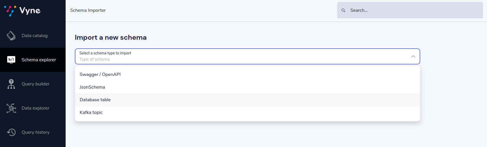
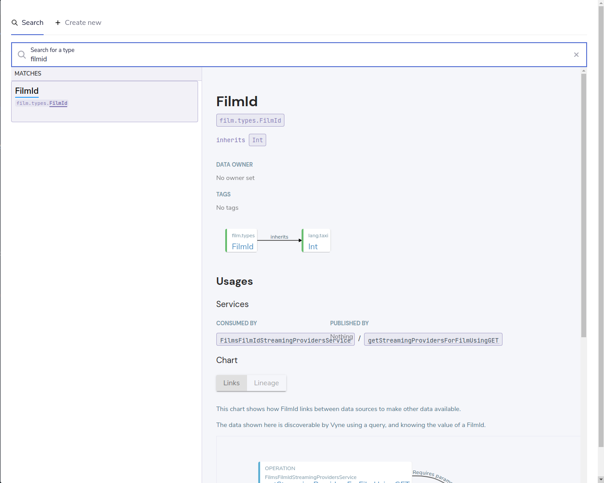

import {Link} from 'gatsby';
import {Callout} from '../../components/callout';

# Overview
Vyne can connect to databases to fetch data when running a query.

In order to understand the data that is present in a database table, Vyne uses a Taxi Schema for that table.
The taxi schema describes the table - it's columns and the data they hold.  Because we're using Taxi here,
the column descriptions are richer than things like "String" or "Integer" - instead using rich semantic tags like "FirstName",
"LastName", or "EmailAddress"

In this guide, we'll learn how to create a Taxi Schema for a specific database table - both through the user interface, and by directly editing a schema

<Callout type='hint' title='Before you continue...'>

   Before you run through this guide, make sure you've <Link to='/how-to-guides/connections/manage-database-connection/'>added a database connection</Link> for the table you want to connect.

</Callout>

## Using the UI

The UI allows you to connect a database table directly, without having manually edit taxi files.
Through the UI, Vyne will connect to the database, and create:

 * A series of types for each column in the database table
 * A model that describes the database table
 * A service that exposes query capabilities for the table

<Callout type='info' title='Coming soon...'>

   At this stage, only connecting new database tables in the UI is supported.  To edit and remove existing tables,
   modify the [taxi schema](#editing-a-taxi-schema) directly.  Support for editing via the UI will be shipped in a
   future release.

</Callout>


<Callout type='hint' title='Before you continue...'>

   Before you run through this guide, make sure you've <Link to='/how-to-guides/schema-management/enable-ui-schema-editing/'>enabled schema editing through the UI</Link>.  If you're running through
   one of our tutorials, don't worry - we've already configured this for you.

</Callout>

### Importing a new table

 * From the home page, click Add a data source.
   * Alternatively, Click Schema Explorer in the left-hand navigation menu, then click "Add new"
 * For the schema type to import, select "Database table"



 * Click the connection name drop-down, and select the connection for your database
   * If you haven't yet created your connection, you can click "Add new connection".  <Link to="/how-to-guides/connections/manage-database-connection/#create-a-connection-when-importing-a-new-data-source">This guide</Link> has more details.
 * Select the table from the drop-down
 * Specify a namespace for the taxi types, models and services that will be created
 * Click Create

At this stage you'll be taken to a screen that allows you to preview the information gathered from the database table.
In this form, you can click to explore the created models, types and services that were generated.


### Changing the assigned types
Vyne has assigned reasonable defaults to all the fields.  Specifically

 * Id's have been tagged
 * Foreign keys have been mapped
 * For all other fields, new semantic types have been created.

If the columns in your database map to exisitng semantic types, you may wish to update the definitions.
To do this:

 * Select a Model from the table on the left-hand side
 * Click on the blue link for the column you wish to change the type of
 * A search dialog is displayed
 * From here, you can search for existing types in your catalog, or create a new type



You can also click to edit documentation for any of the types, models and services.

 * Once you're satisfied with the edits to your table and types, click Save
 * The schema has been created and written to the taxi project configured in your <Link to="/how-to-guides/schema-management/enable-ui-schema-editing/">schema server</Link>.


### Required permissions
In order to view, create or edit connected database tables through the UI, users must have the following permissions granted.

| Activity                          | Required permission |
|-----------------------------------|---------------------|
| View the connected tables         | `VIEW_CONNECTIONS`  |
| Create or modify a database table | `EDIT_CONNECTIONS`  |

See <Link to='/how-to-guides/auth/manage-user-permissions'>this guide</Link> for more information on role based security.


## Editing a taxi schema

<Callout type='hint' title='Before you continue...'>

   Before you run through this guide, it's worth understanding the basics of <Link to='/background/taxi-basics/'>taxi projects</Link>, and how Vyne uses it.

   Also, make sure you have a <Link to="/how-to-guides/taxi/create-a-taxi-project/">taxi project set up</Link>, and that it's been <Link to={"how-to-guides/schema-management/publish-taxi-project/#publish-a-file-based-taxi-project"}>published to Vyne</Link>.  If you're running through one of our
   tutorials, we've already taken care of this for you.

</Callout>

Taxi files define the mappings of data models and the services that expose them.
In this guide, we'll describe how expose a new database table to Vyne, and make it queryable.

Before starting, in your taxi project, create a new file under the `src/` directory.  It's up to you what
you name it. For this example, `customers.taxi` is a good start.

### Databases, and pull-based schema definitions

As discussed in <Link to={"/background/schema-publication-methods/"}>publishing schemas to Vyne</Link>, there
are different ways for Vyne to consume schema information - either by data sources ***pushing*** their information
directly to Vyne (well suited for application APIs), or by ***pulling*** from git-based repositories that describe the
schemas.

While the push model is preferred, it's not currently supported for databases.  We're looking into ways to embed
Taxi metadata into DDL schema definitions.  For now, you'll need to maintain taxi definition file that describes the
database.


### Defining a table mapping

Tables are exposed to Vyne using the annotation `@io.vyne.jdbc.Table` on a model.

Fields names in the model are expected to align with column names from the database.

Here's an example:

```taxi
import io.vyne.jdbc.Table

namespace demo.customers {

  @Table(connection = "films-database", schema = "public" , table = "customer" )
  model Customer {
    @Id // Use @Id to denote the primary key
    customerId : CustomerId
    firstName : CustomerFirstName? // Nullable columns should have the Taxi nullable symbol
    lastName : CustomerLastName
  }
}
```

The `@Table` annotation contains the following parameters:

| Parameter  | Description                                                                                                                                                                          |
|------------|--------------------------------------------------------------------------------------------------------------------------------------------------------------------------------------|
| connection | The name of a connection, as defined in your <Link to="/how-to-guides/connections/manage-database-connection/#defining-a-database-connection">connections configuration file.</Link> |
| schema     | The name of the schema.  Optional, depending on your database                                                                                                                        |
| table      | The name of the table                                                                                                                                                                |


#### Mapping the primary key
Use an `@Id` annotation to define the column that represents the primary key.  At this stage, composite keys
are not supported.

### Exposing a query service
Vyne uses Taxi Services to expose query capabilities.  To configure Vyne to be able to query the database table, a
service must be declared, and annotated with the `@io.vyne.jdbc.DatabaseService` annotation.

Here's an example:

```
import io.vyne.jdbc.DatabaseService
import vyne.vyneQl.VyneQlQuery
namespace demo.customers {
   @DatabaseService(connection = "films-database")
   service CustomerService {
      vyneQl query customerQuery(query: VyneQlQuery):Customer[] with capabilities {
         sum,
         count,
         avg,
         min,
         max,
         filter(==,!=,in,like,>,<,>=,<=)
      }
   }
}

```


The `@DatabaseService` annotation contains the following parameters:

| Parameter  | Description                                                                                                                                                                          |
|------------|--------------------------------------------------------------------------------------------------------------------------------------------------------------------------------------|
| connection | The name of a connection, as defined in your <Link to="/how-to-guides/connections/manage-database-connection/#defining-a-database-connection">connections configuration file.</Link> |


The service should expose a [query operation](https://docs.taxilang.org/language-reference/describing-services/#query-operations), which returns an array of the mapped model type.

The operation should also define the query capabilities (filtering and aggregating) you wish to expose.

<Callout type='hint' title='Coming soon...'>

   Support for aggregations and advanced filtering in Vyne is evolving.

   Not all the aggregation operations shown in the above example are fully supported yet.  Feel free to reach out to us on Slack if this is something that you need.

</Callout>

### Publishing changes to Vyne

If you've connected your Taxi project to Vyne as a local file-based project, then as soon as you save your changes, they're published to Vyne, and available to use.

If you've connected your project as a git-based project, you'll need to commit and push your changes to the remote git repository.  They'll then be picked up om the next poll, and be available to use in Vyne.

You should now see your new types and services present in the data catalog of Vyne.
