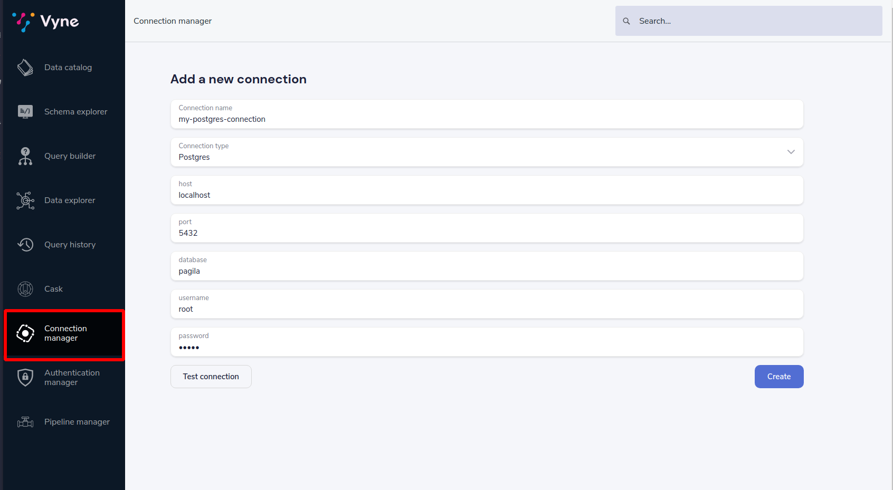
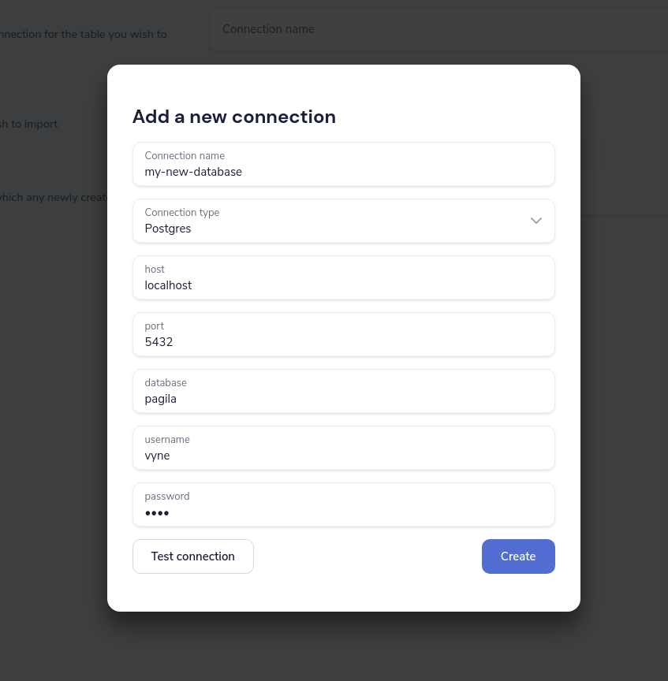

import {Link} from 'gatsby';
import {Callout} from '../../components/callout';

# Overview
Vyne can connect to databases to fetch data when running a query.

In this guide, we'll learn how create database connections - both through the user interface, and through Vyne's config files.

## Using the UI
The UI allows you to create new connections to databases, as well as see a list of the connections already configured.

<Callout type='hint' title='Coming soon...'>

   At this stage, only creating new connections in the UI is supported.  To edit and remove existing connections,
   modify the [config file](#using-a-configuration-file) directly.  Support for editing via the UI will be shipped in a
   future release.

</Callout>

### Create a new connection
There are two ways to add a new database connection in Vyne.

#### Create a connection in the Connection Manager
The connection manager is the place that allows you to create and view connections.

 * Click on the Connection Manager icon in the left-hand navigation menu
 * Specify a connection name
 * Select the database type from the list of possible connections
 * Based on the database you select, a list of required parameters is shown
 * Fill out the form
 * Click Test connection
 * If the connection test was successful, click Create



The connection is created, and written out to the config file.

#### Create a connection when importing a new data source
You can also create a connection in-line, when specifying a new datasource.

 * From the home page, click Add a data source.
   * Alternatively, Click Schema Explorer in the left-hand navigation menu, then click "Add new"
 * For the schema type to import, select "Database table"


 * Click the connection name drop-down
 * Select Add new connection...
 * A pop-up form is displayed, allowing you to create a connection
 * Specify a connection name
 * Select the database type from the list of possible connections
 * Based on the database you select, a list of required parameters is shown
 * Fill out the form
 * Click Test connection
 * If the connection test was successful, click Create

After the connection has been created, the popup form is closed, and your new connection is populated into the schema form.



### Required permissions
In order to view, create or edit database connections through the UI, users must have the following permissions granted.

| Activity | Required permission |
|---------------|--------------|
| View the list of database connections       | `VIEW_CONNECTIONS`  |
| Create or modify a database connection       | `EDIT_CONNECTIONS`  |

See <Link to='/how-to-guides/auth/manage-user-permissions'>this guide</Link> for more information on role based security.

## Using a configuration file
All the connections configured for Vyne are stored in a config file - including any that you configure through the UI

By default, this file is called `connections.conf`, and lives in the `conf/` directory under where launch Vyne from.
If this file doesn't exist when Vyne is launched, it's created the first time a connection is created via the UI.

You can specify the name of the configuration file when launching Vyne, by setting the parameter `vyne.connections.config-file`.
The same configuration file is used for all types of connections, not just Databases.  This includes Kafka connections, etc.

### Defining a database connection

```hocon
jdbc { # The root element for database connections
   another-connection { # Defines a connection called "another-connection"
      connectionName = another-connection # The name of the connection.  Must match the key used above.
      jdbcDriver = POSTGRES # Defines the driver to use.  See below for the possible options
      connectionParameters { ## A list of connection parameters.  The actual values here are defined by the driver selected.
         database = transactions # The name of the database
         host = our-db-server # The host of the database
         password = super-secret # The password
         port = "2003" # The port
         username = jack # The username to connect with
      }
   }
}
```

### Passing sensitive data
It may not always be desirable to specify sensistive connection information directly in the config file - especially
if these are being checked into source control.

Environment variables can be used anywhere in the config file, following the [HOCON standards](https://github.com/lightbend/config#uses-of-substitutions).

For example:

```HOCON
jdbc {
   another-connection {
      connectionName = another-connection
      jdbcDriver = POSTGRES # Defines the driver to use.  See below for the possible options
      connectionParameters {
         # .. other params omitted for bevity ..
         password = ${postgres_password} # Reads the environment variable "postgres_password"
      }
   }
}
```

### Supported drivers

### Postgres

To configure a Postgres connection, specify `jdbcDriver = POSTGRES`

Connection parameters are as follows:

| Parameter name | Description |
|---------------|--------------|
| `host`       | The host address of the Postgres database  |
| `port`       | The port to connect to. Defaults to  `5432`     |
| `database`      | The name of the database on the postgres server      |
| `username`          | Optional. The username to use when connecting      |
| `password`    | Optional. The password to use when connecting      |

#### Example

```HOCON
jdbc { # The root element for database connections
   another-connection { # Defines a connection called "another-connection"
      connectionName = another-connection # The name of the connection.  Must match the key used above.
      jdbcDriver = POSTGRES # Defines the driver to use.  See below for the possible options
      connectionParameters { ## A list of connection parameters.  The actual values here are defined by the driver selected.
         database = transactions # The name of the database
         host = our-db-server # The host of the database
         password = super-secret # The password
         port = "2003" # The port
         username = jack # The username to connect with
      }
   }
}
```

### Redshift

To configure a Postgres connection, specify `jdbcDriver = REDSHIFT`

Connection parameters are as follows:

| Parameter name | Description |
|---------------|--------------|
| `host`       | The host address of the Redshift database  |
| `port`       | The port to connect to. Defaults to  `5439`     |
| `database`      | The name of the database on the Redshift server      |
| `username`          | Optional. The username to use when connecting      |
| `password`    | Optional. The password to use when connecting      |

#### Example

```HOCON
jdbc { # The root element for database connections
   another-connection { # Defines a connection called "another-connection"
      connectionName = another-connection # The name of the connection.  Must match the key used above.
      jdbcDriver = REDSHIFT # Defines the driver to use.  See below for the possible options
      connectionParameters { ## A list of connection parameters.  The actual values here are defined by the driver selected.
         database = transactions # The name of the database
         host = our-db-server # The host of the database
         password = super-secret # The password
         port = "2003" # The port
         username = jack # The username to connect with
      }
   }
}
```

### Snowflake

To configure a Postgres connection, specify `jdbcDriver = SNOWFLAKE`

Connection parameters are as follows:

| Parameter name | Description |
|---------------|--------------|
| `account`       | The name of the Snowflake account  |
| `schema`      | The name of the schema to connect to     |
| `db`       | The name of the database to connect to     |
| `warehouse`       | The name of the warehouse where the snowflake db exists     |
| `username`          | The username to use when connecting      |
| `password`    |  The password to use when connecting      |
| `role`    |  The role to specify when connecting      |

#### Example

```HOCON
jdbc { # The root element for database connections
   another-connection { # Defines a connection called "another-connection"
      connectionName = another-connection # The name of the connection.  Must match the key used above.
      jdbcDriver = SNOWFLAKE # Defines the driver to use.  See below for the possible options
      connectionParameters { ## A list of connection parameters.  The actual values here are defined by the driver selected.
        account = mySnowflakeAccount123.eu-west-1
        schema = public
        db = demo_db
        warehouse = COMPUTE_WH
        schema = public
        role = QUERY_RUNNER
      }
   }
}
```
