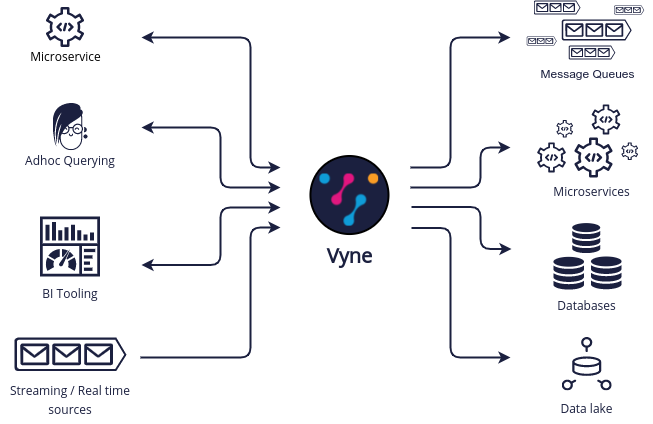

import { Hint } from './components/hint'

# Welcome


Welcome! 👋 Vyne is a data gateway that automates the integration, transformation and discovery of data from data sources (API's, databases, message brokers) across your enterprise.

Vyne provides intelligent on-the-fly integrations, that automatically upgrade themselves as your data sources change.

Vyne uses rich semantic schemas to infer how data across your organisation links together, and automate the integration and discovery of data.



## Get started

Get vyne running quickly:

```
docker run -p 9022:9022 vyneco/vyne
```

