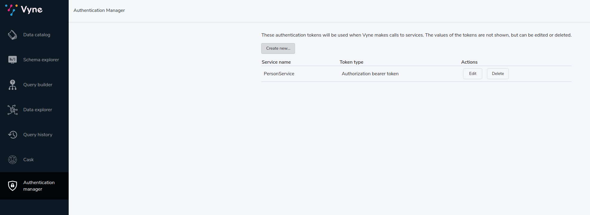
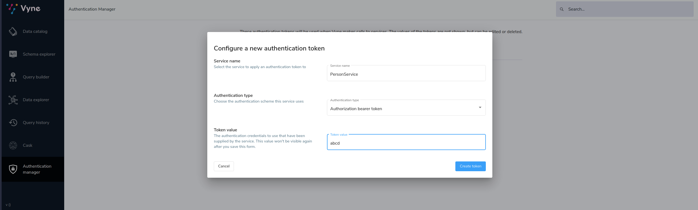

Vyne will pass authentication headers to upstream services when sending requests.

Configuration is either through the UI, or by a file stored on the Vyne server.

## File based configuration
Vyne will read / write authentication settings from a file on the vyne server.

The location of the file is configurable by setting `vyne.auth.config-file` setting, and defaults to `config/auth.conf`.

Vyne uses a [HOCON](https://github.com/lightbend/config#examples-of-hocon) format for it's config files.  (HOCON is a superset of JSON, so JSON is also valid.)

Here's a sample config:

```HOCON
authenticationTokens {
   "com.acme.MyService" { // The fully qualified name of a service, as defined in a taxi schema.  Should be surrounded in quotes.
      tokenType = AuthorizationBearerHeader // Only `AuthorizationBearerHeader` is supported at present
      value = "Hello, World"
   }
}

```
## Authentication token types
At present, only AuthorizationBearerHeader is supported, however we plan on expanding support as required.

### Authorization Bearer tokens
Setting the `tokenType` to `AuthorizationBearerHeader` will add a header of `Authorization: Bearer ${tokenValue}` to outbound requests.

## Using environment variables
Environment variables can be used in authentication config files.

```HOCON
authenticationTokens {
   "com.acme.MyService" {
      tokenType = AuthorizationBearerHeader
      value = ${foo} // The enviroment variable of 'foo' is read and substituted
   }
}
```

## Other configuration approaches
Authentication configuration is always persisted to the file described above.
However, there are ways of adding / removing to the configuration without requiring file access.

### UI configuration
Authentication tokens can be added, modified and deleted through the UI, via the Authentication Manager.

Changes made here are persisted in the configured authentication file.




### REST API
Authentication tokens can be added, modified and deleted through the REST API:

#### Create or update token

POST to `/api/tokens/service/{serviceName}`:
```json
{
   "tokenType" : "AuthorizationBearerHeader",
   "value" : "yourAPIToken"
}
```

#### Deleting a token
Deletes a token

DELETE to `/api/tokens/service/{serviceName}`

#### Listing configured tokens
It is possible to list the configured tokens.  However, the token values are not returned.

GET to `/api/tokens`

```
[ { "serviceName" : "com.foo.MyService", "tokenType" : "AuthorizationBearerHeader" } ]
```
