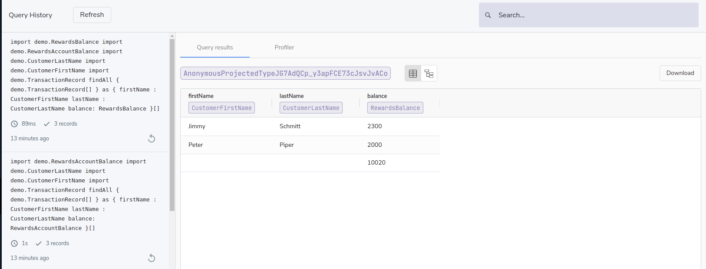

import { Link } from 'gatsby';

Vyne stores a history of the queries it executes, to allow for later sharing of results.

Results may be downloaded as either:
 * A CSV file
 * A JSON file
 * A Test case for use in <Link to="/testing/testing-with-vynetest">Vyne Test</Link>.

## Displaying active queries
Vyne history also shows a list of all queries currently running on the server, and their progress.

These queries can be cancelled through the UI.

## Configuration

This feature must be enabled in your vyne configuration.

| Config parameter                | Description                                                                                        | Default setting             |
|---------------------------------|----------------------------------------------------------------------------------------------------|-----------------------------|
| `vyne.history.persist-results`               | Defines if results of queries should be persisted.                                                 | `false`                     |
| `vyne.history.persist-remote-call-responses` | Defines if results from remote calls should be captured and stored in the history.                 | `false`                     |
| `vyne.history.max-payload-size-in-bytes`     | When request results are being captured, defines the maximum size (in bytes) of a payload to store | 2048                        |
| `vyne.history.persistence-queue-store-path`  | Defines where Vyne queues history data waiting to be persisted                                    | `./historyPersistenceQueue` |
| `vyne.history.mode`                          | Defines whether history data is persisted by vyne query server or by vyne history server (possible values `inprocess` or `remote`)         | `inprocess` |

