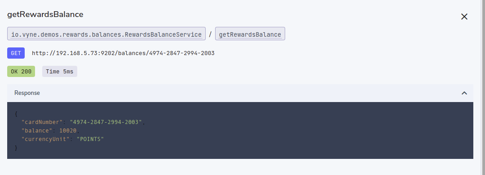
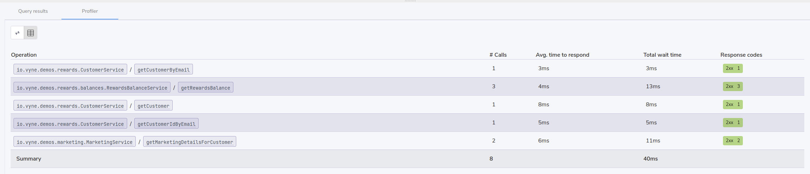

Vyne captures details of all the calls that are made during a query.

Note: This must be enabled via the `vyne.analytics.persist-results` setting.  See query-history for more details.

If enabled, "Profiler" tab will be visible in the query results display.

## Sequence diagrams
Vyne produces sequence diagrams that show the services that were called.

Clicking on any of the rows shows the actual query that was sent and response received.  (requires `vyne.analytics.persist-remote-call-responses` to be enabled)

## Call summary
Vyne also provides a summary table of all the endpoints that were called, the number of calls, average response times and response codes received.

