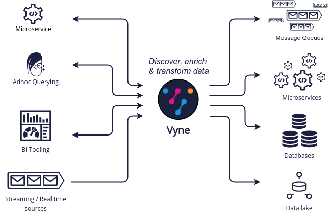

Vyne focuses on querying for data based on it's meaning, rather than which system provides it. This allows services to
change, and data to move, without requiring consumers to update their queries.



## Querying with TaxiQL

Queries are written in [TaxiQL](https://docs.taxilang.org/language-reference/querying-with-taxiql/), an open source
query language for data.

TaxiQL is agnostic of where data comes from - it's left to Vyne to discover data from the various sources that have been
connected.

Here's some sample queries:

```
// Find all the movies
find { Movie[] } 

// Find all the movies, enriching and projecting them to a different structure
find { Movie[] } as {
   title : MovieTitle
   director : DirectorName
   rating : RottenTomatoesScore
}[]
```

### Rest API

Queries to Vyne are submitted to the `/api/taxiql` endpoint:

```
curl 'https://localhost:9022/api/taxiql' \
  -H 'Content-Type: application/taxiql' \
  --data-raw 'find { Movie[] }'
```

#### A word about content type

Strictly speaking, the content type for taxiql queries is `application/taxiql`. However, the Vyne server will accept
taxiql queries with any of the following content types headers:

* `Content-Type: application/json`
* `Content-Type: application/taxiql`
* `Content-Type: text/plain`

This is to allow broad compatability with clients.

### Large queries with Server Sent Events

Running large queries can result in out-of-memory errors if Vyne is holding the result set in memory.

To address this, Vyne supports pushing results over server-sent-events. To consume a query as a server-sent-event, set
the `Accept` header to `text/event-stream`:

```
curl 'http://localhost:9022/api/taxiql' \
  -H 'Accept: text/event-stream' \
  -H 'Content-Type: application/taxiql' \
  --data-raw 'find { Movie[] }'
```

Results are pushed out from Vyne as they are available.

## Including type metadata in responses

Vyne can include type metadata in the responses being sent back.

To enable this, append  `?resultMode=TYPED` to the API call:

```
curl 'http://localhost:9022/api/taxiql?resultMode=TYPED' \
  -H 'Accept: text/event-stream' \
  -H 'Content-Type: application/taxiql' \
  --data-raw 'find { Movie[] }'
```

