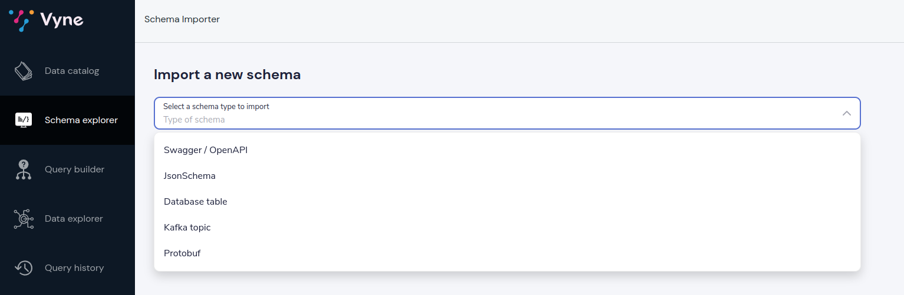
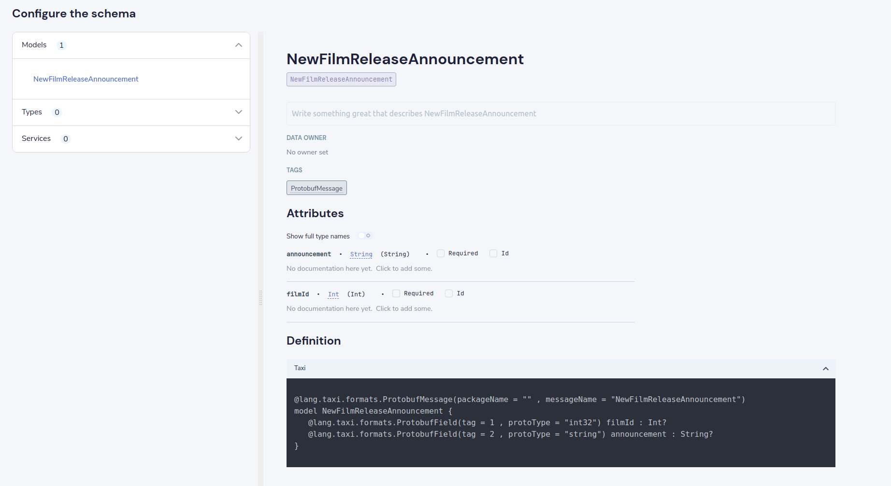

import {Callout} from "../../components/callout";
import {Link} from 'gatsby';

Vyne supports reading protobuf messages - either as a source in a <Link to='/reference/pipelines-2.0/pipelines-overview/'>pipeline</Link>
or from a streaming query originating from Kafka.

You can annotate protobuf sources directly with Taxi metadata, or
you can import through the Schema Importer.

## Embedding semantic types in protobuf
Within a protobuf, fields can be annotated with taxi metadata to
indicate the semantic type used on a field.

Fields are annotated using the `taxi.dataType` extension (which must be imported in
the protobuf file).

An example is shown:

```
import "taxi/dataType.proto";

message CafeDrink {
  optional string customer_name = 1 [(taxi.dataType)="foo.CustomerName"];
  optional int32 customer_id = 2 [(taxi.dataType)="foo.CustomerId"];

  enum Foam {
    NOT_FOAMY_AND_QUITE_BORING = 1;
    ZOMG_SO_FOAMY = 3;
  }
}
```

### Datatype proto extension
Protobufs do not currently support importing external type definitions,
so you need to include the source of the dataType proto definition directly
in your protobuf project.

By convention, the protobuf definition should be written to `taxi/dataType.proto`
within your protobuf project.

```protobuf
import "google/protobuf/descriptor.proto";

package taxi;

extend google.protobuf.FieldOptions {
  optional string dataType = 50002;
}
```


### Generated taxi
When a protobuf with taxi metadata is imported by Vyne, a taxi representation is automatically generated.

<Callout title='Hint'type='hint'>

You generally wouldn't hand-craft a protobuf taxi declaration.  Taxi has tooling to generate this automatically.

The source is shown here for reference only.

</Callout>


```taxi
@lang.taxi.formats.ProtobufMessage(packageName = "" , messageName = "CafeDrink")
model CafeDrink {
   @lang.taxi.formats.ProtobufField(tag = 1 , protoType = "string")
   customer_name : foo.CustomerName?

   @lang.taxi.formats.ProtobufField(tag = 2 , protoType = "int32")
   customer_id : foo.CustomerId?
}
```

## Importing a Protobuf through the UI
You can import a protobuf schema directly through the UI

### Import the protobuf file

 * Click on Schema Explorer, then Add new
 * Select Protobuf from the dropdown



To provide the protobuf you can:

  * Upload a single protobuf schema
  * Upload a zip file containing protobuf schemas
  * Specify a URL to a single protobuf file
  * Specify a URL to a zip file of protobuf schemas

Then click "Create"

### Preview the generated types

A preview is shown, containing the models, fields and types that were imported from the Protobuf schema.



You can change any of the types (eg., swapping a primitive type with a more specific semantic type), by clicking on the underlined
type name, and search for the desired type.

Once you're satisfied, click Save, and the schema will be updated.

## See also

 * Our <Link to='/tutorials/api-db-integration/rest-db-integration/#import-a-protobuf-schema'>Getting Started tutorial</Link> includes a walkthrough which imports a Kafka topic with Protobuf
