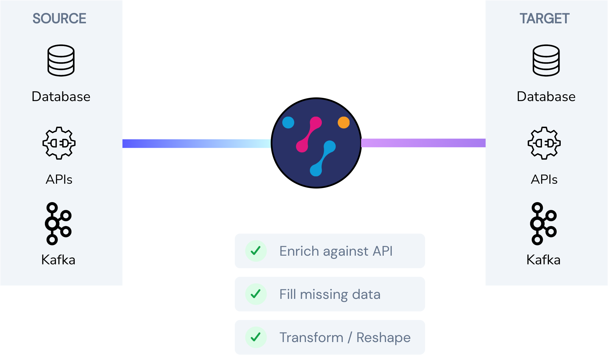
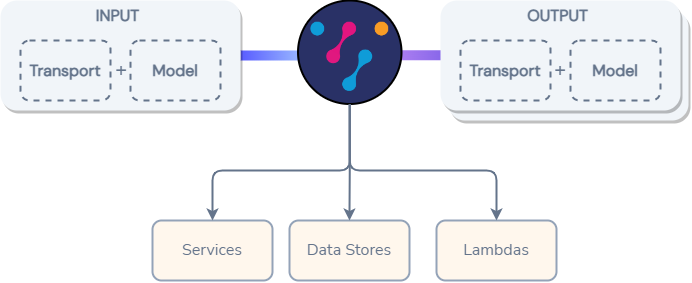

import {Callout} from "../../components/callout";

## Overview

Where queries in Vyne are a great for on-demand data transformation, Pipelines provide continuously streaming data between source and destination, using Vyne to transform data along the way.



<Callout title='In beta' type='warning'>

   Pipelines are a new addition to the Vyne stack. We're making them available
   as an early preview release, but you may hit a few rough edges.

   Reach out to us on Slack to discuss any problems you encounter, or to give feedback

</Callout>

Pipelines work by reading content from a source, transforming using Vyne, then writing to a Sink.

Pipelines can be defined either in a [config file](#pipeline-config-spec), or using the UI.

## Starting Pipeline Engine
The pipeline engine ships as a separate docker image.

A typical docker-compose config looks as follows:

```yaml
version: "3.3"
services:
  ## Other services omitted
  pipeline-engine:
    image: vyneco/pipeline:${VYNE_VERSION}
    depends_on:
      - schema-server
      - eureka
      - vyne
    environment:
      OPTIONS: >-
        --eureka.uri=http://eureka
        --vyne.schema.consumptionMethod=RSOCKET
        --vyne.pipelines.pipeline-path=./pipeline-config
        --vyne.connections.config-file=./config/connections.conf
        --server.port=80
```

### Application config
The pipeline server can be configured with the following properties.

These are generally passed into the `environment.OPTIONS` block within a docker services item in
docker compose.

| Config Parameter                | Description                                                                                                                |
|---------------------------------|----------------------------------------------------------------------------------------------------------------------------|
| `vyne.pipelines.pipeline-path`  | Specifies a directory containing multiple pipeline spec `.pipeline.json` files.  Defaults to `./pipelines`                 |
| `vyne.connections.config-file`  | Path to the config file of connections.  Should be the same file as passed to Vyne.  Defaults to `config/connections.conf` |
| `vyne.schema.consumptionMethod` | Defines how to connect to the schema server and consume schema updates.  `RSOCKET` is a reasonable default                 |

## Creating a pipeline
Pipelines are created and stored as a series of `*.pipeline.json` files, written to the configured directory.

Pipelines are defined as an Input (transport + spec) and Output (transport + spec), with Vyne handling the transformation and enrichment.



Pipelines listen on the input, and as messages arrive they are passed to Vyne to transform to
the output model.

The data is transformed, and Vyne's query engine is used to enrich and populate any missing data.

Although all pipelines are persisted as json files, they can be created either through the UI,
or authored as json directly.

### Creating a pipeline using the UI


### Creating a pipeline through configuration
Pipelines are authored and stored in json files, with a file per pipeline.

Files should adhere to the pipeline spec, which has its own dedicated [reference documentation](pipeline-specs).

