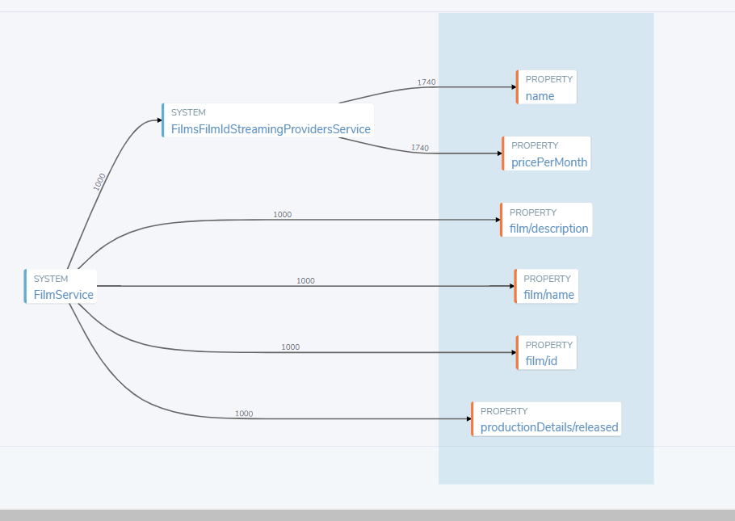
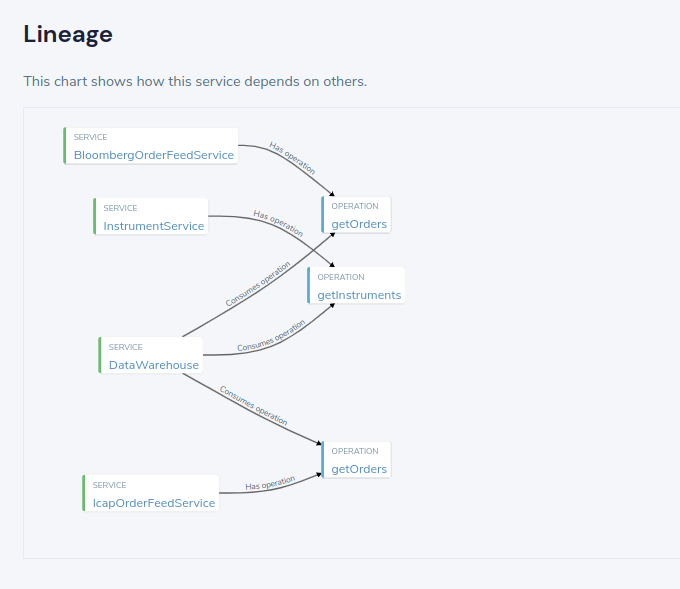
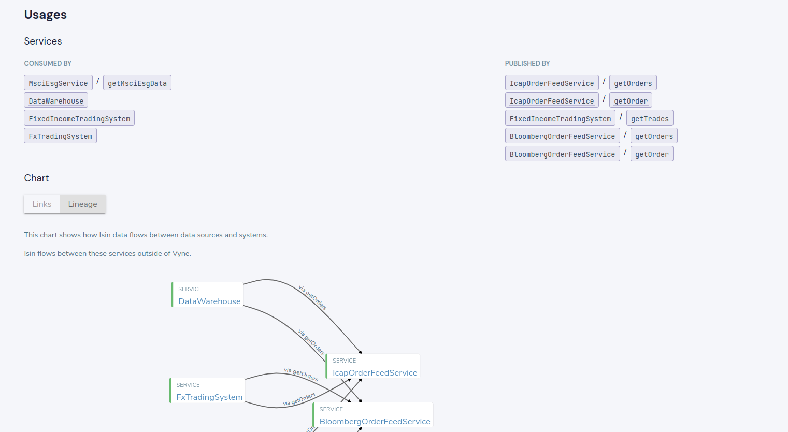

import {Link} from "gatsby";

This page contains details of releases in the 0.20.xx set of releases.

## 0.20.0

0.20 is a major feature release, containing multiple new features, including breaking changes.

### Authentication, and role based authorization

Vyne now has integration with OpenID for authentication, and role based authorisation.

 * <Link to={'/reference/auth/authentication/'}>Authentication docs</Link>
 * <Link to={'/reference/auth/authorization/'}>Configuring role based authorisation</Link>

### New pipeline engine

We've completely rebuilt our pipeline engine, to make it simpler, and more powerful.

Pipelines pick up where queries leave off - a great way to react to a triggered source - such as an AWS SQS notification, a message on a Kafka topic, a periodic HTTP poll, and more.

Pipelines work with sinks and sources, and use Vyne in the middle to transform and enrich the data.

Pipelines are experimental in 0.20, and we're excited to make them available as an early preview.

 * <Link to="/reference/pipelines-2.0/pipelines-overview/">Read the pipeline docs</Link>

### Powerful expressions in queries
We've overhauled the internal expression engine, to make it more consistent, and more powerful.

You can leverage complex expressions, which - in turn - leverage [expression types](#expression-types), allowing for
very rich queries and transformations.

See:

 * <Link to="/querying-with-vyne/writing-queries/#expressions-in-queries">Expressions in queries</Link>
 * <Link to='/querying-with-vyne/writing-queries/#expressions-on-a-type'>Expression types</Link>

### New connection import wizard

In order to help get started with Vyne, we've build a connection and schema import
tool.

This lets you onboard databases, APIs, Kafka topics, AWS connections and more, without
writing any code, and without updating the publisher applications.

Take it for a spin as part of our new <Link to='/tutorials/api-db-integration/rest-db-integration/'>Getting Started</Link> tutorial.

### Query lineage summary view
Queries now show a summary view of all the data attributes that were returned,
and the various paths taken to populate them.  Numbers indicate the number
of results that took the corresponding path.

This is a handy way to see at a glance all the different sources that your
query used.

This is in addition to our existing cell-based lineage, which shows you the
exact path taken to compute every value shown.



### Support for database querying
Vyne now supports querying directly to SQL databases - either
as part of a discovery query, or to fetch additional data to enrich results.

In fact, databases can be used at any part of the query graph, including
looking up reference data to resolve ids.

It's incredibly powerful - take it for a spin in our latest <Link to='/tutorials/api-db-integration/rest-db-integration/'>Getting Started</Link> tutorial.

### Support for querying Kafka topics
Vyne now supports streaming queries directly from Kafka, and
can handle either JSON messages, or Protobuf messages (with more support coming soon).

You're not just reading data from Kafka though - you have the full power
of Vyne in your queries - allowing you to consumer data from Kafka, enriched
with data from REST API's, Databases, Casks, and dervied data from Vyne's
new expression engine.

Take the new Kafka support for a spin in our latest <Link to='/tutorials/api-db-integration/rest-db-integration/'>Getting Started</Link> tutorial,
or <Link to='/how-to-guides/connections/connect-kafka-topic/'>read the documentation</Link>


### Support for consuming Protobuf messages
Vyne now understands how to consume Protobuf messages.  Initial
support is limited to reading Protobuf from Kafka, but this will be soon
extended for full gRPC support.

In addition, you can now embed Taxi metadata directly within protobuf messages,
so that Vyne understands which elements to read.

 * Read <Link to="/reference/message-formats/protobuf">Working with protobuf</Link> for more detail

### Support for JsonSchema

It is now possible to import JsonSchema models directly into Vyne, using our new Schema Import wizard.


### Initial support for output formats on models
It is now possible to specify output types directly on a model.

This allows model authors to control how a model is written when returning from a query:

```
import io.vyne.formats.Csv

@Csv(
   delimiter = "|"
)
model Person {
   firstName : String by column("firstName")
   lastName : String by column("lastName")
   age : Int by column("age")
}

// Query:
// Response type (Person) contains a Csv format defined,
// which will be considered when writing responses.
find { Customer[] }
as { Person[] }
```

Format hints can also be declared inline within the query:

```
find { Customer[] }
as
@Csv(
   delimiter = "|"
)
{
   firstName : String by column("firstName")
   lastName : String by column("lastName")
   age : Int by column("age")
}
```

See <Link to='/querying-with-vyne/writing-queries/#defining-output-formats-with-model-formats'>Output formats</Link> for more information

### New analytics server

Previously, query history was captured and persisted as part of the Vyne server.  This is fine for getting started, but
under heavy load can cause the query server to slow down.

It's now possible for large-scale deployments to move capturing of history out to a separate server - called the Vyne Analytics Server, which renders
the overhead on the query server minimal.

 * <Link to={'/reference/analytics-server/query-history/'}>Learn more</Link>

### Support for OpenAPI with Taxi extensions
Vyne now supports OpenAPI schemas enriched with [taxi extensions](https://docs.taxilang.org/generating-taxi-from-source/#swagger--openapi).

This allows applications that are already producing OpenAPI schemas to register directly, without any code changes in the application layer.

### Improved query editor experience
Our query editor is now connected to the same [Taxi Language Server](https://gitlab.com/taxi-lang/taxi-lang/-/tree/develop/language-server)
that powers the [Taxi VS Code plugin](https://marketplace.visualstudio.com/items?itemName=taxi-lang.taxi-language-server).

In addition, we've enhacned the as-you-type code completion to give intelligent
hints specifically tailored to writing queries, rather than models.

Read more about it in our [blog post](https://blog.vyne.co/better-query-assistance-in-vyne/)

### New configuration system for connections
As part of Vyne's ability to connect to Kafka, Databases, AWS and more, we now have a new connection manager.

Connections can be managed either through our UI, or via config files that can be checked in to source control,
to make scripted deployments of Vyne easier.

Read more about it here:

 * <Link to="/reference/connections/connections-config/">Configuring connections</Link>

### Support for Lineage metadata

Vyne now has support for Taxi's experimental [service lineage documentation](https://docs.taxilang.org/language-reference/describing-services/#documenting-service-lineage-experimental).

When services declare their upstream lineage, Vyne renders it within the Service Catalog:



Additionally, within the data catalog's type view, we can see the lineage on a per type basis, which shows:

 * The services that consume a given data type
 * The services that expose a given data type
 * The lineage graph for that data type



Combined with Vyne's query result value-level lineage, this now gives full lineage visibility across the entire organisation, for
both data-in-motion, and data-at-rest.


### License key requirements
Vyne now requires a license key to run in production.

If a license key is not present, the query service will shut down after 4 hours.

You should've been provided a license key already.  If not, please get in touch so we can provide you with one.

 * <Link to='/reference/licensing/configuring-your-license/'>Read how to register your license key.</Link>

### AWS support

We're excited with our first pass of support for AWS services:

 * Pipeline sink and source from SQS (allows connecting with S3)
 * Querying from RDF data sources

This is an area we're working on, so expect to see more support very shortly

### Removed Eureka distribution for schemas
Distributing schemas via Eureka is no longer supported.

Establish an RSocket connection to the schema server instead.

### Removed Hazelcast distribution for schemas
Distributing schemas via Hazelcast is no longer supported.

Establish an RSocket connection to the schema server instead.

### Support for M1-Max Macbook Pros' (ARM)
We now produce docker images for ARM chipsets, to support M1-Max MacBook pros.

The correct docker images should be automatically downloaded when you pull from Docker hub.

### Spring changes
The Vyne Spring maven artifacts have been temporarily rescoped to "Internal" only - at this stage
we consider these best suited to applications built by the Vyne team (or the
team at Notional).

This means usage of `@VyneSchemaConsumer`, `@VyneSchemaProducer`, and `@EnableVyne` is
not currently reccomended in user applications.

You're still welcome to use them, but we're aware that these cause
tight couplings to specific versions of the Spring stack - which is not something we're currently addressing.

We intend to release a new Vyne client SDK, along with spring tooling at a future date.

In the meantime, we recommend following the documentation for programatically publishing and consuming schemas here:

### Taxi language changes
The taxi version has been bumped to 1.33.0

This contains breaking changes, which impact both how schemas are declared and queries issued.
These have been discussed below

#### Changes on how to generate from Java / Kotlin code
The `@VyneSchemaPublisher` annotation has been temporarily deprecated, due to Spring versioning
issues.

The auto-wiring has been replaced with a builder.  See our <Link to='/how-to-guides/register-schemas/publish-a-schema-in-spring-boot/'>dedicated Spring Boot</Link> tutorial for more details.

#### Changes on how to publish schemas from applications
The schema publication mechanism has been simplified, with dependencies on Eureka and Hazelcast removed.
Applications now publish directly to the schema server, either via HTTP (which requires manual unregistration), or
RSocket (which automatically unregisters when applications terminate).

Read more here:

 * <Link to="/reference/schema-server/schema-server/#publishing-external-schemas">Publishing schemas reference
   documentation</Link>
 * <Link to='/how-to-guides/register-schemas/publish-a-schema-in-spring-boot/'>Dedicated Spring Boot tutorial</Link>.
 * <Link to="/background/schema-publication-methods/#publishing-schemas-to-vyne">Comparing the different schema
   publication approaches</Link>

#### Standardized treatment of the equal operator
Previously, treatment of the equals sign was inconsistent throughout the language.

It has now been standardised to the following:
 * Single equals (`=`) for assignment (used in query given clauses)
 * Double equals (`==`) for equality (used in when clauses)

This diff shows an example of the change for equality checks:

```diff{ 6-10 }
model StockPurchasedEvent {
   previousQuantity : Quantity
   quantity : Quantity
   eventType : EventType // Buy or Return
   remainingQuantity : Decimal by when {
-      this.eventType = Buy -> this.previousQuantity - this.quantity
+      this.eventType == Buy -> this.previousQuantity - this.quantity

-      this.eventType = Return -> this.previousQuantity + this.quantity
+      this.eventType == Return -> this.previousQuantity + this.quantity
   }
}
```

#### Overhaul of expression syntax
The expression syntax has been standardized throughout.

Previous limitations around usage of expressions in Where clauses have been addressed.
However, this has introduced breaking changes around usage of field references vs type references.

 * **Field references** must always use `this.fieldName`
 * **Type references** consistently use `TypeName`


## 0.20.1

0.20.1 is a patch release, which addresses issues found running Vyne through Docker on M1 Max Macbook Pros.

## Fixes

 * Updated Netty to address Sigfault errors when running on M1 Max Macbook Pro

## 0.20.2

0.20.2 is a patch release, containing only bug fixes

## Fixes

 * Projection functionally correctly handles the case where a single source instance needs to be mapped to a typed collection.

