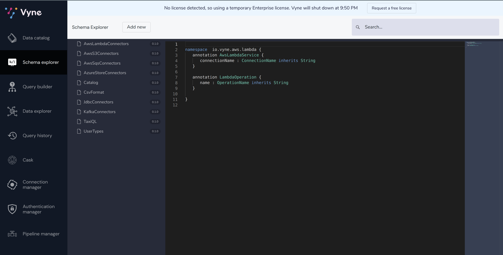
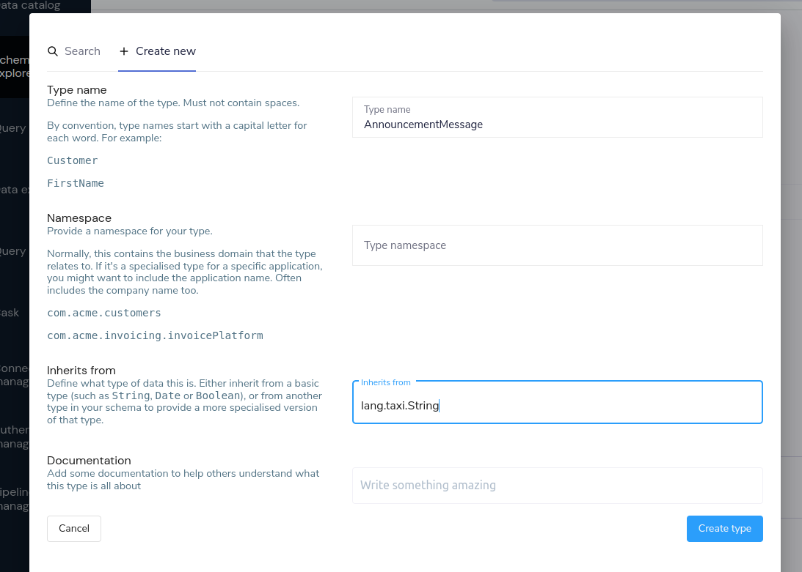
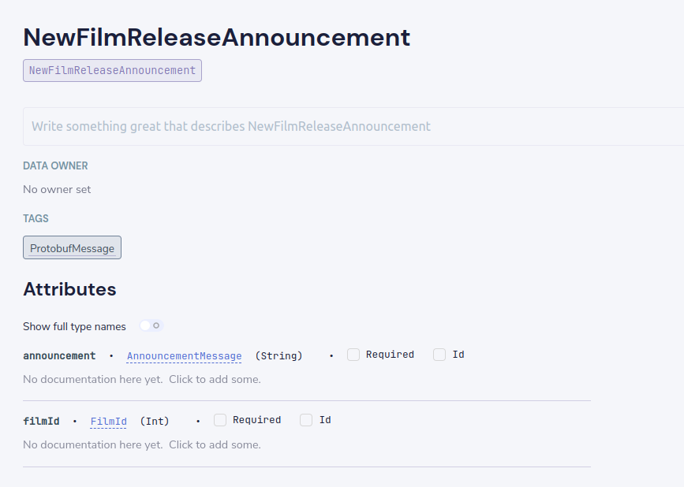
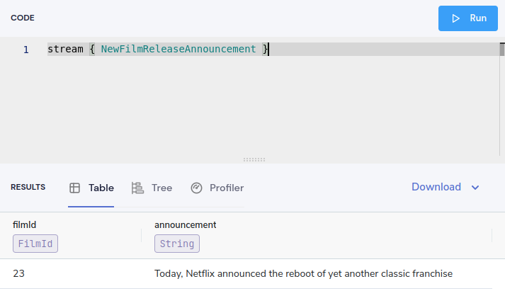
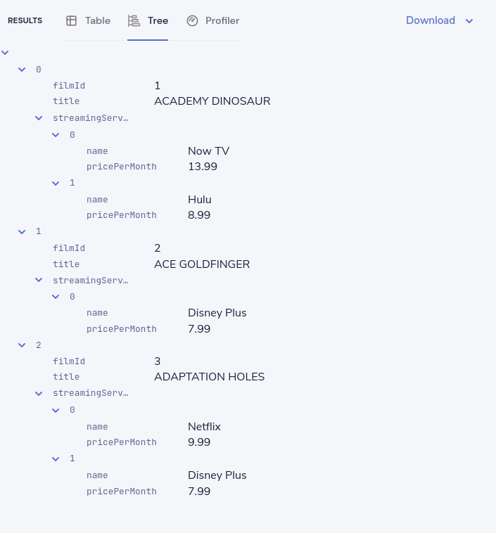

import { Callout } from '../../components/callout';
import { Link } from "gatsby"

## Overview
In this tutorial, we'll set up a local instance of Vyne, and then see how to use Vyne
to link data from a REST API, a database, and a Kafka topic.

<div style="position: relative; padding-bottom: 48.28125%; height: 0;">
   <iframe src="https://www.loom.com/embed/5837732161c742e9a341b9bb596bae11" frameborder="0" webkitallowfullscreen
           mozallowfullscreen allowfullscreen
           style="position: absolute; top: 0; left: 0; width: 100%; height: 100%;"></iframe>
</div>


Our use-case is to find a list of films, along with which online streaming service has the
films available to watch.

This involves linking Films lists from our Database, with streaming service information from a REST API.

Finally, we'll listen for updates on a Kafka topic, sending Protobuf messages, and join those with the DB and API.

<Callout title='This is a step-by-step introduction for beginners.' type={'hint'}>

   If you're already familiar with the basics of Vyne, our other guides are probably more appropriate.

</Callout>

<Callout title='Prerequisites' type='info'>

   * You should have [Docker](https://docs.docker.com/engine/install/) and [Docker
   Compose](https://docs.docker.com/compose/install/) installed.

   * Docker on the new Apple M1 chips has some compatability issues. [Here's some
   tips](../../reference/troubleshooting/m1-docker-compatibility/) to try if you encounter problems.

</Callout>


## Start a local instance of Vyne
For this tutorial, we're going to deploy Vyne, as well as a few demo projects
that we'll use throughout this tutorial.

Everything you need is packaged up in a Docker Compose file to make getting started easier.  To launch, run the following in your command line:

```bash
mkdir vyne-films-demo
cd vyne-films-demo
wget https://gitlab.com/vyne/demos/-/raw/master/films/docker-compose.yml
wget https://gitlab.com/vyne/demos/-/raw/master/films/docker/schema-server/schema-server.conf -P vyne/schema-server
wget https://gitlab.com/vyne/demos/-/raw/master/films/docker/schema-server/projects/taxi.conf -P vyne/schema-server/projects
wget https://gitlab.com/vyne/demos/-/raw/master/films/services.conf -P vyne/config
docker compose up -d
```

This will download the following files:

| File                                                                                                           | Purpose                                                                                                                                                                  |
|----------------------------------------------------------------------------------------------------------------|--------------------------------------------------------------------------------------------------------------------------------------------------------------------------|
| [docker-compose.yml](https://gitlab.com/vyne/demos/-/raw/master/films/docker-compose.yml)                      | The Docker Compose file that contains all the Docker images for this tutorial.                                                                                           |
| [schema-server.conf](https://gitlab.com/vyne/demos/-/raw/master/films/docker/schema-server/schema-server.conf) | A config file for Vyne's <Link to="/reference/schema-server/schema-server/">Schema Server</Link>, which will store and publish the schemas we generate in this tutorial. |
| [taxi.conf](https://gitlab.com/vyne/demos/-/raw/master/films/docker/schema-server/projects/taxi.conf)          | A skeleton taxi project configuration, which contains basic information for the schemas we create.                                                                       |
| [services.conf](https://gitlab.com/vyne/demos/-/raw/master/films/services.conf)                                | A service discovery configuration file to tell services where to find each other. Vyne supports various service discovery mechanisms.                                    |


After about a minute, and Vyne should be available at [http://localhost:9022](http://localhost:9022).

To make sure everything is ready to go, head to the [Schema Explorer](http://localhost:9022/schema-explorer) to make sure that some schemas are registered.
It should look like the screenshot below.  If you see a message saying there's nothing registered, wait a few moments longer.



You now have Vyne running locally, along with a handful of demo services
which we'll use in our next steps.

If you run `docker ps`, you should see a collection of docker containers now running.

| Docker Image              | Part of Vyne stack or Demo? | Description                                                                                                                                                                     |
|---------------------------|-----------------------------|---------------------------------------------------------------------------------------------------------------------------------------------------------------------------------|
| vyneco/vyne               | Vyne                        | The core Vyne server, which provides our UI, and runs all our integration for us                                                                                                |
| vyneco/schema-server      | Vyne                        | A schema server, which stores all the schemas that Vyne knows about                                                                                                             |
| films-api                 | Demo                        | A REST API, which exposes information about films.  We also publish a protobuf message to Kafka from here.                                                                      |
| pagila-db                 | Demo                        | A Postgres Db, which contains the Postgres [Pagila](https://github.com/devrimgunduz/pagila) demo database for a fake DVD rental store                                           |
| confluentinc/cp-zookeeper | Demo (Kafka)                | Official zookeeper image, required to run Kafka                                                                                                                                 |
| confluentinc/cp-kafka     | Demo (Kafka)                | The official Kafka image                                                                                                                                                        |

<Callout title='Related links' type='info'>

   * [Deploying Vyne](../../deployment/deploying-vyne/) (without the demo projects)
   * [Demo project source code](https://gitlab.com/vyne/demos/-/tree/master/films) (on GitLab)

</Callout>

## Connect a database table
First, we'll add a connection to our database, and make a table available
as a datasource that Vyne can fetch data from.

This demo ships with an instance of the Postgres demo db called "[Pagila](https://github.com/devrimgunduz/pagila)".

Pagila contains several tables related to running a fictional DVD Rental store, including details of all sorts of different
films, actors, etc.  We'll use this database as part of our walk through.

To get started, click "Add a data source" on the home page of Vyne, or navigate to [http://localhost:9022/schema-explorer/import](http://localhost:9022/schema-explorer/import)

### Define the database connection
First, we need to tell Vyne how to connect to the database.

 * Select "Database Table" as the type of schema to import
 * For Connection, select "Add a new connection..."
 * A pop-up window appears, allowing you to create a connection to our database
 * Fill in the form with the details below


| Parameter       | Value          |
|-----------------|----------------|
| Connection name | films-database |
| Connection type | Postgres       |
| Host            | postgres       |
| Port            | 5432           |
| Database        | pagila         |
| Username        | root           |
| Password        | admin          |

 * Click "Test connection" and wait for the connection test to be successful.
 * Click "Save".

The connection to the database has now been created, and the pop-up should close.

<Callout title='Related links' type='info'>

   * [Vyne data source configuration](../../reference/connections/connections-config/)
   * [Managing database connections](../../how-to-guides/connections/manage-database-connection/)

</Callout>

### Select the table to import

Now that Vyne has a connection to the database, we need to select the tables we
want to make available for Vyne to query from.

Vyne will create schema files for the contents of the table.  Specifically, Vyne will create:

 * A model for the table, defining all the fields that are present
 * A series of types, which describe the content of each field
 * A query service, which lets Vyne run queries against the database

To import the schema:

 * Complete the form for the database table to import using the parameters below

| Parameter         | Value                                                                             |
|-------------------|-----------------------------------------------------------------------------------|
| Connection        | `films-database` (Note - this should already be populated from the previous step) |
| Table             | film                                                                              |
| Default namespace | `io.vyne.demos.films`                                                             |

Namespaces are used to help us group related content together - like packages in Java or namespaces in C# and Typescript.

Here, we're providing a default namespace, which will be applied to the types, models and services Vyne will create
importing this table.

 * Click Create

Vyne will connect to the database, and create all the necessary schema configuration for us for the table.

<Callout title='Related links' type='info'>

   * [Understanding namespaces](https://docs.taxilang.org/language-reference/taxi-language/#namespaces)
   * [Understanding types and models](https://docs.taxilang.org/language-reference/types-and-models/)

</Callout>

### Preview the imported tables

Vyne now shows a preview of the types, models and services that will be created.


You can click around to explore the different models, types and services that will
be created. For now, the defaults that have been assigned are good enough.

 * Click Save

Vyne will create the necessary schema files in a local project.

<Callout title="If you're interested..." type='hint'>

   Vyne has just created a series of [Taxi](https://taxilang.org) schema files, which contain the schemas
   we've just imported. You can explore these files locally.

   ```
   cd vyne/schema-server/projects
   ```

   Taxi ships a great [VS Code
   plugin](https://marketplace.visualstudio.com/items?itemName=taxi-lang.taxi-language-server), which provides
   click-to-navigate, syntax highlighting, autocompletion and more.

</Callout>

You've now connected a database to Vyne, and exposed one of its tables, so that Vyne can
run queries against it.

<Callout title='Related links' type='info'>

   * [Understanding Taxi](https://docs.taxilang.org/language-reference/taxi-language/)

</Callout>


## Connect a Swagger API
In this step, we want to tell Vyne about our REST API, which exposes information about
which streaming service each of our films are available on.

We'll use the UI of Vyne to import a Swagger definition of our REST API

 * Click on the Vyne logo in the top-left corner to navigate back to the home page
 * Once again, click "Add a data source"
 * Alternatively, navigate to [http://localhost:9022/schema-explorer/import](http://localhost:9022/schema-explorer/import)
 * From the drop-down list, select "Swagger / Open API" as the type of schema to import
 * For the Swagger Source, select a Url.

Fill in the form with the following values:

| Parameter         | Value                               |
|-------------------|-------------------------------------|
| Swagger source    | `http://films-api/v2/api-docs`      |
| Default namespace | `io.vyne.demo.films`                |
| Base url          | Leave this blank                    |


* Click Create

### Update the service type

A preview of the imported schema is once again displayed.

This time, we do need to modify some default values.

Click on Services → `getStreamingProvidersForFilmUsingGET`.

This shows the API operation that's exposed in the swagger spec we just imported.
This API accepts the id of a Film, and returns information about the streaming services that have the film available to watch.

Now, take a look at the parameters section.

Note that the input parameter - `filmId` is typed as `String`.  Since we know that this is a FilmId - the same value that's exposed
by the Films database table.  We need to update the type accordingly, so that Vyne knows these two pieces of information are linked.

 * Click on the `String` link
 * In the search box, type `FilmId`
 * Select the FilmId type that's shown
 * Finally, click Save

Great!  We've now exposed the Swagger API to Vyne

#### What just happened?
We've connected the Swagger schema of a REST API to Vyne.  Vyne now knows about this service, and will
make calls to it as needed.

<Callout title='Related links' type='info'>

   * [Understanding the different ways to publish schemas to Vyne](../../reference/schema-server/schema-server/)
   * [Describing REST APIs in Taxi](https://docs.taxilang.org/language-reference/describing-services/)
   * [Embedding Taxi definitions inside Swagger, to keep Vyne automatically up-to-date](https://docs.taxilang.org/generating-taxi-from-source/#openapi-x-taxi-type-extension)

</Callout>

## Integrating services & loading data

Now that everything is set up, let's fetch and integrate some data.

### List all the films in the database
Queries in Vyne are written in TaxiQL. TaxiQL is a simple query language that
isn't tied to one specific underlying technology (i.e., it's independent of databases, APIs, etc.).

This means we can write queries for data without worrying where the data is served from.

Our first query is very simple - it just finds all the films.

 * Head over to the Query Builder, and select the Query Editor tab (or navigate to [http://localhost:9022/query/editor](http://localhost:9022/query/editor))
 * Paste in the below query:

```taxi
find { Film[] }
```
 * Click run.

This query tells asks Vyne for all `Film` records.
When this query is executed, Vyne looks for services that expose a collection of Films, and invokes them.
In our example, that means that Vyne will query the database to select all available films.

There are different options to show the result of Vyne queries. These are displayed as tabs under the query editor.

 * Table - Nice for tabular, two-dimensional data
 * Tree - Nice for nested data
 * Profile - What work did Vyne to produce the result. Contains information about the systems called by Vyne, performance stats and lineage information.

Once the query is completed, you should see a list of records displayed in the grid.


### Restructure the data into a way that's useful for us
Vyne lets you restructure data in a way that's useful to you.
Our original query returned the data as a flat list, since it's coming from a database.

However, for our purposes, (let's say we're building a UI), we might want to restructure the data
to a subset of fields, grouped in a way that's useful.

 * Paste the below query into the Query Editor.

```taxi
find { Film[] } as {
    film: {
        name: Title
        id : FilmId
        description: Description
    }
    productionDetails: {
        released: ReleaseYear
    }
}[]
```
 * Click Run

This time, the data has been returned structured as a tree.  To see the tree data, click on the Tree tab in the results panel.


Now our data has been restructured into a tree shape.
Using this approach, we can change the shape of the structure, along with field names.

In Taxi language, this is called a _projection_ - as we're changing the shape of the output.

### List films and the providers they're available on

Finally, let's add in data about which streaming movie service contains each movie.
This requires linking data between our database and our REST API.

As Vyne is handling all the integration for us, this is as simple as updating our
query to include the provider data.

Vyne handles working out how to call the REST API, which data to pass, and what to collect.

 * Paste the below query

```taxi
findAll { Film[] } as {
    film: {
        name: Title
        id : FilmId
        description: Description
    }
    productionDetails: {
        released: ReleaseYear
    }
    providers: StreamingProvider[]
}[]
```

 * Click Run

When the query results are returned, as this is nested data, ensure you're in the Tree view to see the results.
Note that now we have data from our database, combined with data from our Rest API.


<Callout title='Related links' type='info'>

   * [Writing queries with Vyne](../../querying-with-vyne/writing-queries/)
   * [TaxiQL language reference](https://docs.taxilang.org/language-reference/querying-with-taxiql/)

</Callout>

### Exploring the query execution
Vyne has several diagnostic tools to help us see what happened.

#### Explore the individual server requests
In the Profiler, you can click to see a sequence diagram of calls that have taken place to different services.
Clicking on any of the rows shows the actual request and response.


#### Exploring cell-based lineage
Vyne provides detailed trace lineage for each value shown in its results.

In tree mode, try clicking on one of the names of the streaming providers.  A lineage display will open,
showing the trace of how the value was derived.

 * We can see that a value of Netflix was returned from an Http operation.
 * The input to that Http operation was a FilmId - in our example, the value 1.
 * Clicking on the FilmId expands the lineage graph to show where that FilmId came from.
 * We can see that the FilmId was returned as the result of a database query.


This deep lineage is very powerful for understanding how data has flowed, and proving the [provenance](https://en.wikipedia.org/wiki/Data_lineage#Data_provenance) of data that Vyne is exposing.

### Running our query via CURL

Although Vyne's UI is powerful, developers will want to interact with Vyne through its API.
That's a topic on its own, but here is an example of running the same query through Vyne's API, using curl.

#### Getting a JSON payload
We can use Curl to get the results of our query as a JSON document.

 * Copy and paste the below snippet into a shell window, and press enter

```shell
curl 'http://localhost:9022/api/taxiql' \
  -H 'Accept: application/json' \
  -H 'Content-Type: application/taxiql' \
  --data-raw 'findAll { Film[] } as {
    film: {
        name: Title
        id : FilmId
        description: Description
    }
    productionDetails: {
        released: ReleaseYear
    }
    providers: StreamingProvider[]
}[]'
```

<Callout type="hint" title="Better json with jq">

   Interacting with JSON from the command line is better with
   tools like [jq](https://stedolan.github.io/jq/)

   Try installing jq, then adding ` | jq` at the end of the curl commands.

</Callout>


#### Getting streaming data via Curl
Alternatively, for queries with large datasets, Vyne can stream results.  This enables Vyne to work on
arbitrarily large datasets, as it's not holding content in memory.

To ask Vyne to stream the data over HTTP, Vyne can serve [Server-Sent events](https://developer.mozilla.org/en-US/docs/Web/API/Server-sent_events/Using_server-sent_events).
Simple update the headers with an `Accept: text/event-stream`.

```shell
curl 'http://localhost:9022/api/taxiql' \
  -H 'Accept: text/event-stream' \
  -H 'Content-Type: application/taxiql' \
  --data-raw 'findAll { Film[] } as {
    film: {
        name: Title
        id : FilmId
        description: Description
    }
    productionDetails: {
        released: ReleaseYear
    }
    providers: StreamingProvider[]
}[]'
```

<Callout title='Related links' type='info'>

   * [Running queries through Vyne's API](../../querying-with-vyne/writing-queries/#rest-api)

</Callout>

## Adding a Kafka streaming source
Now that we have Vyne linking our Database and REST API, it's time we add a Kafka stream into the mix.

We have a new releases topic that emits a message whenever Netflix decides to turn a beloved movie
into a new TV series.

For this part of our demo, we'll use Vyne to listen for new release announcements, and join
data from our REST API and Postgres DB.

### Import a Protobuf schema
Our new releases topic emits a protobuf message - which Vyne needs to know about.

To keep things simple in our demo, the protobuf message is available via one of our APIs.  You can view the protobuf yourself by clicking on [http://localhost:9981/proto](http://localhost:9981/proto).
For Vyne (running inside the Docker Compose network), this is visible as `http://films-api/proto`.

Import the spec by clicking "Add a data source" on the front page of Vyne, or by navigating to [http://localhost:9022/schema-explorer/import](http://localhost:9022/schema-explorer/import).

 * Select "Protobuf" as the type of schema to import
 * Set the Protobuf Source as a URL
 * Paste the url: `http://films-api/proto`
 * Click Create

You should see a preview of a newly created a model: `NewFilmReleaseAnnouncement`.

We need to indicate that the filmId property is the same as the FilmId used elsewhere in our company.

 * On the left-hand table, click Models → NewFilmReleaseAnnouncement
 * The NewFilmReleaseAnnouncement data model is displayed
 * In the "Attributes" table, click on the underlined `Integer` type next to filmId
 * Search for the type FilmId, and select `film.types.FilmId` from the search box

Also, notice that the announcement field has been typed as `String`.  Let's create a more specific type:

 * In the "attributes" table, click on the underlined `String` type next to announcement
 * In the popup, click "Create new"

Fill out the form with the following details:

| Parameter     | Value                                                                       |
|---------------|-----------------------------------------------------------------------------|
| Type name     | `AnnouncementMessage`                                                       |
| Namespace     | Leave this blank for now                                                    |
| Inherits from | Start typing `String`, and select `lang.taxi.String` from the drop-down box |
| Documentation | Leave this blank for now                                                    |



* Click Create type

Your `NewReleaseFilmAnnouncement` type should look like the following screenshot:



 * Click Save

We've now imported a protobuf schema, and linked its fields to other fields in our schema.

### Import a Kafka Topic
Next we need to tell Vyne about the Kafka topic.

 * Return to the Vyne home page by clicking the Vyne logo in the nav bar.
 * Click Add a Data Source, or navigate to [http://localhost:9022/schema-explorer/import](http://localhost:9022/schema-explorer/import)
 * From the drop-down, select Kafka Topic
 * In the Connection Name, select "Add a new connection..."

Fill out the form with the following details:

| Parameter       | Value                                 |
|-----------------|---------------------------------------|
| Connection name | `my-kafka`                            |
| Connection type | `kafka` (should already be populated) |
| Broker address  | `kafka:29092`                         |
| Group Id        | `vyne` (should already be populated)  |

 * Click create.  A new Kafka connection is created, and the popup should close

Fill out the rest of the form with the following details:

| Parameter                  | Value                                                          |
|----------------------------|----------------------------------------------------------------|
| Connection name            | `my-kafka` (should have been populated when the pop-up closed) |
| Topic                      | `releases`                                                     |
| Topic Offset               | `LATEST`                                                       |
| Namespace                  | `io.vyne.demos.announcements`                                  |
| Message Type               | `NewFilmReleaseAnnouncement`                                   |
| Service and Operation Name | Leave these blank                                              |

 * Click Create

A preview of the schema is shown.

By clicking Services → MyKafkaService → consumeFromReleases, you can see
a new operation has been created which returns a `Stream<NewFilmReleaseAnnouncement>`.

Streams are a different type of operation - rather than request / response like an HTTP operation exposes, these
expose a continuous stream of data.

Take a look around, and then click Save.

## Join data from Kafka, API and our DB
It's time to explore writing some queries that join data from across all 3 sources.

First, let's start with querying our Kafka topic.  Head over to the [Query Editor](http://localhost:9022/query/editor),
and paste the following query:

```taxi
stream { NewFilmReleaseAnnouncement }
```

At this stage, you should see a running query, but without any results.
In order to see some data, we need to publish onto our Kafka topic.

Open a terminal window, and paste the following:

```bash
curl --location --request POST 'http://localhost:9981/kafka/newReleases/23'
```

This will send a new release Protobuf message onto our Kafka topic - and you should see
the details of the message appear in your query panel.



Now, let's enrich our Kafka stream with data from our other sources.

Cancel the running query, and paste the following:

```taxi
stream { NewFilmReleaseAnnouncement } as {
    // The announcement comes from our Kafka Protobuf message
    news: {
        announcement: AnnouncementMessage
    }
    // Grab some film information from the Database
    film: {
        name: Title
        id : FilmId
        description: Description
    }
    productionDetails: {
        released: ReleaseYear
    }
    // And query the REST API to see where we can watch this
    providers: StreamingProvider[]
}[]
```

Now, let's push a couple of new release announcements to our kafka topic:

```bash
curl --location --request POST 'http://localhost:9981/kafka/newReleases/1'
curl --location --request POST 'http://localhost:9981/kafka/newReleases/2'
curl --location --request POST 'http://localhost:9981/kafka/newReleases/3'
```

In the results panel, you should see the following:



### What just happened?
 * Vyne read our protobuf message from the Kafka topic
 * Enriched it with data from a Database query
 * Then fleshed it out some more information from a REST API call
 * And served it up in our UI.

## What's next?
In this tutorial, we've set up Vyne, and used it to automatically integrate data from a Postgres Database, a REST API, and a Kafka topic with protobuf.  Nice stuff!

### Look under the hood
In order to get a better understanding of what's happened under the hood, take a look at some of the files that Vyne
has generated during this tutorial.

| Directory                                 | What's there?                                                                                                                         |
|-------------------------------------------|---------------------------------------------------------------------------------------------------------------------------------------|
| `./vyne/schema-server/schema-server.conf` | The config file that's driving the Schema server. It defines where to read and write the schema files Vyne created in the background. |
| `./vyne/schema-server/projects`           | The schema project that Vyne was writing schemas to.                                                                                  |
| `./vyne/config/connections.conf`          | A connections file defining the api connections you imported in the UI.                                                               |

### Other tutorials
There's lots of things left to explore - a few great next tutorials are:

 * <Link to="/reference/schema-server/schema-server/">Understand the difference between "pushing" and "pulling" schemas in Vyne</Link>
 * <Link to="/reference/schema-server/schema-server/#publishing-external-schemas">Push schemas to Vyne automatically</Link>
