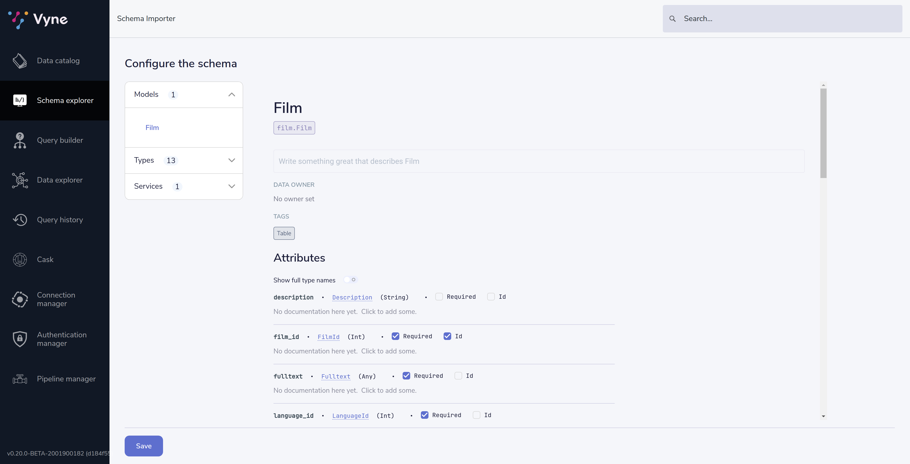
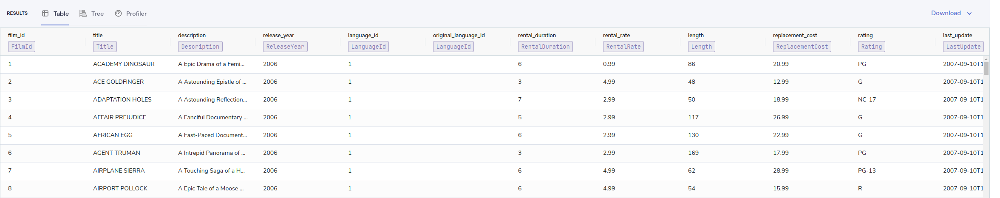
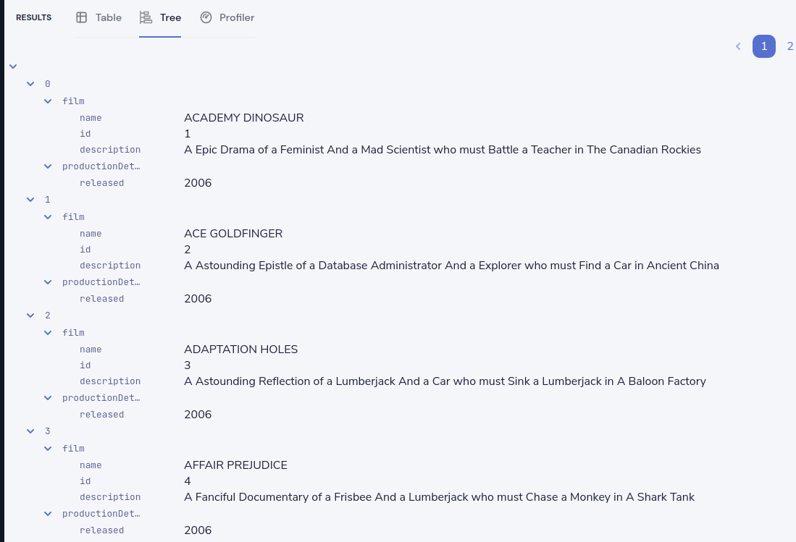
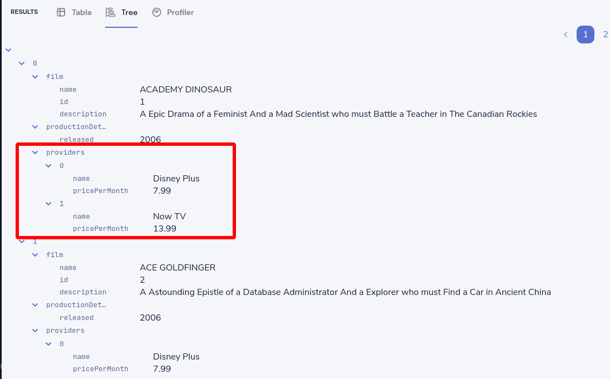
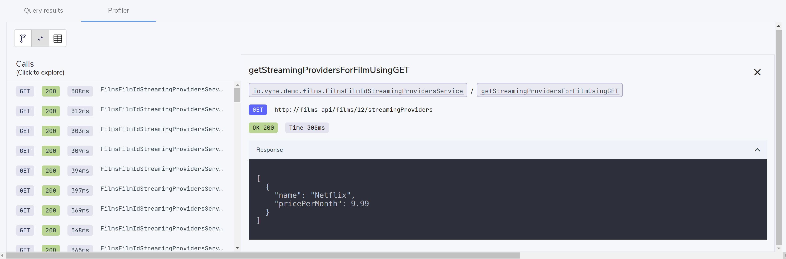
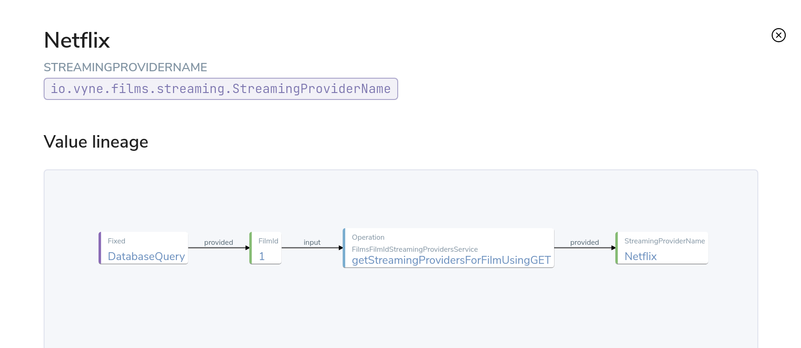

import {Callout} from '../../components/callout';


## Overview
In this tutorial, we'll set up a local instance of Vyne, and then see how to use Vyne
to link data from a REST API, and a database.

Our use-case is to find a list of films, along with which online streaming service has the
films available to watch.

This involves linking Films lists from our Database, with streaming service information from a REST API.

<Callout title='This is a step-by-step introduction for beginners.' type={'hint'}>

If you're already familiar with the basics of Vyne, our other guides are probably more appropriate.

</Callout>

<Callout title='Prerequisites' type='info'>

   * You should have [Docker](https://docs.docker.com/engine/install/) and [Docker Compose](https://docs.docker.com/compose/install/) installed.

</Callout>

In this tutorial, we'll deploy Vyne locally, and run through a basic integration project
connecting a Database and REST API.


## Start a local instance of Vyne
For this tutorial, we're going to deploy Vyne, as well as a few demo projects
that we'll use throughout this tutorial.

Everything you need is packaged up in a docker-compose file to make getting started easier.  To launch, run the following in your command line:

```bash
mkdir vyne-films-demo
cd vyne-films-demo
wget https://gitlab.com/vyne/demos/-/raw/master/films/docker-compose.yml
wget https://gitlab.com/vyne/demos/-/raw/master/films/docker/schema-server/schema-server.conf -P vyne/schema-server
wget https://gitlab.com/vyne/demos/-/raw/master/films/docker/schema-server/projects/taxi.conf -P vyne/schema-server/projects
docker-compose up -d
```

After about a minute, and Vyne should be available at [http://localhost:9022](http://localhost:9022).

You now have Vyne running locally, along with a handful of demo services
which we'll use in our next steps.

If you run `docker ps`, you should see a collection of docker containers now running.

| Docker Image         | Part of Vyne stack or Demo? | Description                                                                                                                           |
|----------------------|-----------------------------|---------------------------------------------------------------------------------------------------------------------------------------|
| vyneco/vyne          | Vyne                        | The core Vyne server, which provides our UI, and runs all our integration for us                                                      |
| vyneco/schema-server | Vyne                        | A schema server, which stores all the schemas that Vyne knows about                                                                   |
| vyneco/eureka        | Vyne (Optional)             | A instance of [Eureka](https://github.com/Netflix/eureka) - a service discovery server, which makes finding and resolving services easier.  This is optional when running Vyne.                                                                                |
| films-api            | Demo                        | A REST API, which exposes information about films                                                                                     |
| pagila-db            | Demo                        | A Postgres Db, which contains the Postgres [Pagila](https://github.com/devrimgunduz/pagila) demo database for a fake DVD rental store |

<Callout title='Related links' type='info'>

   * Deploying Vyne (without the demo projects)
   * [Demo project source code](https://gitlab.com/vyne/demos/-/tree/master/films) (on GitLab)

</Callout>

## Connect a database table
First, we'll add a connection to our database, and make a table available
as a datasource that Vyne can fetch data from.

This demo ships with an instance of the Postgres demo db called "[Pagila](https://github.com/devrimgunduz/pagila)".

Pagila contains several tables related to running a fictional DVD Rental store, including details of all sorts of different
films, actors, etc.  We'll use this database as part of our walkthrough.

To get started, click "Add a data source" on the home page of Vyne, or navigate to [http://localhost:9022/schema-explorer/import](http://localhost:9022/schema-explorer/import)

### Define the database connection
First, we need to tell Vyne how to connect to the database.

 * Select "Database Table" as the type of schema to import
 * For Connection, select "Add a new connection..."
 * A pop-up window appears, allowing you to create a connection to our database
 * Fill in the form with the details below


| Parameter       | Value          |
|-----------------|----------------|
| Connection name | films-database |
| Database type   | Postgres       |
| Host            | postgres       |
| Port            | 5432           |
| Database        | pagila           |
| Username        | root           |
| Password        | admin           |

 * Click Test connection.
 * After a short moment, you should see that the connection was tested successfully.
 * Click Create.

The connection to the database has now been created, and the pop-up should close.

<Callout title='Related links' type='info'>

 * Vyne data source configuration

</Callout>

### Select the table to import

Now that Vyne has a connection to the database, we need to select the tables we
want to make available for Vyne to query from.

Vyne will create schema files for the contents of the table.  Specifically, Vyne will create:

 * A model for the table, defining all the fields that are present
 * A series of types, which describe the content of each field
 * A query service, which lets Vyne run queries against the database

To import the schema:

 * Complete the form for the database table to import using the parameters below

| Parameter       | Value          |
|-----------------|----------------|
| Connection | `films-database` (Note - this should already be populated from the previous step) |
| Table | film |
| Default namespace   | `io.vyne.demos.films`       |

Namespaces are used to help us group related content together.  Here, we're
providing a default namespace, which will be applied to the types, models and services Vyne will create
importing this table.

 * Click Create

Vyne will connect to the database, and create all the necessary schema configuration for us for the table.

<Callout title='Related links' type='info'>

   * Understanding namespaces
   * Understanding types and models

</Callout>

### Preview the imported tables

Vyne now shows a preview of the types, models and services that will be created.



You can click around to explore the different models, types and services that will
be created. For now, the defaults that have been assigned are good enough.

 * Click Save

Vyne will create the necessary schema files in a local project.

<Callout title="If you're interested..." type='hint'>

Vyne has just created a series of [Taxi](https://taxilang.org) schema files, which contain the schemas
we've just imported.  You can explore these files locally.

   ```
   cd vyne/schema-server/projects
   ```

   Taxi ships a great [VS Code plugin](https://marketplace.visualstudio.com/items?itemName=taxi-lang.taxi-language-server), which provides click-to-navigate, syntax highlighting, as you type code completion, etc.

</Callout>

You've now connected a database to Vyne, and exposed one of it's tables, so that Vyne can
run queries against it.

<Callout title='Related links' type='info'>

   * Understanding Taxi

</Callout>


## Connect a Swagger API
In this step, we want to tell Vyne about our REST API, which exposes information about
which streaming service each of our films are available on.

We'll use the UI of Vyne to import a Swagger definition of our REST API

 * Click on the Vyne logo in the top-left corner to navigate back to the home page
 * Once again, click "Add a data source"
 * Alternatively, navigate to [http://localhost:9022/schema-explorer/import](http://localhost:9022/schema-explorer/import)
 * From the drop-down list, select "Swagger / Open API" as the type of schema to import
 * For the Swagger source, select URL, and paste in the following: `http://films-api/v2/api-docs`
 * For the default namespace, enter `io.vyne.demo.films`
 * Click Create

### Update the service type

A preview of the imported schema is once again displayed.

This time, we do need to modify some of the default values.

Click on Services -> getStreamingProvidersForFilmUsingGET.

This shows the API operation that's exposed in the swagger spec we just imported.
This API accepts the id of a Film, and returns information about the streaming services that have the film avaialble to watch.

Note that the input parameter - `filmId` is typed as `String`.  Since we know that this is a FilmId - the same value that's exposed
by the Films database table.  We need to update the type accordingly, so that Vyne knows these two pieces of information are linked.

 * Click on the `String` link
 * In the search box, type FilmId
 * Select the FilmId type that's shown
 * Finally, click Save

Great!  We've now exposed the Swagger API to Vyne

#### What just happened?
We've connected the Swagger schema of a REST API to Vyne.  Vyne now knows about this service, and will
make calls to it as needed.

<Callout title='Related links' type='info'>

   * Understanding the different ways to publish schemas to Vyne
   * Exploring API's in the data catalog
   * Describing REST API's in Taxi
   * Embedding Taxi definitions inside Swagger, to keep Vyne automatically up-to-date

</Callout>

## Integrating services & loading data

Now that everything is set up, let's fetch and integrate some data.

### List all the films in the database
Queries in Vyne are written in TaxiQL.  TaxiQL is a simple query language that
isn't tied to one specific underlying technology (ie., it's independent of databases, APIs, etc.).

This means we can write queries for data without worrying where the data is served from.

Our first query is very simple - it just finds all the films.

 * Head over to the Query Builder, and select the Query Editor tab.
 * Alternatively, navigate to [http://localhost:9022/query/editor](http://localhost:9022/query/editor)
 * Paste in the below query:

```taxi
find { Film[] }
```
 * Click run.

This query tells Vyne to return all the `Film` records.
When this query is executed, Vyne looks for services that expose a collection of Films, and invokes them.
In our example, that means that Vyne will invoke a database query, selecting all the films.

Once the query is completed, you should see a list of records displayed in the grid.



### Restructure the data into a way that's useful for us
Vyne lets you restructure data in a way that's useful to you.
Our original query returned the data as a flat list, since it's coming from a database.

However, for our purposes, (let's say we're building a UI), we might want to restructure the data
to a subset of fields, grouped in a way that's useful.

 * Paste the below query into the Query Editor.

```taxi
find { Film[] } as {
    film: {
        name: Title
        id : FilmId
        description: Description
    }
    productionDetails: {
        released: ReleaseYear
    }
}[]
```
 * Click Run

This time, the data has been returned structured as a tree.  To see the tree data, click on the Tree tab in the results panel.



Now our data has been restructured into a tree shape.
Using this approach, we can change the shape of the structure, along with field names.

In Taxi language, this is called a Projection - as we're changing the shape of the output.

### List films and the providers they're available on

Finally, let's add in data about which streaming movie service contains each movie.
This requires linking data between our database and our REST API.

As Vyne is handling all the integration for us, this is as simple as updating our
query to include the provider data.

Vyne handles working out how to call the REST API, which data to pass, and what to collect.

 * Paste the below query

```taxi
findAll { Film[] } as {
    film: {
        name: Title
        id : FilmId
        description: Description
    }
    productionDetails: {
        released: ReleaseYear
    }
    providers: StreamingProvider[]
}[]
```

 * Click Run

When the query results are returned, as this is nested data, ensure you're in the Tree view to see the results.
Note that now we have data from our database, combined with data from our Rest API.



<Callout title='Related links' type='info'>

   * TaxiQL language reference

</Callout>

### Exploring the query execution
Vyne has several diagnostic tools to help us see what happened.

#### Explore the individual server requests
In the Profiler, you can click to see a sequence diagram of calls that have taken place to different services.
Clicking on any of the rows shows the actual request and response.



#### Exploring cell-based lineage
Vyne provides detailed trace lineage for each value shown in it's results.

In tree mode, try clicking on one of the names of the streaming providers.  A lineage display will open,
showing the trace of how the value was derived.

 * We can see that a value of Netflix was returned from an Http operation.
 * The input to that Http operation was a FilmId - in our example, the value 1.
 * Clicking on the FilmId expands the lineage graph to show where that FilmId came from.
 * We can see that the FilmId was returned as the result of a database query.



This deep lineage is very powerful for understanding how data has flowed, and proving the [provenance](https://en.wikipedia.org/wiki/Data_lineage#Data_provenance) of data that Vyne is exposing.

### Running our query via CURL

Although Vyne's UI is powerful, developers will want to interact with Vyne through it's API.
That's a topic on it's own, but here is an example f running the same query through Vyne's API, using curl.

#### Getting a JSON payload
We can use Curl to get the results of our query as a JSON document.

 * Copy and paste the below snippet into a shell window, and press enter

```shell
curl 'http://localhost:9022/api/taxiql' \
  -H 'Accept: application/json' \
  -H 'Content-Type: application/taxiql' \
  --data-raw 'findAll { Film[] } as {
    film: {
        name: Title
        id : FilmId
        description: Description
    }
    productionDetails: {
        released: ReleaseYear
    }
    providers: StreamingProvider[]
}[]'
```

#### Getting streaming data via Curl
Alternatively, for queries with large datasets, Vyne can stream results.  This enables Vyne to work on
arbitrarily large datasets, as it's not holding content in memory.

To ask Vyne to stream the data over HTTP, Vyne can serve [Server-Sent events](https://developer.mozilla.org/en-US/docs/Web/API/Server-sent_events/Using_server-sent_events).
Simple update the headers with an `Accept: text/event-stream`.

```shell
curl 'http://localhost:9022/api/taxiql' \
  -H 'Accept: text/event-stream' \
  -H 'Content-Type: application/taxiql' \
  --data-raw 'findAll { Film[] } as {
    film: {
        name: Title
        id : FilmId
        description: Description
    }
    productionDetails: {
        released: ReleaseYear
    }
    providers: StreamingProvider[]
}[]'
```

<Callout title='Related links' type='info'>

   * Running queries through Vyne's API

</Callout>

## What's next?
In this tutorial, we've set up Vyne, and used it to automatically integrate data from a Postgres Database and a REST API.

There's lots of things left to explore - a few great next tutorials are:

 * See how Vyne performs multi-hop data resolutions
 * Connect and query a Kafka streaming datasource
 * Push schemas to Vyne automatically
