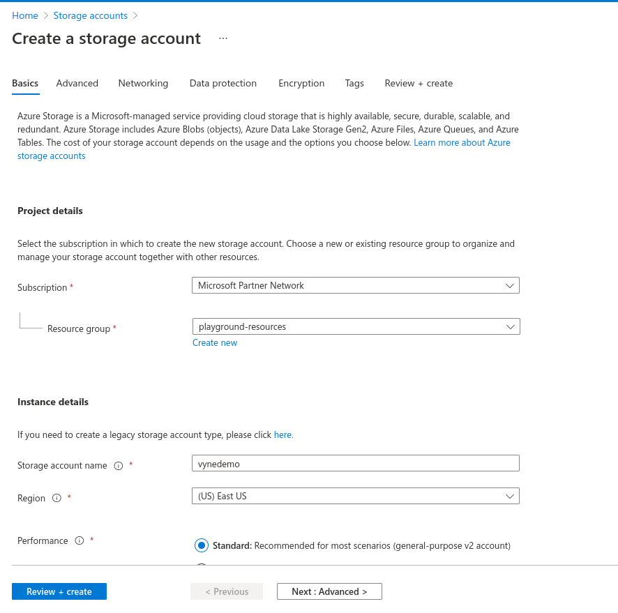

import {Callout} from '../../components/callout';
import { Link } from "gatsby"

## Overview
In this tutorial, we'll set up a local instance of Vyne, and then see how to use Vyne
to link data from a csv file in an Azure blob storage and an aws lambda function.

Our use-case is to find a list of films, along with which online streaming service has the
films available to watch.

This involves linking Films lists from our csv file, with streaming service information from an aws lambda function.


<Callout title='This is a step-by-step introduction for beginners.' type={'hint'}>

   If you're already familiar with the basics of Vyne, our other guides are probably more appropriate.

</Callout>

<Callout title='Prerequisites' type='info'>

   * You should have [Docker](https://docs.docker.com/engine/install/) and [Docker
   Compose](https://docs.docker.com/compose/install/) installed.

</Callout>


## Start a local instance of Vyne
For this tutorial, we're going to deploy Vyne, as well as a few demo projects
that we'll use throughout this tutorial.

Everything you need is packaged up in a docker-compose file to make getting started easier.  To launch, run the following in your command line:

```bash
mkdir vyne-films-demo
cd vyne-films-demo
wget https://gitlab.com/vyne/demos/-/raw/master/films-cloud/film_202203162251.csv
wget https://gitlab.com/vyne/demos/-/raw/master/films-cloud/index.js
wget https://gitlab.com/vyne/demos/-/raw/master/films-cloud/docker-compose.yml
wget https://gitlab.com/vyne/demos/-/raw/master/films-cloud/docker/schema-server/schema-server.conf -P vyne/schema-server
wget https://gitlab.com/vyne/demos/-/raw/master/films-cloud/docker/schema-server/projects/taxi.conf -P vyne/schema-server/projects
docker-compose up -d
```

This will download the following files:

| File                                                                                                           | Purpose                                                                                                                                                                 |
|----------------------------------------------------------------------------------------------------------------|-------------------------------------------------------------------------------------------------------------------------------------------------------------------------|
| [docker-compose.yml](https://gitlab.com/vyne/demos/-/raw/master/films-cloud/docker-compose.yml)                      | The docker compose file that contains all the docker images for this tutorial                                                                                           |
| [schema-server.conf](https://gitlab.com/vyne/demos/-/raw/master/films-cloud/docker/schema-server/schema-server.conf) | A config file for Vyne's <Link to="/reference/schema-server/schema-server/">Schema Server</Link>, which will store and publish the schemas we generate in this tutorial |
| [taxi.conf](https://gitlab.com/vyne/demos/-/raw/master/films-cloud/docker/schema-server/projects/taxi.conf)          | A skeleton taxi project configuration, which contains basic information for the schemas we create                                                                       |
| [film_202203162251.csv]( https://gitlab.com/vyne/demos/-/raw/master/films-cloud/film_202203162251.csv)          | a csv file containing list of movies. We will upload it to an Azure storage container                                                                       |
| [index.js]( https://gitlab.com/vyne/demos/-/raw/master/films-cloud/index.js)          | Aws NodeJs lambda function implementation                                                                      |


After about a minute, and Vyne should be available at [http://localhost:9022](http://localhost:9022).

To make sure everything is ready to go, head to the [Schema Explorer](http://localhost:9022/schema-explorer) to make sure that some schemas are registered.
It should look like the screenshot below.  If you see a message saying there's nothing registered, wait a few moments longer.


You now have Vyne running locally, along with a handful of demo services
which we'll use in our next steps.

If you run `docker ps`, you should see a collection of docker containers now running.

| Docker Image              | Part of Vyne stack or Demo? | Description                                                                                                                                                                     |
|---------------------------|-----------------------------|---------------------------------------------------------------------------------------------------------------------------------------------------------------------------------|
| vyneco/vyne               | Vyne                        | The core Vyne server, which provides our UI, and runs all our integration for us                                                                                                |
| vyneco/schema-server      | Vyne                        | A schema server, which stores all the schemas that Vyne knows about                                                                                                             |
| vyneco/eureka             | Vyne                        | A instance of [Eureka](https://github.com/Netflix/eureka) - a service discovery server, which makes finding and resolving services easier.  This is optional when running Vyne. |

<Callout title='Related links' type='info'>

   * Deploying Vyne (without the demo projects)
   * [Demo project source code](https://gitlab.com/vyne/demos/-/tree/master/films-cloud) (on GitLab)

</Callout>

## Connect an azure data storage container
First, we'll add a connection to our azure data storage, and make it available
as a datasource that Vyne can fetch data from.

As the first step, goto your Azure account and create a new storage account



once your storage account is ready, create a new 'container' called movies


and then upload [film_202203162251.csv]( https://gitlab.com/vyne/demos/-/raw/master/films-cloud/film_202203162251.csv) to 'movies' container that you've just created.


### Define the Azure Blob Storage Connection
First, we need to tell Vyne how to connect to the Azure storage.

 * Goto Connection Manager
 * Click on "Create new connection"
 * 'Add a new connection' form appears, allowing you to create a connection to our Azure storage
 * Set connection name as vyneAzure
 * Set Connection type as 'Azure Storage'
 * Goto your 'vynedemo' azure storage and select 'Access keys' and copy the 'Connection String' value of your first key.


 * Paste the copied connection string into 'Azure storage connection string' textbox and click on 'Test Connection'


Once the connection is tested successfully, click on Create and make sure that connection is created successfully.


## Create an Aws lambda function

As the first step logon to Aws account and goto Lambda service, then click on 'Create function'


Set the function name as streamingproviders and runtime as NodeJs 14.x


Copy the contents of [index.js]( https://gitlab.com/vyne/demos/-/raw/master/films-cloud/index.js) and paste into index.js contents in aws console


<Callout title='Related links' type='info'>

   * Vyne data source configuration

</Callout>

Click on File -> Save and then hit 'Deploy'

Our Aws function to provide streaming providers data is now ready. Next we'll create a new data connection in Vyne so that it can access Aws and invoke the lambda.

### Define the Aws Connection

Goto to your Vyne UI and

 * Click on Connection Manager
 * Click on "Create new connection"
 * 'Add a new connection' form appears, allowing you to create a connection to our Azure storage
 * Set connection name as vyneAws
 * Set Connection type as 'Aws'
 * Set your Aws access key, secret and region correspondingly.
 * Click on Test Connection


After the connection tested successfully, click on Create and make sure that connection is created successfully.


## Integrating services & loading data

Now that everything is set up, let's fetch and integrate some data.

### List all the films in the database
Queries in Vyne are written in TaxiQL.  TaxiQL is a simple query language that
isn't tied to one specific underlying technology (i.e., it's independent of databases, APIs, etc.).

This means we can write queries for data without worrying where the data is served from.

Our first query is very simple - it just finds all the films.

 * Head over to the Query Builder, and select the Query Editor tab.
 * Alternatively, navigate to [http://localhost:9022/query/editor](http://localhost:9022/query/editor)
 * Paste in the below query:

```taxi
find { film.Film[] }
```
 * Click run.

This query tells Vyne to return all the `Film` records.
When this query is executed, Vyne looks for services that expose a collection of Films, and invokes them.
In our example, that means that Vyne will invoke a function to fetch the data from [film_202203162251.csv]( https://gitlab.com/vyne/demos/-/raw/master/films-cloud/film_202203162251.csv) stored in Azure and selecting all the films.

Once the query is completed, you should see a list of records displayed in the grid.


### Filtering the data into a way that's useful for us

Vyne lets you filter data in a way that's useful to you.
Our original query returned the full film data from Azure.

However, for our purposes, (let's say we're building a UI), we might want to fetch the subset of the data in a way that's useful.

 * Paste the below query into the Query Editor.

```taxi
import film.Film
import film.types.Rating
findAll {Film[] (Rating == "G")}
```
 * Click Run

This time, the data has been filtered to return only the movies with General Audiences rating.


Now our data has been restructured into a tree shape.
Using this approach, we can change the shape of the structure, along with field names.

In Taxi language, this is called a Projection - as we're changing the shape of the output.

### List films and the providers they're available on

Finally, let's add in data about which streaming movie service contains each movie.
This requires linking data between our csv file in Azure and our Aws lambda function.

As Vyne is handling all the integration for us, this is as simple as updating our
query to include the provider data.

Vyne handles working out how to call the lambda function, which data to pass, and what to collect.
Lets see this in action find the streaming provider for the movie AIRPORT POLLOCK

 * Paste the below query

```taxi
import film.Film
import film.types.FilmId
import film.types.Title
import film.types.Description
import io.vyne.films.providers.StreamingProviderName
import io.vyne.films.providers.PricerPerMonth

findAll {Film[] (Title == "AIRPORT POLLOCK")} as {
    id: FilmId
    name: Title
    descrption: Description
    streamingPlatform: StreamingProviderName
    monthlyPrice: PricerPerMonth
}[]
```

 * Click Run

When the query results are returned, as this is nested data, ensure you're in the Tree view to see the results.
Note that now we have data from our database, combined with data from our Rest API.


<Callout title='Related links' type='info'>

   * TaxiQL language reference

</Callout>

### Exploring the query execution
Vyne has several diagnostic tools to help us see what happened.

#### Explore the individual server requests
In the Profiler, you can click to see a sequence diagram of calls that have taken place to different services.
Clicking on any of the rows shows the actual request and response.


#### Exploring cell-based lineage
Vyne provides detailed trace lineage for each value shown in its results.

In tree mode, try clicking on one of the names of the streaming providers.  A lineage display will open,
showing the trace of how the value was derived.

 * We can see that a value of "Netflix" was returned from the Aws lambda Call.
 * The input to that Http operation was a StreamingProviderRequest - in our example, the value of this argument is:

```json
  {
     "filmId": 8
  }
```
 * Clicking on the FilmId expands the lineage graph to show where that FilmId came from.
 * We can see that the FilmId was returned as the result of a database query.


This deep lineage is very powerful for understanding how data has flowed, and proving the [provenance](https://en.wikipedia.org/wiki/Data_lineage#Data_provenance) of data that Vyne is exposing.

### Running our query via CURL

Although Vyne's UI is powerful, developers will want to interact with Vyne through its API.
That's a topic on its own, but here is an example f running the same query through Vyne's API, using curl.

#### Getting a JSON payload
We can use Curl to get the results of our query as a JSON document.

 * Copy and paste the below snippet into a shell window, and press enter

```shell
curl 'http://localhost:9022/api/taxiql' \
  -H 'Accept: application/json' \
  -H 'Content-Type: application/taxiql' \
  --data-raw 'findAll {Film[] (Title == "AIRPORT POLLOCK")} as {
    id: FilmId
    name: Title
    descrption: Description
    streamingPlatform: StreamingProviderName
    monthlyPrice: PricerPerMonth
}[]'
```

#### Getting streaming data via Curl
Alternatively, for queries with large datasets, Vyne can stream results.  This enables Vyne to work on
arbitrarily large datasets, as it's not holding content in memory.

To ask Vyne to stream the data over HTTP, Vyne can serve [Server-Sent events](https://developer.mozilla.org/en-US/docs/Web/API/Server-sent_events/Using_server-sent_events).
Simple update the headers with an `Accept: text/event-stream`.

```shell
curl 'http://localhost:9022/api/taxiql' \
  -H 'Accept: text/event-stream' \
  -H 'Content-Type: application/taxiql' \
  --data-raw 'findAll {Film[] (Title == "AIRPORT POLLOCK")} as {
    id: FilmId
    name: Title
    descrption: Description
    streamingPlatform: StreamingProviderName
    monthlyPrice: PricerPerMonth
}[]'
```

<Callout title='Related links' type='info'>

   * Running queries through Vyne's API

</Callout>


## What's next?
In this tutorial, we've set up Vyne, and used it to automatically integrate data from a Postgres Database and a REST API.

### Look under the hood
In order to get a better understanding of what's happened under the hood, take a look at some of the files that Vyne
has generated during this tutorial.

| Directory                                 | What's there?                                                                                                                         |
|-------------------------------------------|---------------------------------------------------------------------------------------------------------------------------------------|
| `./vyne/schema-server/schema-server.conf` | The config file that's driving the Schema server.  It defines where to read and write the schema files Vyne created in the background |
| `./vyne/schema-server/projects`           | The schema project that Vyne was writing schemas to                                                                                   |
| `./vyne/config/connections.conf`          | A connections file defining the api connections you imported in the UI                                                                |

### Other tutorials
There's lots of things left to explore - a few great next tutorials are:

 * See how Vyne performs multi-hop data resolutions
 * <Link to="/reference/schema-server/schema-server/">Understand the difference between "pushing" and "pulling" schemas in Vyne</Link>
 * <Link to="/reference/schema-server/schema-server/#publishing-external-schemas">Push schemas to Vyne automatically</Link>
