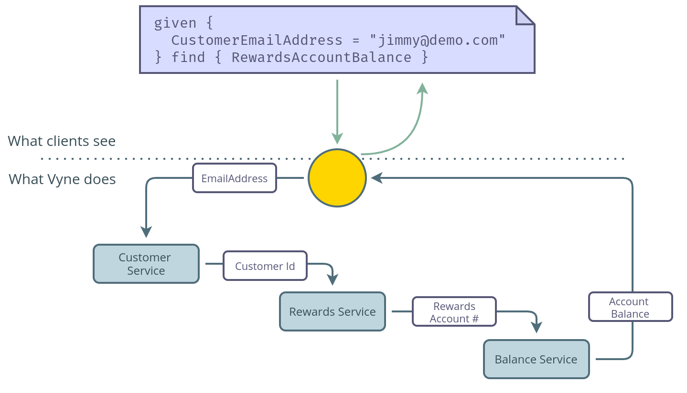
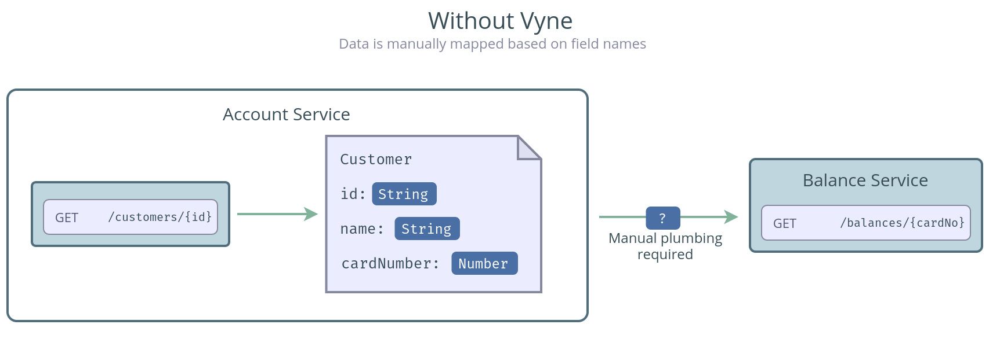
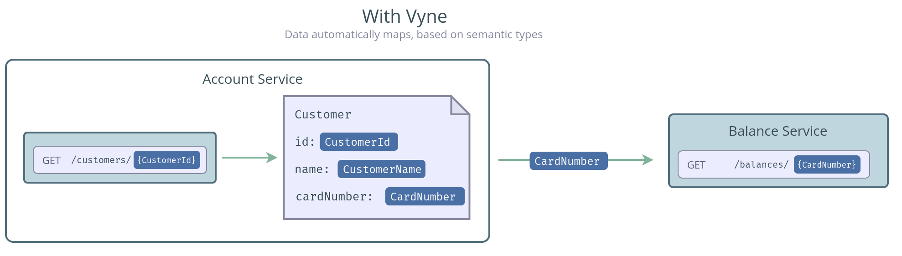

# Overview

Modern organisations have multiple services and data sources - and with the move to microservices, this is on the rise. However, while microservices are great, in practice each API can become a point of friction - something that makes future change difficult. 

Vyne addresses this by automaticlly building and maintaining the integration between services, allowing services to stay decoupled from one another.

Vyne turns integration inside-out, allowing clients to ask for the data they need, without worrying about where it comes from. This means that as API's evolve, or as services are deployed or replaced, Vyne's automated integrations automatically adapt, without requiring clients to change.


By using Vyne's automated integration, brittle service-to-service code is replaced with Vyne's integration API, allowing simple semantic discovery of data.

For example, using our Kotlin SDK:

```kotlin
given(emailAddress).discover<AccountBalance>
```

or, more richly in VyneQL:

```text
given {
   emailAddress : EmailAddress = "jimmy@demo.com"
} find {
   lastPurchase {
      date : LastPurchaseDate( @format = 'dd/MMM/yyyy hh:mm:ss' ),
      value : LastPurchaseValue
   }
   accountBalance : AccountBalance
}
```

Vyne leverages schemas to automatically work out which services to call, and sequences them together to pass data from service to service, in order to discover the data clients need.



## Integration that adapts with you

Services publish their schemas to Vyne, which describe their API's and the data they provide. Vyne uses this to build integration plans on-the-fly. This means that as your API's change, Vyne automatically adapts, keeping clients protected from the change. There's no resolvers to update, or Swagger SDK's to rebuild, or API consumer contracts to refactor.

Vyne provides several ways for services to generate and publish their schema - hand-crafted schema's, automatically generated at runtime, git backed in a central repository, or a mix of the three.

Find out more about schema strategies [here](publishing-and-sharing-schemas.md).




## Semantic data schemas

Legacy integration approaches have relied on mapping field names between services and models in order to pass information from place-to-place. This is brittle, labrious work. It has to be repeated for every service pair - for example, mapping the `CustomerApi` to the `BalancesApi` has to be repeated when mapping the `CustomerApi` to the `MarketingApi`, etc.\)

This field mapping takes place because traditional schemas don't provide rich enough information to link on anything else. If a field gets renamed?  💥 Boom! Breakdown city.



Vyne is different. It uses Taxi to build a semantic represetnation of API's and data. This means that Vyne can understand how data relates from one service to another, between model to model, regardless of how it's named.

Once you've tagged field as having a `CustomerId` \(irrespective of the name assigned to the field\), Vyne instantly knows how to leverage that data on all other services that take a `CustomerId`. This means signficantly less mapping work.



This also means that developers are free to leverage whatever domain model that works for them, avoiding the dreaded "Enterprise Domain Model". Vyne understands how to map the data on-the-fly, avoiding all the getter-to-setter mapping that used to take place.

Find out more about Semantic data and Taxi [here](semantic-data-intro.md).




