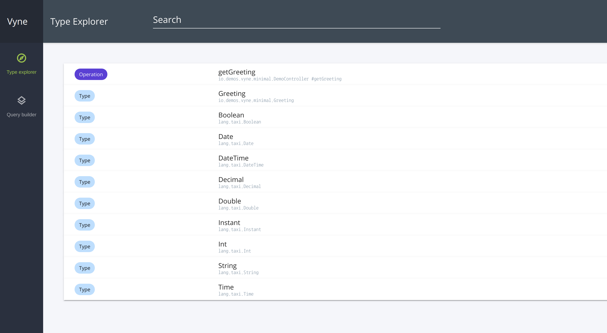
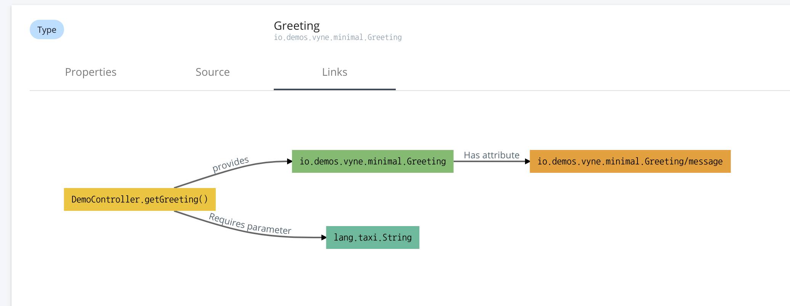

# Basic Walkthrough - Hello World

## Overview

In this example, we'll create a minimal server, register it with Vyne, and invoke a Hello World discovery.


The source for this demo is available on Gitlab, [here](https://gitlab.com/vyne/demos/tree/master/minimal).


This demo doesn't really show off any of Vyne's real capability, it just gets a single app running.  Vyne is intended to integrate between multiple services.  To see that, take a look at one of our other walk-throughs.

This example uses Spring Boot and Kotlin.  Vyne isn't dependent on either of those - however they do make getting up & running easier.  

It also uses Eureka for service discovery.  Vyne requires **some kind** of service discovery to be present, in order for it to look up the services it needs to interact with.  Currently, Eureka is the preferred discovery client.  However, any working implementation of Spring's `DiscoveryClient` should work \(ie., Consul or Zookeeper\), but these haven't been tested yet.

Better support for these - and other - service discovery mechanisms is planned.

## Before we begin

Make sure you've got the Vyne server up & running, with an embedded Eureka server turned on.



## Maven setup

Here's the `pom.xml` for our demo project.  Most of it is boilerplate, except for the `vyne-spring` dependency.


```markup
<?xml version="1.0" encoding="UTF-8"?>
<project xmlns="http://maven.apache.org/POM/4.0.0"
         xmlns:xsi="http://www.w3.org/2001/XMLSchema-instance"
         xsi:schemaLocation="http://maven.apache.org/POM/4.0.0 http://maven.apache.org/xsd/maven-4.0.0.xsd">
    <parent>
        <groupId>org.springframework.boot</groupId>
        <artifactId>spring-boot-starter-parent</artifactId>
        <version>2.0.5.RELEASE</version>
    </parent>
    <modelVersion>4.0.0</modelVersion>

    <groupId>io.vyne.demos.minimal</groupId>
    <artifactId>minimal</artifactId>

    <properties>
        <spring.cloud.netflix.version>2.0.1.RELEASE</spring.cloud.netflix.version>
        <vyne.version>0.1.3-SNAPSHOT</vyne.version>
        <kotlin.version>1.2.71</kotlin.version>
    </properties>

    <dependencies>
        <dependency>
            <groupId>org.springframework.boot</groupId>
            <artifactId>spring-boot-starter-web</artifactId>
        </dependency>
        <dependency>
            <groupId>org.springframework.cloud</groupId>
            <artifactId>spring-cloud-starter-netflix-eureka-client</artifactId>
            <version>${spring.cloud.netflix.version}</version>
        </dependency>
        <dependency>
            <groupId>org.jetbrains.kotlin</groupId>
            <artifactId>kotlin-stdlib-jdk8</artifactId>
            <version>${kotlin.version}</version>
        </dependency>
        <dependency>
            <groupId>io.vyne</groupId>
            <artifactId>vyne-spring</artifactId>
            <version>${vyne.version}</version>
        </dependency>
    </dependencies>

    <build>
        <plugins>
            <plugin>
                <groupId>org.jetbrains.kotlin</groupId>
                <artifactId>kotlin-maven-plugin</artifactId>
                <version>${kotlin.version}</version>
            </plugin>
        </plugins>
    </build>
</project>xml
```


## Vanilla Spring Boot

Let's start with just a vanilla spring-boot application, and get that running:

```kotlin
fun main(args: Array<String>) {
    SpringApplication.run(MinimalDemoApp::class.java, *args)
}

@SpringBootApplication
open class MinimalDemoApp


@RestController
class DemoController {

    @GetMapping("/greeting/{name}")
    fun getGreeting(@PathVariable("name") name: String): Greeting {
        return Greeting("Hello, $name")
    }
}

data class Greeting(val message: String)
```

That's all pretty standard stuff.   Start the app, and you should have a service running on port 8080.

## Adding Vyne

Let's revisit, and add a couple of lines to enable Vyne on this app.  We'll take this step-by-step.

```kotlin
@SpringBootApplication
@EnableEurekaClient (1)
@EnableVyne(remoteSchemaStore = RemoteSchemaStoreType.HAZELCAST) (2)
open class MinimalDemoApp
```

1. First, we configured our app to register with Eureka, using the `@EnableEurekaClient` annotation.
2. Then we enabled Vyne, with the `@EnableVyne` annototation.  We've configured it to use Hazelcast for our [schema store](../running-a-local-taxonomy-editor-environment/vyne-components.md#schema-stores).  This is easier, more responsive during development, and requires less config.

### Generating Taxi Schema's

Vyne uses [Taxi](https://docs.taxilang.org) to model the services and models made available by our app.  Generating a model is pretty simple, we just need to add a couple of annotations:

```kotlin
@RestController
@Service (1)
class DemoController {

    @GetMapping("/greeting/{name}")
    @Operation (2)
    fun getGreeting(@PathVariable("name") name: String): Greeting {
        return Greeting("Hello, $name")
    }
}
```

1. We added Taxi's `@Service` annotation, to publish a service here.  A service is just a group of operations.
2. We published this function as an `@Operation` with another Taxi annotation.


Be sure that the `@Service` annotation belongs to the taxi `lang.taxi.annotations` package, and not Spring's `@Service` annotation.


Finally, we need to generate a model for our `Greeting` class:

```kotlin
@DataType
data class Greeting(val message: String)
```

## Take it for a spin

We're now ready to start our service, and play with it.  Run the application, and wait for it to start.

Now, open Vyne's app in the browser - by default it's running at [http://localhost:9022/](http://localhost:9022/)

You should see our type and service registered, along with a handful of Taxi primitive types.



Open up the Greeting type in the list, and you can exploring some of the data that's been generated by our schema, including the taxi source:


  
...and how it relates to other types across our services:



###  Running a query

Finally, let's get Vyne to discover our greeting for us.

Vyne queries work in the form of "Given I know `this thing`, go and find me `that thing`."  So, to run a query, we need to give it a starting point.  Expand `String` in the explorer, and click "Start a query"


  
In the query wizard, add a value for the String fact we've added.  Then, in the **Target to find** section, select our `Greeting` type.  Finally, submit the query.


You should get a success result back, with a message of "Hello, Jimmy".

Also, Vyne returns a sequence diagram, showing the services that were called in order to discover our greeting.


## What just happened?

As a demo, this is fairly boring - invoking a rest call isn't exactly groundbreaking.  However, what is interesting, is that Vyne determined that it needed to call the `DemoController` based off the goal we gave it \("Find me a `Greeting`\), and some starting point - a string.

If the requirements of our `DemoController` were to change, Vyne would adapt it's route wherever possible, in order to still fetch our `Greeting`.

Now that we've finished this basic primer, take a stroll through some of our other walk-throughs, to get a better understanding of how Vyne can be useful.

