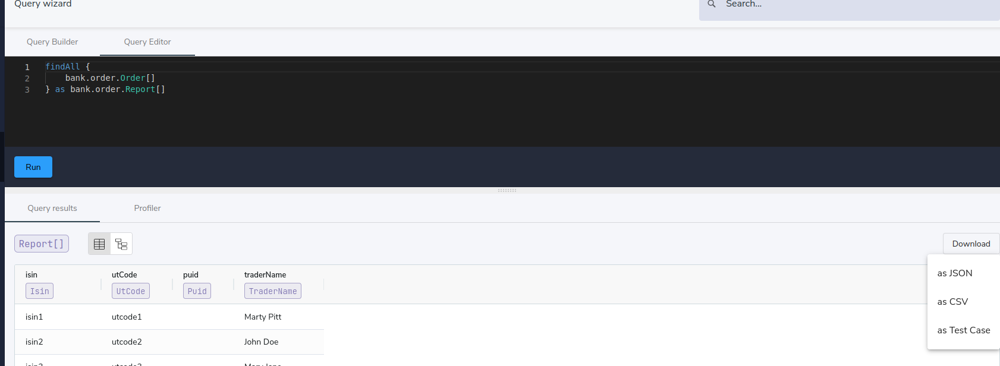
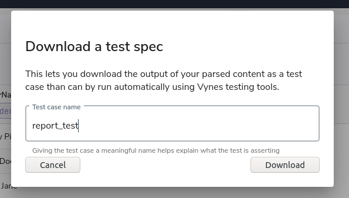
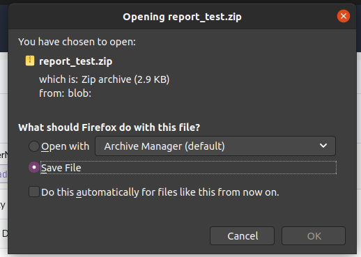

# How To Run Query Tests

* Goto Vyne and issue a query that you want to test

* Once Query Results are ready, click on Download button and select 'as Test Case' option:

* Give a name to your test case:

* Download the 'test zip' file:

* Extract the Zip

* Run 'vynetest' app with the path of the extracted folder:

<code>
./vynetest queryTest -p [PATH TO YOUR TEST QUERY PACKAGE FOLDER]
</code>
